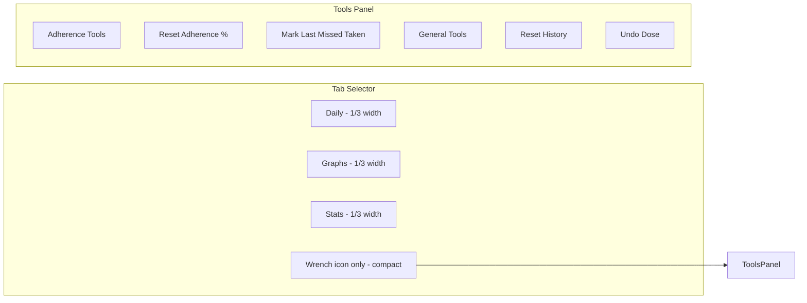
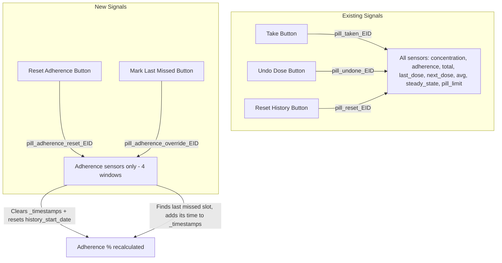

# Adherence Reset & Last-Missed Override — Architecture Plan

## Objective

Add two new maintenance actions for users who miss doses due to unforeseen circumstances:

1. **Reset Adherence %** — Clears adherence timestamps only, without touching PK (Amount in Body), Total, Last Dose, Next Dose, or any other sensor.
2. **Mark Last Missed as Taken (Adherence Only)** — Retroactively marks the most recent missed dose slot as "taken" for adherence calculation only, without adding a dose to the PK model, Total counter, or Last Dose sensor.

Additionally, surface the existing **Reset History** and **Undo Dose** buttons in a new dedicated **Tools panel** alongside the new adherence actions.

## Feasibility Analysis

Both new features are **fully feasible without impacting PK or other sensors** because:

- [`PillAdherenceSensor._timestamps`](../Home-Assistant-Pill-Logger/custom_components/pill_logger/sensors/adherence.py:46) is a **completely independent list** from [`PillConcentrationSensor._dose_history`](../Home-Assistant-Pill-Logger/custom_components/pill_logger/sensors/concentration.py:40).
- Both are populated by the same `pill_taken_{entry_id}` signal, but nothing prevents us from sending an adherence-only signal that modifies only `_timestamps`.
- The adherence slot-counting methods (`_count_slots_time_of_day`, `_count_slots_regular_interval`, `_count_slots_cyclic`) check `dose_covers` by matching timestamps against expected slot times. Adding a timestamp at a missed slot's expected time will cause that slot to be counted as "covered" — raising adherence % — without any PK effect.

## Naming

- Backend button entity names (the `_attr_name` shown in HA entity lists):
  - `Reset Adherence %` — unique_id `{entry_id}_reset_adherence`
  - `Mark Last Missed Taken` — unique_id `{entry_id}_cover_last_missed`
- Frontend card button labels (inside the Tools panel):
  - `Reset Adherence %`
  - `Mark Last Missed Taken`
  - `Reset History` (existing)
  - `Undo Dose` (existing)
- Each button's confirmation popup title and descriptor makes the adherence-only scope explicit (see UI section).

## Architecture

### Panel Layout Diagram



### Signal Flow Diagram



### Backend Changes

#### 1. `button.py` — Two new button entities

**`PillAdherenceResetButton`**
- `_attr_name = "Reset Adherence %"`
- Unique ID: `{entry_id}_reset_adherence`
- Icon: `mdi:percent-circle-outline`
- Entity category: `CONFIG` (maintenance action)
- `async_press()`: fires `pill_adherence_reset_{entry_id}` signal

**`PillAdherenceCoverButton`**
- `_attr_name = "Mark Last Missed Taken"`
- Unique ID: `{entry_id}_cover_last_missed`
- Icon: `mdi:check-underline-circle`
- Entity category: `CONFIG`
- `async_press()`: fires `pill_adherence_override_{entry_id}` signal
- Also fires `pill_logger_adherence_override` bus event for automation/logging

Register both in `async_setup_entry()` alongside existing buttons.

#### 2. `sensors/adherence.py` — New signal handlers + slot finder

**New dispatcher connections** in `async_added_to_hass()`:
```python
async_dispatcher_connect(self.hass, f"pill_adherence_reset_{self._entry_id}", self.adherence_reset)
async_dispatcher_connect(self.hass, f"pill_adherence_override_{self._entry_id}", self.adherence_override)
```

**`adherence_reset()` callback**:
- Clears `self._timestamps = []`
- Resets `self._history_start_date = dt_util.now()`
- Calls `_update_state()` + `async_write_ha_state()`
- (Same logic as existing `reset_data` but triggered by a separate signal so only adherence is affected)

**`adherence_override()` callback**:
- Calls `_find_last_missed_slot()` to get the most recent missed slot's expected_time
- If a missed slot is found: appends it to `self._timestamps`
- Calls `_update_state()` + `async_write_ha_state()`
- If no missed slot found: does nothing (optionally logs a debug message)

**`_find_last_missed_slot()` method**:
- Dispatches to tracking-type-specific helpers based on `self._tracking_type`
- Each helper iterates expected slots from most recent backward (same iteration pattern as `_count_slots_*`)
- Skips pending slots (today's slots where `now < expected_time + grace_td` and not covered)
- Returns the first (most recent) slot that is expected but NOT covered by any timestamp
- Returns `None` if no missed slots exist in the window

**Tracking-type-specific helpers**:
- `_find_last_missed_time_of_day()` — iterates dose_times per day, backward
- `_find_last_missed_regular_interval()` — backward chain from last dose + forward gap
- `_find_last_missed_cyclic()` — iterates ON days only, backward

**Edge case handling**:
- If `_timestamps` is empty and tracking type is Regular Interval, there are no actual doses — the "last missed slot" is the most recent expected slot whose grace window has expired
- Multiple presses of Mark Last Missed: each press covers the next-most-recent missed slot (since the previously-missed one is now covered). This is intentional — allows users to cover multiple missed doses.
- All 4 adherence sensors (7/14/30/365 day) respond to the same signal. Each finds its own last missed slot within its own window. In the common case, they all cover the same slot (the most recent miss is within all windows). If the 7-day window has no misses, that sensor does nothing while longer-window sensors cover their last miss.

#### 3. `strings.json` / `translations/en.json` — Button name translations (if needed)

### Frontend Changes

#### 4. `src/pill-logger-card.ts` — 4th panel + entity resolution + UI

**A. Pane type extension**

Update the `_activePane` type and all references from `'daily' | 'graphs' | 'stats'` to `'daily' | 'graphs' | 'stats' | 'tools'`:
- [`_activePane`](src/pill-logger-card.ts:78) state property type
- [`_handlePaneChange()`](src/pill-logger-card.ts:363) parameter type
- [`_renderPaneSelector()`](src/pill-logger-card.ts:906) panes array type
- [`connectedCallback()`](src/pill-logger-card.ts:975) saved-pane validation
- [`render()`](src/pill-logger-card.ts:953) conditional pane rendering
- [`getCardSize()`](src/pill-logger-card.ts:1005) switch — add `case 'tools': return 6`

**B. Pane selector — compact Tools button**

In `_renderPaneSelector()`, add a 4th pane entry:
```ts
{ id: 'tools', label: '', icon: 'mdi:wrench' }
```

The Tools button is rendered differently from the other 3:
- Icon only, no text label (the `label` is empty string, and the `<span>` is conditionally omitted when empty)
- Visually compact — approximately 1/4 the width of the other buttons

CSS approach: The 3 main buttons share `flex: 1` (equal width). The Tools button gets a fixed compact width via a `.pane-btn.tools` modifier class:
```css
.pane-btn.tools {
  flex: 0 0 auto;
  min-width: 44px;
  padding: 8px;
}
.pane-btn.tools span { display: none; }
```

This gives Daily/Graphs/Stats each ~1/3 of the remaining space and Tools a compact fixed slot.

**C. Entity resolution** (`_resolveEntities()`):
- Add `adherenceResetButton?: string` and `adherenceCoverButton?: string` to `ResolvedEntities` interface
- Match `_reset_adherence` and `_cover_last_missed` suffixes

**D. New `_renderPane4()` method — Tools panel**

Layout:
```
┌─────────────────────────────────┐
│  Adherence Tools                │  ← section header
│  ┌───────────┐  ┌─────────────┐ │
│  │ Reset     │  │ Mark Last   │ │
│  │ Adherence │  │ Missed      │ │
│  │ %         │  │ Taken       │ │
│  └───────────┘  └─────────────┘ │
│                                 │
│  General Tools                  │  ← section header
│  ┌───────────┐  ┌─────────────┐ │
│  │ Reset     │  │ Undo Dose   │ │
│  │ History   │  │             │ │
│  └───────────┘  └─────────────┘ │
└─────────────────────────────────┘
```

- Two section headers: "Adherence Tools" and "General Tools"
- Each section has a 2-column grid of action buttons
- Adherence Tools: Reset Adherence %, Mark Last Missed Taken (only render if entity exists)
- General Tools: Reset History, Undo Dose (only render if entity exists)
- Each button: icon + label, full-width within its grid cell
- Destructive actions (Reset Adherence %, Reset History, Undo Dose) get `.danger` class (red accent)
- Mark Last Missed Taken is non-destructive (default accent)

**E. Confirmation popup pattern** (reusable for all 4 buttons):

State property:
```ts
@state() private _toolsDialog: { title: string; descriptor: string; onConfirm: () => void } | null = null;
```

Shared `_renderToolsDialog()` method renders the popup when `_toolsDialog` is non-null:
- Title: the action name
- Descriptor: a short sentence explaining what will happen
  - Reset Adherence %: "Clears the adherence percentage history for all windows. Does NOT affect Amount in Body, dose count, or any other sensor."
  - Mark Last Missed Taken: "Marks the most recent missed dose slot as taken for adherence calculation only. Does NOT add a dose to the pharmacokinetics model or dose count."
  - Reset History: "Clears ALL dose history across every sensor — adherence, Amount in Body, totals, and last dose. This cannot be undone."
  - Undo Dose: "Removes the most recently logged dose from all sensors, including the pharmacokinetics model and adherence calculation."
- Cancel / Confirm buttons
- On Confirm: calls `onConfirm()`, then sets `_toolsDialog = null`
- On Cancel / backdrop / Escape: sets `_toolsDialog = null`

**F. Handler methods**:
- `_openToolsDialog(title, descriptor, onConfirm)` — sets `_toolsDialog` state
- `_handleAdherenceReset(entities)` — opens dialog, on confirm presses `entities.adherenceResetButton` via `hass.callService('button', 'press', { entity_id })`
- `_handleAdherenceCover(entities)` — opens dialog, on confirm presses `entities.adherenceCoverButton`
- `_handleResetHistory(entities)` — opens dialog, on confirm presses `entities.resetButton`
- `_handleUndoDose(entities)` — opens dialog, on confirm presses `entities.undoButton`

**G. Render integration**:
- In `render()`: add `${this._activePane === 'tools' ? this._renderPane4(entities) : nothing}`
- Add `${this._toolsDialog ? this._renderToolsDialog() : nothing}` alongside existing dialog conditionals

**H. CSS additions**:
- `.pane-btn.tools` — compact fixed-width, no label
- `.tools-panel` — container padding
- `.tools-section-header` — section title styling (font-weight, margin, secondary-text-color)
- `.tools-grid` — 2-column grid with gap
- `.tool-btn` — action button (icon + label, padding, border-radius, hover)
- `.tool-btn.danger` — red accent for destructive actions
- `.tool-btn ha-icon` — icon sizing
- Reuse existing `.dialog-backdrop`, `.dialog-box` pattern from refill dialog

## Design Decisions

1. **Dedicated Tools panel (4th tab)**: Keeps maintenance actions separate from the data-display panes (Daily/Graphs/Stats). The wrench-icon-only compact tab button signals "settings/maintenance" without competing for space with the 3 main panes.

2. **Two section headers in Tools panel**: "Adherence Tools" (adherence-only actions) and "General Tools" (full-reset actions). This visually reinforces the scope distinction — users immediately see which actions are safe (adherence-only) vs. destructive (full reset).

3. **Button entities, not frontend-only actions**: Using HA button entities makes the actions available in HA automations, dashboards, and scripts — not just the card. Follows HA best practices.

4. **Entity category CONFIG**: Both new buttons are maintenance/correction actions, not daily-use. Setting `EntityCategory.CONFIG` hides them from default entity lists and groups them with other config entities.

5. **Mark Last Missed is per-press, not a picker**: Each press covers the single most recent missed slot. Repeated presses cover earlier misses. This is simpler than a slot picker dialog and handles the common case (user missed one dose) efficiently.

6. **No PK impact**: The adherence `_timestamps` list is completely decoupled from concentration `_dose_history`. Adding a timestamp to adherence does not trigger `_recalculate_from_history()` in the concentration sensor.

7. **All 4 adherence windows respond to the same signal**: This ensures consistency — covering a missed dose improves all adherence windows simultaneously.

8. **Confirmation popups for ALL 4 buttons**: Every maintenance action gets a confirmation popup with a descriptor, so users understand the scope (especially the adherence-only vs. full-reset distinction). Reset Adherence % and Mark Last Missed explicitly state they do NOT affect PK.

9. **Surfacing existing Reset History + Undo Dose**: These buttons already exist as HA entities but were not exposed in the card UI. Placing them in the General Tools section gives users a single, well-documented maintenance hub.