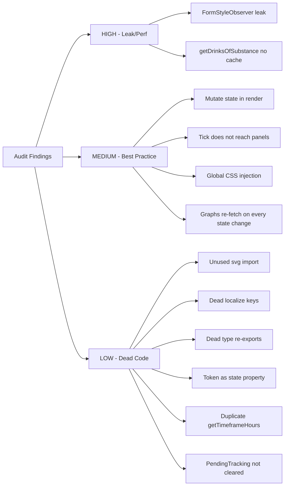

# AX Dose Logger Card — Integration Audit

**Date:** 2026-07-11
**Scope:** `/workspaces/lovelace-pill-logger-card/src/` (all TypeScript source)
**Focus:** Redundant/dead references · HA best-practice violations · Performance / memory leaks

---

## Summary

The card is well-structured — container/presentational split, `CardController` contract, race-guarded fetches, `shouldUpdate` gating, entity-resolution caching. The findings below are refinement opportunities, not architectural flaws. They are ordered by severity.



---

## HIGH — Memory Leak / Performance

### H1. `installEditorGridAlignment()` — MutationObserver leak + global DOM scanning

**File:** [`src/ax-dose-logger-editor.ts`](src/ax-dose-logger-editor.ts:44)

`installEditorGridAlignment()` creates a `MutationObserver` on `document.body` with `{ childList: true, subtree: true }` — it watches **every DOM mutation in the entire dashboard**. It is called from [`connectedCallback()`](src/ax-dose-logger-card.ts:1923), so every card instance installs (or reinstalls) this observer.

**Problems:**

1. **Memory leak** — the module-scoped `_formStyleObserver` is **never disconnected** in `disconnectedCallback()`. When the last card instance is removed from the DOM, the observer persists indefinitely, retaining its callback closure and observing `document.body` forever.
2. **Performance** — `processForms()` runs `document.querySelectorAll('ha-form')` on **every DOM mutation anywhere in the dashboard** (not just this card's shadow DOM). On a busy dashboard with frequent DOM updates, this is a continuous O(forms) scan.
3. **Cross-card pollution** — the injected `<style>` (`align-items: end !important`) is inserted into **every** `ha-form` shadow root in the document, not just this card's config editor. It can alter the layout of **other** custom cards' visual editors that use `type: 'grid'` containers.

**Recommended fix:**

- Move the CSS injection into the card's **own shadow DOM** (e.g., render a `<style>` inside the card's `static styles` that targets `ha-form` within the card's shadow root), or scope the observer to the card's `shadowRoot` / the editor dialog that HA opens for this specific card.
- If global injection is truly needed, disconnect the observer in `disconnectedCallback()` and add a guard so only one observer exists process-wide.
- Better: use HA's `ha-form` `schema` layout options (the `column_min_width` is already used) and avoid CSS injection entirely.

---

### H2. `_getDrinksOfSubstance()` — O(n) entity scan with no cache

**File:** [`src/ax-dose-logger-card.ts`](src/ax-dose-logger-card.ts:712)

Unlike `_resolveEntities()` (which has a cache at [line 200](src/ax-dose-logger-card.ts:200)), `_getDrinksOfSubstance()` does a full `Object.entries(this.hass.entities)` scan on **every call**. It is called from:

- [`_fetchDrinkLowPredictions()`](src/ax-dose-logger-card.ts:875) (Log Drink popup open)
- [`_renderLogDrinkDialog()`](src/ax-dose-logger-card.ts:1122) (every render of the dialog)
- [`_relevantStateChanged()`](src/ax-dose-logger-card.ts:2100) when inventory pane is active — **runs on every HA state change** while the inventory pane is visible
- Panel components via the public [`getDrinksOfSubstance()`](src/ax-dose-logger-card.ts:940) wrapper (Inventory + Tools panels on every render)

**Impact:** On a system with 500+ entities, this is a 500-iteration scan per state change while the inventory pane is open. The master-tracker ResolvedEntities cache doesn't help because drink entities belong to **other** devices (granular drink devices), so they're not in the master's ResolvedEntities.

**Recommended fix:** Add a cache mirroring `_resolvedEntities` — key by `(substance, hass.entities reference)`. Invalidate on config change or entity registry update.

---

## MEDIUM — Best-Practice Violations / Potential Bugs

### M1. Mutating `this._activePane` inside `render()`

**File:** [`src/ax-dose-logger-card.ts`](src/ax-dose-logger-card.ts:1880)

```typescript
// Inside render():
if (this._activePane === 'tracking' && entities.metrics.length === 0) {
  this._activePane = 'daily';   // ← mutating @state during render
}
if (isMaster && medicinePanes.includes(this._activePane)) this._activePane = 'drinks';
if (!isMaster && masterPanes.includes(this._activePane)) this._activePane = 'daily';
```

Lit's documentation explicitly states: **"Do not update reactive properties in `render()`."** Mutating `@state` during render can cause:
- An immediate second render pass (Lit detects the change after the current render completes)
- In rare cases, render loops if the mutation condition is never satisfied

In practice this works because the mutation converges (the fallback pane is valid), but it violates the Lit contract and is fragile.

**Recommended fix:** Move this auto-fallback logic to `willUpdate()` or `updated()`, where reactive property mutations are expected:

```typescript
protected willUpdate(changedProps: PropertyValues) {
  if (changedProps.has('_activePane') || changedProps.has('config') || changedProps.has('hass')) {
    // perform auto-fallback here
  }
}
```

---

### M2. 30-second tick does not propagate to panel components

**File:** [`src/ax-dose-logger-card.ts`](src/ax-dose-logger-card.ts:1989) + [`src/ax-dose-logger-card.ts`](src/ax-dose-logger-card.ts:1896)

The `_tick` `@state` (line 132) bumps every 30s to refresh "Xh XXm" countdowns. The container's `shouldUpdate` (line 2057) returns `true` for `_tick` on the daily/stats/drinks/inventory panes. **But the countdowns live inside the panel components** (daily-panel, stats-panel, drinks-panel), not in the container's template.

When `_tick` changes:
1. Container re-renders ✓
2. Container passes `.controller=${this}` `.entities=${entities}` `.hass=${this.hass}` to the active panel
3. **All three references are unchanged** (controller is `this`, entities is cached, hass hasn't changed since no state update occurred)
4. Lit's default `shouldUpdate` in the panel sees no changed `@property` → **panel does not re-render**
5. The countdown text inside the panel stays stale until the next HA state change

The 30s timer was added specifically to keep countdowns fresh between state changes, but it doesn't reach the panels.

**Recommended fix:** Pass the tick value as a prop to panels that render time-relative content:

```typescript
<ax-dose-daily-panel .controller=${this} .entities=${entities} .hass=${this.hass} .tick=${this._tick}>
```

Or give panels their own tick timer. Or override the panel's `shouldUpdate` to also check `controller`'s tick (less clean).

---

### M3. Global CSS injection affects all `ha-form` elements

**File:** [`src/ax-dose-logger-editor.ts`](src/ax-dose-logger-editor.ts:46)

The injected CSS:
```css
div[style*="display: grid"],
div[style*="display:grid"] {
  align-items: end !important;
}
```

is injected into **every** `ha-form` shadow root in the document, not just this card's editor. Any other custom card that uses `type: 'grid'` in its `getConfigForm()` schema will receive this `align-items: end !important` override, which may not be desired for their layout.

**Recommended fix:** Scope the injection to only the `ha-form` elements that belong to this card's editor. HA opens the card config in a dialog; the observer can check that the `ha-form` is inside a dialog that was triggered for `ax-dose-logger-card` before injecting.

---

### M4. History re-fetch on every state change while on graphs pane

**File:** [`src/ax-dose-logger-card.ts`](src/ax-dose-logger-card.ts:2139)

In `updated()`, when `changedProperties.has('hass')` and the active pane is `'graphs'`:

```typescript
this._fetchDoseHistory(entities);      // custom REST endpoint (in-memory, cheap)
this._fetchAmountHistory(entities);    // HA history/period API (recorder DB query)
this._fetchEffectivenessHistory(entities); // HA history/period API (recorder DB query)
```

ANY watched entity state change (take pill, undo dose, effectiveness slider change) triggers **all three** fetches simultaneously. The amount and effectiveness fetches hit the HA `history/period` endpoint, which queries the **recorder database** — not in-memory data.

The comment at line 2147 claims "the REST endpoint reads in-memory store data (no DB query)", but that only applies to `_fetchDoseHistory` (the custom `ax_dose_logger/history/` endpoint). The HA history API calls **do** query the database.

**Impact:** On a system with a large recorder database, each state change while viewing the graphs pane triggers 2 database-backed history queries. With `minimal_response&significant_changes_only=1` the payload is smaller, but the DB query still runs.

**Recommended fix:** Only re-fetch the specific history that's relevant to the changed entity. For example:
- If `lastDose` or `totalDoses` changed → re-fetch dose history only
- If `amountInBody` changed → re-fetch amount history only
- If an effectiveness `number` entity changed → re-fetch effectiveness history only

Or debounce the re-fetch (e.g., 2-second delay) so rapid successive state changes coalesce into one fetch.

---

## LOW — Dead Code / Redundancy

### L1. `svg` import unused in main card file

**File:** [`src/ax-dose-logger-card.ts`](src/ax-dose-logger-card.ts:1)

```typescript
import { LitElement, html, svg, css, nothing } from 'lit';
```

`svg` is imported but **never used** in this file. All SVG rendering moved to [`graphs-panel.ts`](src/components/graphs-panel.ts:11) (which correctly imports `svg`). The import is dead.

**Fix:** Remove `svg` from the import.

---

### L2. Dead localize keys

**File:** [`src/localize.ts`](src/localize.ts)

| Key | Line | Status |
|-----|------|--------|
| `pane.caffeine` | 17 | Dead — no code references `pane.caffeine`; the pane selector uses `pane.drinks` with substance-aware icons |
| `caffeine.placeholder` | 103 | Dead — comment says "legacy scaffold, retained one release"; well past retention |
| `config.graph_options` | 295 | Dead — comment says "retained for backward compat"; the editor schema uses `graphs_panel` as the expandable name. Localize keys are not a backward-compat concern (they're translation strings, not config keys) |

**Fix:** Remove all three keys.

---

### L3. Type re-exports from main card file — no consumers

**File:** [`src/ax-dose-logger-card.ts`](src/ax-dose-logger-card.ts:39)

```typescript
export type {
  AxDoseLoggerCardConfig,
  AxDoseLoggerHass,
  CardController,
  ResolvedEntities,
  MetricEntity,
  DayBucket,
  DrinkInfo,
  ChipConfig,
} from './types.js';
```

The comment says these are re-exported "for downstream code (the editor module, panel components)." But all downstream modules import directly from `../types.js` / `./types.js` — none import from the card module. These re-exports are dead.

**Fix:** Remove the re-export block (lines 39–48). Keep the import block (lines 25–34) which the card itself uses.

---

### L4. `_predictLowToken` should not be `@state()`

**File:** [`src/ax-dose-logger-card.ts`](src/ax-dose-logger-card.ts:88)

```typescript
@state() private _predictLowToken: number = 0;
```

This is a race-guard token — an internal counter with no rendering impact. Making it `@state()` and listing it in the `shouldUpdate` whitelist (line 2044) means every increment triggers a shouldUpdate evaluation and potential re-render. The token is incremented:
- At the start of `_fetchDrinkLowPredictions()` (line 876) — triggers an unnecessary re-render
- On dialog close (line 1127) — the dialog close already triggers re-render via `_showLogDrinkDialog`

The actual UI update comes from `_drinkLowPredictions` changing (also in the whitelist), so the token itself doesn't need to be reactive.

**Fix:** Change to a plain field: `private _predictLowToken: number = 0;` and remove it from the `shouldUpdate` whitelist.

---

### L5. Duplicate `_getTimeframeHours()` logic

**Files:** [`src/ax-dose-logger-card.ts`](src/ax-dose-logger-card.ts:595) + [`src/components/graphs-panel.ts`](src/components/graphs-panel.ts:75)

Both files define an identical `_getTimeframeHours()` method with the same `switch` on timeframe IDs. The container's version is used for fetch calculations; the panel's for rendering.

**Fix:** Export from `helpers.ts` and import in both, or expose via `CardController`.

---

### L6. `_pendingTracking` Set not cleared on disconnect

**File:** [`src/ax-dose-logger-card.ts`](src/ax-dose-logger-card.ts:125)

`_pendingTracking` is a `Set<string>` that tracks entities with in-flight `set_value` calls. It's cleaned up in `updated()` when HA confirms `logged_today=true` (line 2160). But if the card is disconnected before HA confirms, the entity ID persists in the set. On re-connect, `connectedCallback()` does not clear it, so a stale pending flag could suppress the override dialog on the next tracking change for that entity.

**Fix:** Clear `_pendingTracking` in `connectedCallback()` (alongside the other reset calls at lines 1959–1969), or in `disconnectedCallback()`.

---

### L7. `_computeEntities()` double iteration

**File:** [`src/ax-dose-logger-card.ts`](src/ax-dose-logger-card.ts:236)

The method iterates `Object.entries(this.hass.entities)` **twice**:
1. Lines 236–296: suffix-based categorization
2. Lines 308–373: master-tracker / granular-drink detection

These could be combined into a single pass. However, since the result IS cached by `_resolveEntities()`, this only runs when the device_id or entity registry reference changes — not on every render. The impact is minimal.

**Fix (optional):** Merge into one loop. Low priority.

---

## Not Flags (Confirmed Correct)

These patterns were checked and are **not** problems:

- ✅ `setConfig()` throws on missing `device_id` but allows empty string for stub config — correct HA contract
- ✅ Race-guard tokens for fetches (`_amountFetchToken`, `_doseFetchToken`, `_effectivenessFetchToken`) — properly bumped in `disconnectedCallback()`
- ✅ `shouldUpdate` gating — prevents re-render on every system-wide state tick
- ✅ Entity resolution cache (`_resolvedEntities`) — invalidates on device_id or entity registry reference change
- ✅ `disconnectedCallback()` stops the tick timer and invalidates fetch tokens
- ✅ `connectedCallback()` clears dialog state (prevents stale ha-dialog overlays on back-navigation)
- ✅ `getGridOptions()` uses documented HA sections-view options (no undocumented `rows: 'auto'`)
- ✅ SVG `svg` tag function used correctly in graphs-panel (not `html` for SVG children)
- ✅ `customElements.define` + `window.customCards` registration pattern is standard
- ✅ `fireEvent(this, 'hass-more-info', ...)` for more-info dialog — canonical HA pattern
- ✅ `handleAction` from custom-card-helpers for custom tap/hold/double-tap actions — standard
- ✅ Static imports of panel components (no dynamic `import()`) — correct for HACS single-file delivery

---

## Recommended Action Priority

| Priority | Finding | Effort |
|----------|---------|--------|
| 1 | H1 — Fix MutationObserver leak + scope CSS injection | Medium |
| 2 | M1 — Move state mutation out of `render()` | Small |
| 3 | M2 — Pass tick to panels (or panel-level timer) | Small |
| 4 | H2 — Cache `_getDrinksOfSubstance()` | Small |
| 5 | M4 — Debounce / scope graphs-pane history re-fetch | Medium |
| 6 | L1 — Remove unused `svg` import | Trivial |
| 7 | L2 — Remove dead localize keys | Trivial |
| 8 | L3 — Remove dead type re-exports | Trivial |
| 9 | L4 — Demote `_predictLowToken` from `@state()` | Trivial |
| 10 | L6 — Clear `_pendingTracking` on connect/disconnect | Trivial |
| 11 | L5 — Deduplicate `_getTimeframeHours()` | Small |
| 12 | L7 — Merge `_computeEntities()` double loop | Small |