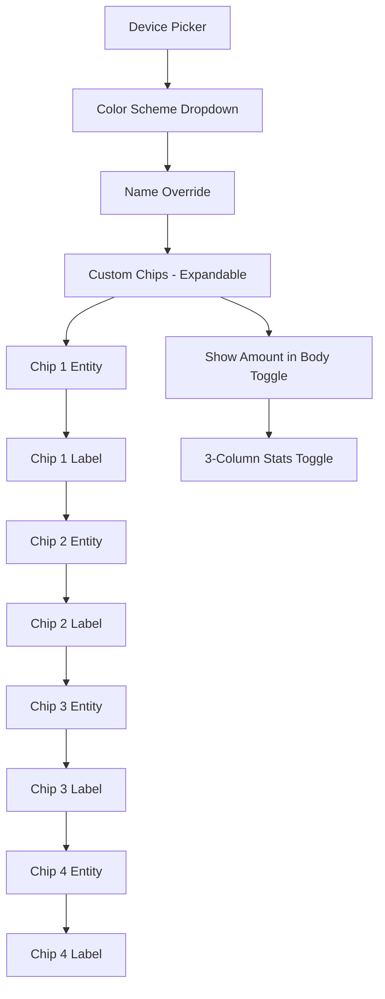

# Plan: Configuration Pane Restructure + Color Scheme + Column Toggle

## Overview

Three changes to the Pill Logger Card configuration pane and rendering:

1. **Chips → Collapsible Submenu**: Move the 8 chip fields into an `expandable` panel
2. **Color Scheme Selector**: Add a `select` dropdown above Name Override with 14 options (Default + 13 distinct colors aligned with medical color-coding standards)
3. **Stats Column Toggle**: Add a `boolean` toggle below "Show Amount in Body" to switch Stats between 2 and 3 columns

---

## Feature 1: Chips in Collapsible Submenu

### HA Form Schema Support

The `getConfigForm()` schema supports `type: "expandable"` which renders a collapsible panel. Key properties:

- `type: "expandable"` — required
- `name` — key for the panel in form data
- `title` — heading text on the panel
- `flatten: true` — **critical**: keeps child fields at the top level of the config object instead of nesting them under a sub-key
- `schema` — list of child controls

Using `flatten: true` means `chip_1`, `chip_1_label`, etc. remain flat top-level properties in the config — no migration needed.

### Schema Change

**Before** (lines 698–744): 8 individual fields at the top level of the schema array.

**After**: Replace those 8 fields with a single expandable panel:

```js
{
  type: 'expandable',
  name: 'chips',
  title: 'Custom Chips',
  flatten: true,
  schema: [
    { name: 'chip_1', selector: { entity: { context: { filter_device_id: 'device_id' } } } },
    { name: 'chip_1_label', selector: { text: {} } },
    { name: 'chip_2', selector: { entity: { context: { filter_device_id: 'device_id' } } } },
    { name: 'chip_2_label', selector: { text: {} } },
    { name: 'chip_3', selector: { entity: { context: { filter_device_id: 'device_id' } } } },
    { name: 'chip_3_label', selector: { text: {} } },
    { name: 'chip_4', selector: { entity: { context: { filter_device_id: 'device_id' } } } },
    { name: 'chip_4_label', selector: { text: {} } },
  ],
}
```

### Config Interface

No changes needed — `chip_1` through `chip_4_label` remain flat fields.

### computeLabel / computeHelper

The `computeLabel` and `computeHelper` callbacks receive the schema object for each field, including fields inside expandable panels. The existing chip label/helper logic will continue to work since it matches on `schema.name` which stays `chip_1`, `chip_1_label`, etc.

Add a label for the expandable panel itself:
```js
// In computeLabel:
chips: 'Custom Chips',
```

---

## Feature 2: Color Scheme Selector

### Config Interface Change

Add to `PillLoggerCardConfig`:
```ts
color_scheme?: string;  // 'default' | 'blue' | 'red' | 'green' | 'yellow' | 'orange' | 'purple' | 'pink' | 'teal' | 'brown' | 'coral' | 'slate' | 'gold' | 'grey'
```

### Schema Addition

Insert **above** the `name` field in `getConfigForm()`:

```js
{
  name: 'color_scheme',
  selector: {
    select: {
      options: [
        { value: 'default', label: 'Default (HA Theme)' },
        { value: 'blue', label: 'Blue' },
        { value: 'red', label: 'Red' },
        { value: 'green', label: 'Green' },
        { value: 'yellow', label: 'Yellow' },
        { value: 'orange', label: 'Orange' },
        { value: 'purple', label: 'Purple' },
        { value: 'pink', label: 'Pink' },
        { value: 'teal', label: 'Teal' },
        { value: 'brown', label: 'Brown' },
        { value: 'coral', label: 'Coral' },
        { value: 'slate', label: 'Slate' },
        { value: 'gold', label: 'Gold' },
        { value: 'grey', label: 'Grey' },
      ],
    },
  },
},
```

### Color Palette Definitions

14 options: Default (no override, uses HA theme) + 13 distinct colors aligned with medical/pharmaceutical color-coding standards.

| # | Name   | `--primary-color` | `--rgb-primary-color` | Medical Use |
|---|--------|-------------------|-----------------------|-------------|
| 0 | Default | —                 | —                     | Uses HA theme accent |
| 1 | Blue   | `#03a9f4`         | 3, 169, 244           | Controlled substances |
| 2 | Red    | `#e53935`         | 229, 57, 53           | Emergency / high-alert |
| 3 | Green  | `#43a047`         | 67, 160, 71           | OTC / non-controlled |
| 4 | Yellow | `#fdd835`         | 253, 216, 53          | Caution / high-alert |
| 5 | Orange | `#fb8c00`         | 251, 140, 0           | Schedule III |
| 6 | Purple | `#7e57c2`         | 126, 87, 194          | Schedule I |
| 7 | Pink   | `#d81b60`         | 216, 27, 96           | Pediatric |
| 8 | Teal   | `#00897b`         | 0, 137, 123           | Respiratory |
| 9 | Brown  | `#795548`         | 121, 85, 72           | Nutritional / supplements |
| 10 | Coral | `#ff7043`         | 255, 112, 67          | Moderate alert |
| 11 | Slate | `#546e7a`         | 84, 110, 122          | Investigational |
| 12 | Gold  | `#daa520`         | 218, 165, 32          | Specialty |
| 13 | Grey  | `#9e9e9e`         | 158, 158, 158         | Dark mode / neutral |

### New Helper Method

```ts
private _getColorOverrides(): string {
  const schemes: Record<string, { primary: string; rgb: string }> = {
    default: { primary: '', rgb: '' },
    blue:    { primary: '#03a9f4', rgb: '3, 169, 244' },
    red:     { primary: '#e53935', rgb: '229, 57, 53' },
    green:   { primary: '#43a047', rgb: '67, 160, 71' },
    yellow:  { primary: '#fdd835', rgb: '253, 216, 53' },
    orange:  { primary: '#fb8c00', rgb: '251, 140, 0' },
    purple:  { primary: '#7e57c2', rgb: '126, 87, 194' },
    pink:    { primary: '#d81b60', rgb: '216, 27, 96' },
    teal:    { primary: '#00897b', rgb: '0, 137, 123' },
    brown:   { primary: '#795548', rgb: '121, 85, 72' },
    coral:   { primary: '#ff7043', rgb: '255, 112, 67' },
    slate:   { primary: '#546e7a', rgb: '84, 110, 122' },
    gold:    { primary: '#daa520', rgb: '218, 165, 32' },
    grey:    { primary: '#9e9e9e', rgb: '158, 158, 158' },
  };
  const scheme = this.config?.color_scheme || 'default';
  const colors = schemes[scheme];
  if (!colors || !colors.primary) return '';  // Default: no overrides, use HA theme
  return `--primary-color: ${colors.primary}; --rgb-primary-color: ${colors.rgb};`;
}
```

### Render Change

Apply the overrides as inline style on `<ha-card>`:

```html
<ha-card style="${this._getColorOverrides()}">
```

This works because CSS custom properties inherit — all child elements inside the shadow DOM that use `var(--primary-color, ...)` and `var(--rgb-primary-color, ...)` will pick up the new values from the `<ha-card>` inline style. When "Default" is selected, the method returns an empty string, so no inline style is set and HA's theme accent color is used naturally.

### CSS Impact

No CSS changes needed. The existing fallback values in `var()` calls serve as defaults when no color scheme override is present. The inline style on `<ha-card>` takes precedence over the fallbacks.

### computeLabel Addition

```js
color_scheme: 'Color Scheme',
```

### computeHelper Addition

```js
if (schema.name === 'color_scheme') {
  return 'Sets the accent color for buttons, icons, and highlights across the card.';
}
```

---

## Feature 3: Stats Column Toggle

### Config Interface Change

Add to `PillLoggerCardConfig`:
```ts
stats_3_columns?: boolean;
```

### Schema Addition

Insert **below** `show_amount_in_body` at the end of the schema array:

```js
{
  name: 'stats_3_columns',
  selector: { boolean: {} },
},
```

### Render Change in `_renderPane3()`

Add a conditional CSS class:

```html
<div class="stats-grid ${this.config?.stats_3_columns ? 'three-col' : ''}">
```

### CSS Addition

```css
.stats-grid.three-col {
  grid-template-columns: 1fr 1fr 1fr;
}
```

### computeLabel Addition

```js
stats_3_columns: '3-Column Stats',
```

### computeHelper Addition

```js
if (schema.name === 'stats_3_columns') {
  return 'Display statistics in 3 columns instead of 2.';
}
```

---

## Final Schema Order

The complete `getConfigForm()` schema array will be:

1. `device_id` — device picker (required)
2. `color_scheme` — select dropdown (14 options: Default + 13 colors)
3. `name` — text input
4. `chips` — **expandable panel** (flatten: true) containing chip_1 through chip_4_label
5. `show_amount_in_body` — boolean toggle
6. `stats_3_columns` — boolean toggle

---

## Files Modified

| File | Changes |
|------|---------|
| `src/pill-logger-card.ts` | Interface additions (`color_scheme`, `stats_3_columns`), `_getColorOverrides()` helper, `_renderPane3()` class toggle, `render()` inline style on ha-card, `getConfigForm()` schema restructure (expandable panel, color_scheme select, stats_3_columns boolean), `computeLabel`/`computeHelper` updates, `setConfig`/`getStubConfig` defaults, CSS `.three-col` rule |
| `dist/pill-logger-card.js` | Rebuilt output |

---

## Mermaid: Config Form Layout



## Mermaid: Color Scheme Flow

```mermaid
flowchart LR
    A[color_scheme config] --> B[_getColorOverrides]
    B --> C{scheme is default?}
    C -- Yes --> D[Return empty string]
    C -- No --> E[Return CSS custom properties]
    D --> F[No inline style on ha-card]
    F --> G[HA theme accent color used naturally]
    E --> H[Inline style on ha-card]
    H --> I[var(--primary-color) cascades to all children]
    H --> J[var(--rgb-primary-color) cascades to all children]
    I --> K[Buttons, icons, accents use new color]
    J --> L[Backgrounds with opacity use new color]