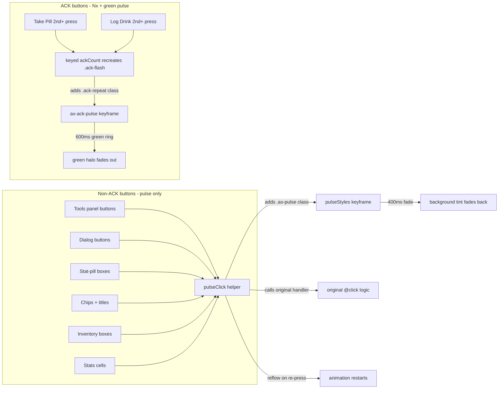

# Consecutive‑Press Background Pulse Animation

## Goal

Add a Mushroom‑Template‑card‑style "consecutive press" background pulse to
qualifying buttons across the card. When the user presses the same button
repeatedly (or re‑presses within a short window), the button's background
flashes to a more vibrant shade of its tint colour, then fades back. The effect
is tactile, animated feedback that a rapid second/third/etc. press landed.

## Scope (user‑confirmed)

### IN scope — three groups

1. **ACK buttons** (Take Pill, Log Drink) — keep the existing `Nx` rapid‑click
   counter AND gain a green background pulse on each repeat press (the 2nd+
   press while the ACK overlay is active). The 1st press already shows the
   green ACK flash, so no extra pulse is needed on the first press; the pulse
   is the "more vibrant shade" cue on repeats.
2. **Repeatable action buttons** — Tools panel buttons (Reset Adherence, Mark
   Adherence Taken, Skip Dose, Undo Dose, Reset History, per‑drink Undo/Reset)
   and dialog action buttons (Refill Confirm, Log Drink drink‑picker rows,
   Override Confirm, Tracking Confirm, Tools Confirm, device‑info buttons).
3. **Dialog‑opener boxes / chips** — Safe to Take, Pills Left, In Body,
   Disruption, Inventory refill box, Inventory avg‑cell, med‑name / drinks‑
   title (device‑info openers), Daily custom chips, Drinks custom chips.

### OUT of scope (explicitly excluded)

- **Navigation bar** pane tabs ([`_renderPaneSelector`](src/ax-dose-logger-card.ts:2214)).
- **State‑toggle controls** in the Graphs panel: timeframe chips, carousel
  prev/next, effectiveness view tabs (avg/individual), effectiveness tracker
  on/off chips. These are single‑shot state switches; a rapid‑repeat pulse
  reads oddly there.
- **Non‑ACK buttons do NOT get an `Nx` counter** — counting "dialog opened 3x"
  or "more‑info opened 3x" is odd. The pulse is the only feedback on non‑ACK
  buttons. The ACK buttons keep their existing `Nx` (unchanged) and gain the
  pulse alongside it.

### No backend change

The pulse is a pure frontend, CSS‑driven affordance. No coordinator / sensor /
button / store / config‑flow change. No new card config option — the pulse is
always‑on behaviour (matches the existing "indicators always on" directive for
the ACK counter).

## Design

### Core mechanism — self‑contained CSS pulse (no per‑button container state)

The non‑ACK buttons are spread across 7 component files + the container's
dialog render methods. Tracking a reactive counter + timer for *every*
clickable element would balloon the container's `@state` surface (one counter +
one timer per element × ~30 elements) and force every panel to re‑render on
every tap. That is the wrong trade‑off for a tactile effect.

Instead, the pulse is **self‑contained per element**:

1. A shared helper `pulseClick(ev, handler)` (in [`helpers.ts`](src/helpers.ts))
   wraps the click handler. It adds a CSS class (`ax-pulse`) to the clicked
   element, schedules a class removal after `PULSE_MS` (400ms), and calls the
   original handler.
2. A shared CSS `@keyframes ax‑press‑pulse` + `.ax‑pulse` rule is injected once
   per panel stylesheet (and the container's dialog stylesheet) via a small
   exported `css` fragment `pulseStyles` from a new `src/styles/pulse.ts`.
3. The class re‑application uses the **animation‑restart trick**: removing +
   re‑adding the class (or toggling a reflow in between) restarts the CSS
   animation, so rapid 2nd/3rd presses re‑flash. The helper handles this by
   clearing the class, forcing `void el.offsetWidth` (reflow), then re‑adding
   it when a press lands while the class is still present.

```ts
// src/helpers.ts
const PULSE_MS = 400;
export function pulseClick<T extends EventTarget>(
  ev: Event,
  handler: (ev: Event) => void,
): void {
  const el = ev.currentTarget as HTMLElement | null;
  if (el) {
    el.classList.remove('ax-pulse');
    // Force reflow so the animation restarts on rapid re‑press.
    void el.offsetWidth;
    el.classList.add('ax-pulse');
    window.setTimeout(() => el.classList.remove('ax-pulse'), PULSE_MS);
  }
  handler(ev);
}
```

> **Why not Lit `@state` + `keyed()` like the ACK counter?** The ACK buttons
> are two elements that already own a reactive counter + timer for the `Nx`
> badge. Replicating that machinery for ~30 elements would add 60 reactive
> properties + 30 timers to the container, each triggering a full card
> `requestUpdate` on every tap. The CSS‑class approach is zero‑state from
> Lit's perspective — the animation is driven entirely by the browser's
> animation engine, and the class is removed automatically after one cycle.
> This is the same pattern Mushroom Template cards use for their press pulse.

### Shared CSS fragment — `src/styles/pulse.ts` (NEW)

```ts
import { css } from 'lit';
// Consecutive‑press background pulse — a vibrant tint flash that fades back.
// Applied by the pulseClick() helper in helpers.ts via the .ax-pulse class.
// The keyframe animates background-color from a vibrant tint to the element's
// normal background; elements override --ax-pulse-color to their own tint.
export const pulseStyles = css`
  @keyframes ax-press-pulse {
    0%   { background-color: var(--ax-pulse-color, rgba(var(--rgb-primary-color, 3, 169, 244), 0.32)); }
    100% { background-color: transparent; }
  }
  .ax-pulse {
    animation: ax-press-pulse 400ms ease-out;
  }
`;
```

Each panel that adopts the pulse adds `${pulseStyles}` to its `static styles`
and, where it wants a non‑default pulse colour, sets `--ax-pulse-color` on the
element (e.g. danger buttons use the error‑color tint).

### Adoption sites — non‑ACK buttons (pulse‑only)

Each site wraps its existing `@click` handler with `(ev) => pulseClick(ev, () =>
originalHandler(...))`. The element must be the `@click`'s `currentTarget`
(the `<button>` / `.stat-pill` / `.chip` / etc.), which it is by default for
`@click` on that element.

| File | Elements | Pulse colour |
|------|----------|--------------|
| [`tools-panel.ts`](src/components/tools-panel.ts:182) | 5 tool buttons + per‑drink Undo/Reset | danger buttons → error tint; others → primary tint |
| [`inventory-panel.ts`](src/components/inventory-panel.ts:94) | refill box, avg‑cell | primary tint |
| [`daily-panel.ts`](src/components/daily-panel.ts:212) | med‑name, Safe‑to‑Take box, Pills Left box, chips | primary tint |
| [`drinks-panel.ts`](src/components/drinks-panel.ts:233) | drinks‑title, In Body box, Disruption box, chips | primary tint |
| [`stats-panel.ts`](src/components/stats-panel.ts:145) | stat cells (more‑info openers) | primary tint |
| [`ax-dose-logger-card.ts`](src/ax-dose-logger-card.ts:1354) dialog buttons | Refill Confirm, Log Drink drink‑picker rows, Override Confirm, Tracking Confirm, Tools Confirm, device‑info buttons | primary tint; danger dialog buttons → error tint |

> The Stats panel stat cells were not in the original three‑group list but are
> dialog‑opener equivalents (more‑info). Including them keeps "dialog‑opener
> boxes" consistent. They are low‑risk additions (one `pulseClick` wrap each).

### ACK buttons — green pulse integrated into the existing `keyed()` mechanism

The ACK buttons already recreate their `.ack-flash` element on each `ackCount`
change via [`keyed(this.ackCount, html\`...\`)`](src/components/daily-panel.ts:239).
The 2nd+ press already adds the `ack-repeat` class (skips the 240ms intro). The
green pulse is a **background flash on the underlying button** (not the
overlay) so the user sees the button surface pulse green behind/around the
overlay on each repeat.

Implementation:

1. The `.ack-repeat` class is currently applied to the `.ack-flash` *overlay*
   div. Add a parallel class `ack-pulse` to the **button element itself**
   (`.take-pill-btn` / `.log-drink-btn`) when `ackCount >= 2`. Because the
   button element is NOT recreated by `keyed()` (only the overlay is), the
   class needs to retrigger the animation on each count change. Lit re‑renders
   the button's class binding on each `ackCount` change, so toggling the class
   string is enough — but CSS will not restart an animation on a class that is
   already present. Two options:
   - **Option A (chosen):** Drive the pulse off the `.ack-flash.ack-repeat`
     overlay element itself — add a `box-shadow` / background pulse keyframe
     to `.ack-repeat` so the overlay (which IS recreated by `keyed()`) pulses
     a brighter green ring on each repeat. This reuses the existing
     recreation mechanism with zero extra state.
   - Option B: Add `keyed()` around the button class string — rejected
     (button is a real `<button>`; wrapping its class in keyed is awkward and
     would recreate the whole button on each press, losing focus).

2. New CSS in both [`daily-panel.ts`](src/components/daily-panel.ts:619) and
   [`drinks-panel.ts`](src/components/drinks-panel.ts:579), scoped to the
   existing `.ack-flash.ack-repeat` rule:

```css
/* Consecutive‑press green pulse on the ACK overlay. The overlay is recreated
   by keyed() on each ackCount change, so the animation restarts naturally on
   each repeat press. A brighter green ring flashes outward from the overlay
   edge, signalling "another press landed" alongside the Nx counter. */
.take-pill-btn .ack-flash.ack-repeat {
  animation:
    ax-btn-ack-fade var(--ack-duration, 3000ms) ease-out forwards,
    ax-ack-pulse 600ms ease-out;
}
@keyframes ax-ack-pulse {
  0%   { box-shadow: 0 0 0 0 rgba(67, 160, 71, 0.55); }
  100% { box-shadow: 0 0 0 12px rgba(67, 160, 71, 0); }
}
```

The drinks panel mirrors this under `.log-drink-btn .ack-flash.ack-repeat`
with its own `ax-drink-ack-pulse` keyframe (unique name to avoid Lit CSS
keyframe collisions across Shadow DOMs).

> The pulse is a `box-shadow` ring (not a `background-color` change) because
> the overlay already paints an opaque `--btn-green-soft` background; a
> brighter background would clash with the tick/text legibility. The ring
> expands outward from the button edge and fades — the Mushroom "vibrant
> shade" cue rendered as a green halo.

### Helper placement

`pulseClick` goes in [`helpers.ts`](src/helpers.ts) (existing shared helpers
file) so every panel + the container can import it without a new module. The
CSS fragment goes in a new `src/styles/pulse.ts` to keep the keyframe +
`.ax-pulse` rule in one place; each adopting stylesheet does
`${pulseStyles}`.

### What does NOT change

- **Backend** — no change.
- **ACK counter (`Nx`)** — unchanged on ACK buttons; not added to non‑ACK
  buttons.
- **Card config** — no new option; pulse is always‑on.
- **Nav bar + Graphs state toggles** — excluded.
- **`shouldUpdate` whitelist** — the pulse uses imperative DOM class toggling
  (`classList.add/remove`) on the clicked element, NOT `@state`, so it never
  flows through `shouldUpdate`. No whitelist change needed (unlike the prior
  ACK‑counter fix).

## Architecture diagram



## Steps

1. **Shared pulse helper** — add `pulseClick()` to [`helpers.ts`](src/helpers.ts);
   add `src/styles/pulse.ts` exporting `pulseStyles`.
2. **Adopt pulse on non‑ACK buttons** — for each adoption site above, import
   `pulseClick` + `pulseStyles`, add `${pulseStyles}` to the panel's
   `static styles`, and wrap each qualifying `@click` with
   `(ev) => pulseClick(ev, () => originalHandler(...))`. Set
   `--ax-pulse-color` on danger buttons (Tools danger, dialog danger) to the
   error‑color tint.
3. **ACK green pulse** — add the `ax-ack-pulse` / `ax-drink-ack-pulse`
   keyframe + the second animation on `.ack-flash.ack-repeat` in both
   [`daily-panel.ts`](src/components/daily-panel.ts:619) and
   [`drinks-panel.ts`](src/components/drinks-panel.ts:579).
4. **Build + verify** — `yarn run build` clean; dist grep for `ax-pulse` +
   `pulseClick` + `ax-ack-pulse`; manual logic trace (single press → one
   flash; rapid re‑press → animation restarts; danger button → red tint;
   ACK 2nd press → green ring + `Nx`).
5. **README + memory bank** — add a short "Consecutive‑Press Pulse" note to
   the README's Logged Dose Indicator / Button State Matrix section; update
   frontend `activeContext.md` + `progress.md`.

## Verification

- `yarn run build` exit 0, no TS errors.
- Dist grep: `ax-pulse` (CSS class + keyframe), `pulseClick` (helper), 
  `ax-ack-pulse` / `ax-drink-ack-pulse` (ACK ring keyframes).
- Logic trace (no HA runtime in the card repo):
  - Non‑ACK button single press → one 400ms background tint flash, fades back.
  - Non‑ACK button rapid re‑press (within 400ms) → animation restarts (reflow
    trick), each press flashes.
  - Danger button (Tools Undo/Reset, dialog danger) → red tint, not primary.
  - ACK button 1st press → green ACK flash (no ring; `ack-repeat` not
    applied).
  - ACK button 2nd+ press → green ACK flash + `ack-repeat` ring pulse + `Nx`.
  - Nav bar tab click → no pulse (not wrapped).
  - Graph timeframe chip click → no pulse (not wrapped).

## Resolved scope decisions

- **No `Nx` on non‑ACK buttons** (user‑confirmed) — counting dialog/more‑info
  opens is odd; the pulse is the only feedback there.
- **Exclude state‑toggle controls** (user‑confirmed) — timeframe chips,
  carousel nav, effectiveness tabs/tracker chips stay single‑shot.
- **ACK pulse is a ring, not a background change** — the overlay already
  paints an opaque green background; a brighter background would hurt
  tick/text legibility. The `box-shadow` ring is the Mushroom "vibrant shade"
  cue rendered as a halo.
- **CSS‑class + reflow, not Lit `@state`** — zero container state for ~30
  elements; the animation is browser‑driven and self‑cleaning.
- **No new config option** — always‑on, matching the ACK counter directive.