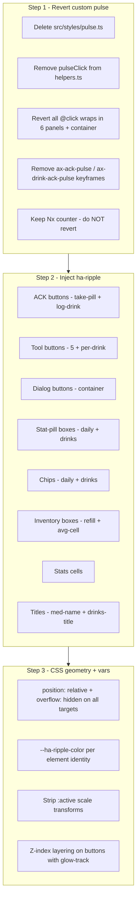

# Consecutive‑Press Ripple — ha‑ripple Migration (Revised Plan)

## Goal

Replace the custom CSS background‑pulse (the "flash so fast you can miss it")
with Home Assistant's native `<ha-ripple>` web component, achieving 1:1 parity
with Lovelace Mushroom card press feedback. Every qualifying clickable element
gets a smooth Material Design radiating‑circle ripple on press; rapid
re‑presses naturally re‑ripple (MdRipple handles consecutive presses itself).
The ACK buttons keep their existing `Nx` counter; the separate green ring
pulse is dropped (ripple is the only press feedback).

## Why the custom pulse failed

The prior implementation used a 400ms `background-color` keyframe driven by an
imperative `classList.add('ax-pulse')` + forced reflow. Two problems:

1. **Too fast / not smooth** — a flat background tint fading over 400ms reads
   as a flash, not a ripple. Mushroom cards use Material Design's `MdRipple`
   which animates a radiating circle from the exact tap point with
   ease‑out‑curve scaling + opacity — a fundamentally different (and
   smoother) visual.
2. **No hover state** — the custom pulse only fired on press; Mushroom cards
   also show a subtle hover tint (`--ha-ripple-hover-opacity: 0.08`) that
   signals "this is interactive" before the press.

## ha‑ripple — verified API (inspected from HA frontend bundle)

`<ha-ripple>` is registered globally by the HA frontend as
`customElements.define("ha-ripple", …)`. It extends Material Web's `MdRipple`.

### Usage patterns (from HA frontend source)

1. **Nested (Mushroom style — preferred):** inject `<ha-ripple></ha-ripple>`
   as a child of the interactive element. MdRipple auto‑detects pointer
   events on its host/parent and ripples from the tap point.
   ```ts
   <button class="my-btn"><ha-ripple></ha-ripple>…content…</button>
   ```
2. **`for` attribute:** `<ha-ripple for="targetId"></ha-ripple>` when the
   ripple can't be a direct child. Not needed here — all our elements can
   host the ripple as a child.

### Properties
- `disabled` (boolean) — suppresses the ripple. Bind to the button's disabled
  state (e.g. Log Drink button when no substance).

### CSS variables (defaults from the ha‑ripple source)
| Variable | Maps to (MdRipple) | Default | Purpose |
|----------|-------------------|---------|---------|
| `--ha-ripple-color` | hover + pressed color | `--secondary-text-color` | One‑stop color override |
| `--ha-ripple-hover-color` | `--md-ripple-hover-color` | inherits `--ha-ripple-color` | Hover tint color |
| `--ha-ripple-pressed-color` | `--md-ripple-pressed-color` | inherits `--ha-ripple-color` | Press ripple color |
| `--ha-ripple-hover-opacity` | `--md-ripple-hover-opacity` | `0.08` | Hover tint strength |
| `--ha-ripple-pressed-opacity` | `--md-ripple-pressed-opacity` | `0.12` | Press ripple strength |

### Geometry requirements (from Gemini guidance + MdRipple docs)
- Parent element must have `position: relative` (so the ripple's
  `position: absolute` surface is clipped to the parent).
- Parent element must have `overflow: hidden` (so the ripple doesn't spill
  past the border radius).
- The ripple inherits `border-radius` from the parent via MdRipple's internal
  surface — no extra border‑radius rule needed.

## Scope (unchanged from the prior plan's user confirmations)

### IN — all get `<ha-ripple>` nested inside
1. **ACK buttons** — Take Pill ([`daily-panel.ts`](src/components/daily-panel.ts:220)),
   Log Drink ([`drinks-panel.ts`](src/components/drinks-panel.ts:241)). Keep
   `Nx` counter; drop the green ring pulse.
2. **Repeatable action buttons** — Tools panel 5 buttons + per‑drink
   Undo/Reset ([`tools-panel.ts`](src/components/tools-panel.ts:182)); dialog
   action buttons in [`ax-dose-logger-card.ts`](src/ax-dose-logger-card.ts:1354)
   (device‑info buttons, Refill Confirm, Log Drink drink‑picker rows, Override
   Confirm, Tools Confirm, Tracking Confirm).
3. **Dialog‑opener boxes / chips** — Safe to Take, Pills Left
   ([`daily-panel.ts`](src/components/daily-panel.ts:252)), In Body, Disruption
   ([`drinks-panel.ts`](src/components/drinks-panel.ts:268)), Inventory refill
   box + avg‑cell ([`inventory-panel.ts`](src/components/inventory-panel.ts:94)),
   med‑name / drinks‑title, Daily + Drinks custom chips, Stats cells
   ([`stats-panel.ts`](src/components/stats-panel.ts:145)).

### OUT (excluded — unchanged)
- **Navigation bar** pane tabs.
- **Graphs state toggles** — timeframe chips, carousel nav, effectiveness
  tabs/tracker chips.

## Design

### Step 1 — Revert the custom pulse code

Remove everything added by the prior plan:

| File | Revert |
|------|--------|
| [`src/styles/pulse.ts`](src/styles/pulse.ts) | **DELETE** the file |
| [`src/helpers.ts`](src/helpers.ts) | Remove the `pulseClick` function + the `import { PULSE_MS } from './styles/pulse.js'` line |
| [`src/components/tools-panel.ts`](src/components/tools-panel.ts) | Remove `pulseClick` + `pulseStyles` imports; revert all `@click` handlers to their original `() => this._handleFoo(e)` form; remove `${pulseStyles}` + the `.tool-btn.danger { --ax-pulse-color }` rule |
| [`src/components/inventory-panel.ts`](src/components/inventory-panel.ts) | Remove imports; revert `@click` handlers; remove `${pulseStyles}` |
| [`src/components/stats-panel.ts`](src/components/stats-panel.ts) | Same |
| [`src/components/daily-panel.ts`](src/components/daily-panel.ts) | Remove imports; revert `@click` handlers (med‑name, Safe‑to‑Take, Pills Left, chips); remove `${pulseStyles}`; remove `ax-ack-pulse` keyframe + the second animation on `.ack-flash.ack-repeat` (revert to the original single `ax-btn-ack-fade` animation) |
| [`src/components/drinks-panel.ts`](src/components/drinks-panel.ts) | Same (remove `ax-drink-ack-pulse` keyframe + revert `.ack-flash.ack-repeat`) |
| [`src/ax-dose-logger-card.ts`](src/ax-dose-logger-card.ts) | Remove `pulseClick` + `pulseStyles` imports; revert dialog button `@click` handlers; remove `${pulseStyles}` from the stylesheet |

> The `Nx` counter code (the `_dailyAckCount` / `_drinksAckCount` state, the
> `keyed()` render, the `.ack-count-badge` CSS) is **NOT** reverted — it stays
> as the ACK consecutive‑press counter. Only the pulse/ring additions are
> reverted.

### Step 2 — Inject `<ha-ripple>` into every qualifying element

For each interactive element, add `<ha-ripple></ha-ripple>` as the **first
child** (so it renders behind the content via z‑index — MdRipple's surface is
`position: absolute; inset: 0` with a default z‑index that sits above the
background but below content when the content is positioned; we add a small
`z-index: 0` on content if needed).

**Buttons (`<button>`)** — inject as first child:
```ts
<button class="take-pill-btn" @click=${() => c.handleTakePill(e)}>
  <ha-ripple></ha-ripple>
  <div class="glow-track"></div>
  <ha-icon icon="mdi:pill"></ha-icon>
  …
</button>
```

**Clickable divs (`.stat-pill`, `.chip`, `.avg-cell`, stat cells, med‑name)**
— inject as first child:
```ts
<div class="stat-pill clickable" role="button" …>
  <ha-ripple></ha-ripple>
  <ha-icon icon="mdi:shield-check"></ha-icon>
  …
</div>
```

**Dialog buttons (`.dialog-btn`)** — inject as first child.

**Disabled‑aware (Log Drink button)** — bind `?disabled`:
```ts
<button class="log-drink-btn" ?disabled=${!substance} @click=${…}>
  <ha-ripple ?disabled=${!substance}></ha-ripple>
  …
</button>
```

### Step 3 — CSS geometry + variables

#### 3a. Geometry — ensure `position: relative` + `overflow: hidden`

| Selector | Current | Action |
|----------|---------|--------|
| `.take-pill-btn` | has `position: relative; overflow: hidden` ✓ | No change |
| `.log-drink-btn` | has `position: relative; overflow: hidden` ✓ | No change |
| `.tool-btn` | **no `position: relative`** | Add `position: relative; overflow: hidden` |
| `.stat-pill` (daily/drinks) | no `position: relative` | Add `position: relative; overflow: hidden` |
| `.stat-pill` (inventory) | no `position: relative` | Add `position: relative; overflow: hidden` |
| `.avg-cell` (inventory) | no `position: relative` | Add `position: relative; overflow: hidden` |
| `.chip` (daily/drinks) | no `position: relative` | Add `position: relative; overflow: hidden` |
| `.stat-cell` (stats) | no `position: relative` | Add `position: relative; overflow: hidden` |
| `.med-name` / `.drinks-title` | no `position: relative` | Add `position: relative; overflow: hidden` + `border-radius` (so the ripple clips to a rounded rect; currently no radius on the title) |
| `.dialog-btn` (container) | check + add if missing | Add `position: relative; overflow: hidden` |

#### 3b. Ripple color variables

Set `--ha-ripple-color` per element to match its visual identity. The ripple
should use the element's own tint color, not the default `--secondary-text-color`
(grey). Shared default (set once per stylesheet `:host`):
```css
:host {
  --ha-ripple-color: var(--primary-color, #03a9f4);
  --ha-ripple-hover-opacity: 0.04;
  --ha-ripple-pressed-opacity: 0.12;
}
```

Per‑element overrides:
| Element | `--ha-ripple-color` |
|---------|---------------------|
| `.tool-btn.danger` (Undo/Reset) | `var(--error-color, #db4437)` |
| `.take-pill-btn.state-lockout` | `var(--btn-red)` |
| `.take-pill-btn.state-execution` | `var(--btn-blue)` |
| `.take-pill-btn.state-latency` | `var(--btn-amber)` |
| `.ack-flash` (when active) | `var(--btn-green)` — so the ripple on the ACK overlay is green |

> The state‑colored ripples on the Take Pill button mean the press feedback
> matches the button's current medical state — a red ripple on lockout, amber
> on latency, etc. This is a richer affordance than Mushroom's single‑color
> ripple and fits the card's Button State Matrix.

#### 3c. Strip `:active` scale transforms (Gemini guidance)

MdRipple provides the press feedback; the `transform: scale()` compression is
redundant + can fight the ripple's layout. Remove:
| Selector | Rule to remove |
|----------|---------------|
| `.take-pill-btn:active` | `transform: scale(0.96)` |
| `.log-drink-btn:active` | `transform: scale(0.96)` |
| `.tool-btn:active` | `transform: scale(0.98)` |
| `.dialog-btn:active` (if present) | any `transform: scale()` |

Also remove `transform` from the `transition` shorthand where it was only
there for the scale (keep `background` + `box-shadow` transitions):
```css
/* before */ transition: transform 0.15s, background 0.2s, box-shadow 0.2s;
/* after  */ transition: background 0.2s, box-shadow 0.2s;
```

#### 3d. Z‑index layering (ensure ripple sits above bg, below content)

MdRipple's surface defaults to a low z‑index. For elements where the
background is a solid tint (`.stat-pill`, `.chip`, `.tool-btn`), the ripple
renders above the background naturally. For the Take Pill / Log Drink buttons
which have the `.glow-track` layer (z‑index: 0) + content, add:
```css
.take-pill-btn > ha-ripple,
.log-drink-btn > ha-ripple {
  z-index: 1;
}
```
This sits the ripple above the `.glow-track` (z‑0) but below the icon/label
(which are the default flow content, z auto > 1). The `.ack-flash` overlay is
z‑index: 2, so the ripple stays under the ACK flash — correct (the ACK flash
is a separate success indicator; the ripple is the press feedback).

### Step 4 — ACK button specifics

The Take Pill / Log Drink buttons get `<ha-ripple>` like every other button.
On a repeat press (2nd+ while ACK active), the ripple fires again (MdRipple
handles consecutive presses) AND the `Nx` counter updates via the existing
`keyed()` mechanism. The green ring pulse is removed (reverted in Step 1).

The `.ack-flash` overlay (z‑index: 2, `pointer-events: none`) sits above the
ripple, so during the ACK flash the ripple is hidden behind the green overlay —
which is fine because the ACK flash itself is the success feedback. The
ripple is visible on the 1st press before the ACK flash becomes opaque
(240ms intro), and on subsequent presses it plays under the flash. The `Nx`
counter is the consecutive‑press cue on the ACK buttons; the ripple is the
general press cue on all buttons.

### Step 5 — Runtime dependency note

`<ha-ripple>` is **not bundled** in the card's rollup output — it relies on
HA's global custom element registry (HA's frontend defines it at load time).
This is the same approach Mushroom cards use and is safe in production HA. The
card's `yarn run build` will compile clean (the `<ha-ripple>` tag is just an
unknown HTML element to TypeScript/Lit). If the card is ever loaded outside
HA (e.g. a standalone test harness), the ripple won't render but the buttons
still work — graceful degradation.

No TypeScript type declaration is needed for `<ha-ripple>` because Lit's
`html` template tag accepts unknown custom element tags. (If we want strict
typing, a `declare global { interface HTMLElementTagNameMap { 'ha-ripple': HTMLElement } }` can be added — optional.)

## Architecture diagram



## Steps

1. **Revert custom pulse** — delete `src/styles/pulse.ts`; remove `pulseClick`
   + `pulseStyles` imports + usages from all 7 files; revert `@click` handlers
   to original; remove `ax-ack-pulse` / `ax-drink-ack-pulse` keyframes + the
   `.ack-flash.ack-repeat` second animation. **Keep** the `Nx` counter code.
2. **Inject `<ha-ripple>`** — add `<ha-ripple></ha-ripple>` (or
   `<ha-ripple ?disabled=${…}></ha-ripple>` for the Log Drink button) as the
   first child of every qualifying element across all 7 files.
3. **CSS geometry** — add `position: relative; overflow: hidden` to
   `.tool-btn`, `.stat-pill`, `.avg-cell`, `.chip`, `.stat-cell`,
   `.med-name`, `.drinks-title`, `.dialog-btn` where missing.
4. **CSS ripple variables** — set `:host { --ha-ripple-color: var(--primary-color); --ha-ripple-hover-opacity: 0.04; --ha-ripple-pressed-opacity: 0.12 }` per stylesheet; per‑element overrides for danger (red) + Take Pill state colors (red/blue/amber) + ACK green.
5. **Strip `:active` scale** — remove `transform: scale(...)` from
   `.take-pill-btn:active`, `.log-drink-btn:active`, `.tool-btn:active`, and
   the `transform` from their `transition` shorthands.
6. **Z‑index layering** — add `.take-pill-btn > ha-ripple,
   .log-drink-btn > ha-ripple { z-index: 1 }` so the ripple sits above the
   `.glow-track` but below content + the ACK flash.
7. **Build + verify** — `yarn run build` clean; dist grep for `ha-ripple`;
   manual logic trace (press → ripple from tap point; hover → subtle tint;
   rapid re‑press → re‑ripple; disabled Log Drink → no ripple; ACK 2nd press
   → ripple under flash + Nx updates; nav/toggles → no ripple).
8. **README + memory bank** — update the "Consecutive‑press pulse" paragraph
  → "Press ripple (ha‑ripple)" describing the Material ripple + hover tint +
  state‑colored ripples; update `activeContext.md` + `progress.md`.

## Verification

- `yarn run build` exit 0, no TS errors.
- Dist grep: `ha-ripple` present in the rendered template strings (count
  should be ~30+ — one per qualifying element).
- Logic trace (no HA runtime in the card repo):
  - Any qualifying button press → smooth radiating ripple from tap point.
  - Hover over a qualifying element → subtle tint (opacity 0.04).
  - Rapid re‑press → MdRipple re‑ripples (its native consecutive‑press
    handling).
  - Log Drink button with no substance (disabled) → no ripple.
  - Take Pill in lockout state → red ripple; latency → amber; execution → blue.
  - ACK 2nd press → ripple plays under the green ACK flash + `Nx` updates.
  - Nav bar tab / Graph timeframe chip → no ripple (no `<ha-ripple>` injected).
  - Card loaded outside HA → buttons work, no ripple rendered (graceful).

## Resolved scope decisions

- **All buttons including ACK get `<ha-ripple>`** (user‑confirmed) — ripple is
  the only press feedback; the separate green background pulse / ring is
  dropped entirely. ACK buttons keep the `Nx` counter.
- **`<ha-ripple>` nested, not `for`** — all our elements can host the ripple
  as a direct child, so the simpler nested pattern is used (Mushroom style).
- **State‑colored ripples on Take Pill** — the ripple color matches the
  button's current medical state (red/amber/blue/green), richer than
  Mushroom's single color + fits the Button State Matrix.
- **Runtime dependency on HA's global registry** — safe in production HA
  (Mushroom does the same); graceful degradation outside HA.
- **Strip `:active` scale transforms** (Gemini guidance) — MdRipple is the
  press feedback; the scale compression is redundant + can fight the ripple.
- **Hover opacity 0.04** (Gemini guidance) — slightly lower than ha‑ripple's
  default 0.08 so the hover tint is subtle, matching Mushroom's restrained
  hover.