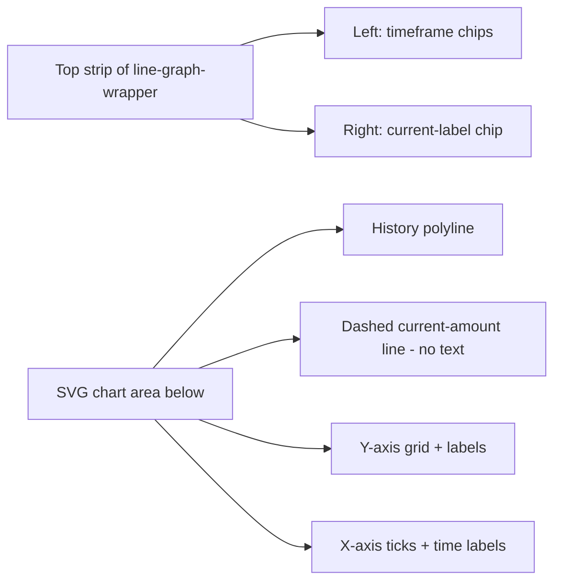

# Current Label Overlap Fix — Architecture Plan

## Problem

The "Current: X mg" label in the **Amount-in-Body** line graph ([`_renderLineGraph`](src/components/graphs-panel.ts:265)) overlaps the history polyline and the dashed current-amount line, rendering both illegible.

### Root Cause

The label is an SVG `<text>` element drawn **inside the chart plotting area** at [`graphs-panel.ts:407`](src/components/graphs-panel.ts:407):

```
x = padLeft (36)          → left edge of chart = oldest history data
y = currentLabelY
    = max(padTop + 8, currentY - 5)   → just above the dashed current-amount line
```

The history polyline ([`graphs-panel.ts:399`](src/components/graphs-panel.ts:399)) occupies the same chart area `y ∈ [padTop, padTop + chartH]`. Because the label sits at `x = padLeft` (where the polyline *starts*, oldest data) and `y ≈ currentY` (the dashed line's height), whenever the amount-in-body value is high the polyline crosses right through the label text and the dashed line runs underneath it. SVG `<text>` has no background, so nothing defends it against overlap.

### Why now

The `show_amount_in_body` toggle (default ON via `!== false`, recently given `default: true` in the editor schema) means most users see this graph. The overlap is most visible at 48H timeframe where the polyline starts in the top-left at the oldest data point — exactly where the label sits.

## User-Requested Direction

> "Move the time scale buttons to the left side, so the current can be displayed on the right side in the same font and size."

Concretely:
1. The timeframe chips (currently `position: absolute; top: 4px; right: 4px` on all three graphs) move to the **left** side.
2. The "Current" amount value becomes an HTML label in the **top-right** of the line graph, styled as a pill chip matching the timeframe chips (same font, same size, same pill background).
3. The SVG `<text>` "Current:" label is removed entirely; the dashed current-amount line stays in the SVG.

## Architecture Overview



## Implementation Steps

### Step 1 — CSS: move timeframe chips to the left

**File:** [`src/components/graphs-panel.ts`](src/components/graphs-panel.ts) — `static styles`

The `.timeframe-chips` block (currently at ~line 838) changes `right: 4px` → `left: 4px`. This single rule covers all three graphs (bar, line, effectiveness) because they share the class.

```css
.timeframe-chips {
  position: absolute;
  top: 4px;
  left: 4px;          /* was: right: 4px */
  display: flex;
  gap: 2px;
  z-index: 1;
}
```

**Why one rule covers all three:** `_renderBarGraph`, `_renderLineGraph`, and `_renderEffectivenessGraph` all render `<div class="timeframe-chips">` inside a `position: relative` wrapper (`.bar-graph-wrapper` / `.line-graph-wrapper`). The absolute positioning is class-scoped, so flipping the side moves chips left on all three graphs uniformly.

### Step 2 — CSS: add the `.current-label` chip style

**File:** [`src/components/graphs-panel.ts`](src/components/graphs-panel.ts) — `static styles`

Add a new class that mirrors the `.timeframe-chip` visual language (same pill background, same font-size, same font-weight) but sits in the top-right. It reuses HA's primary color tokens so it tracks the card's configured color scheme via [`getColorOverrides`](src/helpers.ts:78).

```css
.current-label {
  position: absolute;
  top: 4px;
  right: 4px;
  padding: 4px 10px;
  font-size: 12px;
  font-weight: calc(500 * var(--pill-font-weight-boost, 1));
  border-radius: 4px;
  color: var(--primary-color);
  background: rgba(var(--rgb-primary-color, 3, 169, 244), 0.08);
  border: none;
  font-family: inherit;
  line-height: 1.4;
  white-space: nowrap;
  z-index: 1;
}
```

**Design notes:**
- Same `font-size: 12px`, `padding: 4px 10px`, `border-radius: 4px` as `.timeframe-chip` so the two sides read as a matched pair.
- Uses `--primary-color` text (not the chip's `--secondary-text-color`) so the current value pops as the focal point — matching the old SVG text's `fill="var(--primary-color)"`.
- `white-space: nowrap` prevents the value+unit from wrapping on narrow cards.

### Step 3 — SVG geometry: clear left chips from the top Y-axis label

The chips now sit top-left over `x = padLeft` — the same region as the top Y-axis label (`(maxAmount).toFixed(1)` at [`graphs-panel.ts:392`](src/components/graphs-panel.ts:392), rendered at `x = padLeft - 4, text-anchor: end`). The chips (height ~24px from `4px 10px` padding + 12px font + line-height) would clip the top Y-axis number.

**Fix:** increase `padTop` by 8px on all three graphs and grow `h` by 8px so `chartH` stays 144 (the carefully-matched Y-axis height documented in the file header comments). The Y-axis labels then start 8px lower, clearing the chips.

| Graph | `padTop` | `h` | `chartH` (unchanged) |
|-------|---------|-----|----------------------|
| Bar   | 28 → 36 | 180 → 188 | 144 (188-36-8) |
| Line  | 28 → 36 | 200 → 208 | 144 (208-36-28) |
| Effectiveness | 28 → 36 | 196 → 204 | 144 (204-36-24) |

**Wait — verify chartH math:**
- Bar: `chartH = h - padTop - padBottom = 188 - 36 - 8 = 144` ✓
- Line: `chartH = h - padTop - padBottom = 208 - 36 - 28 = 144` ✓
- Effectiveness: `chartH = h - padTop - padBottom = 204 - 36 - 24 = 144` ✓

**Also update `aspect-ratio` styles** in each `_render*Graph` template (`style="aspect-ratio: 320/180"` → `320/188`, `320/200` → `320/208`, `320/196` → `320/204`) so the SVG keeps its intrinsic dimensions correct.

**Also update the file-header comments** in [`graphs-panel.ts:272-278`](src/components/graphs-panel.ts:272) (line graph) and [`graphs-panel.ts:534-547`](src/components/graphs-panel.ts:534) (effectiveness) that document the `h`/`chartH` rationale — they currently say "h bumped 180 → 200" / "h bumped 180 → 196" to match the bar graph's 144 chartH. Update to reflect the new heights and the padTop bump's reason (clearing left-side chips).

**Alternative considered (rejected):** lowering only the top Y-axis label. Rejected because the gridline stays at `padTop` — the chip would still overlap the top gridline. Bumping `padTop` clears both the gridline and the label cleanly.

### Step 4 — Remove the SVG "Current:" text from `_renderLineGraph`

**File:** [`src/components/graphs-panel.ts`](src/components/graphs-panel.ts:404-410)

Delete the SVG `<text>` block inside the `amountInBody && amountInBody !== 'unavailable'` branch. **Keep the dashed `<line>`** (it's the visual reference tying the HTML label to the chart). The branch becomes:

```typescript
<!-- Current amount dashed line (label rendered as HTML chip) -->
${amountInBody && amountInBody !== 'unavailable' ? svg`
  <line x1="${padLeft}" y1="${currentY}" x2="${w - padRight}" y2="${currentY}"
        stroke="var(--primary-color)" stroke-width="1" stroke-dasharray="4,3" opacity="0.6"/>
` : nothing}
```

**Also remove** the `currentLabelY` computation at [`graphs-panel.ts:321`](src/components/graphs-panel.ts:321) — it was only used by the deleted SVG text. The `currentY` computation (line 317-320) stays because the dashed line still needs it.

### Step 5 — Add the HTML `.current-label` chip to `_renderLineGraph`

**File:** [`src/components/graphs-panel.ts`](src/components/graphs-panel.ts:380-433)

The `_renderLineGraph` return template currently ends with just the `<svg>`. Wrap it so the HTML chip sits in the top-right of `.line-graph-wrapper` (already `position: relative`):

```typescript
return html`
  <div class="line-graph-wrapper">
    <div class="timeframe-chips">
      ${this._renderTimeframeChips()}
    </div>
    ${amountInBody && amountInBody !== 'unavailable' && !isNaN(parseFloat(amountInBody)) ? html`
      <div class="current-label">
        ${localize(this._lang, 'graphs.current')}: ${Math.round(parseFloat(amountInBody))} ${c.getStrengthUnit(entities)}
      </div>
    ` : nothing}
    <svg viewBox="0 0 ${w} ${h}" class="chart-svg" preserveAspectRatio="xMidYMid meet" style="aspect-ratio: ${w}/${h}">
      <!-- ... existing SVG body (grid, polyline, dashed line, axis) ... -->
    </svg>
  </div>
`;
```

**Localize key:** add `graphs.current` = `"Current"` to [`src/localize.ts`](src/localize.ts) (replacing the hardcoded `Current:` in the old SVG text — the old SVG text was hardcoded English, this is a small localization improvement).

**Gate:** the chip renders only when `amountInBody` is a parseable number (same condition the old SVG text used via `currentY`). When unavailable, no chip — the line graph's top-right is just empty, matching the old behavior where no text rendered.

**Why HTML not SVG:** HTML text automatically handles font-size `calc()` + HA CSS vars with no `paint-order` hackery, and absolute positioning in `.line-graph-wrapper`'s top strip keeps it permanently out of the polyline's chart area. The dashed line inside the SVG still visually connects the chip to the current amount level.

### Step 6 — Build, verify, update memory-bank + README

1. `cd /workspaces/lovelace-pill-logger-card && yarn run build` — must exit 0, no warnings.
2. Grep `dist/ax-dose-logger-card.js` to confirm: `.current-label` CSS present, `.timeframe-chips` has `left: 4px` (not `right: 4px`), the SVG `Current:` text block is gone, `graphs.current` string is present.
3. Update [`README.md`](README.md) — only the Graphs Tab section if it mentions the current label position. (Likely no change needed — README describes features, not chip positioning.)
4. Update [`memory-bank/activeContext.md`](memory-bank/activeContext.md) — new Current Status block, archive the previous two blocks per the truncation rule.
5. Update [`memory-bank/progress.md`](memory-bank/progress.md) — append a new feature section with the step checklist.
6. No `projectstructure.md` change (no files added/renamed/deleted — only edits to existing files).

## Files Modified

| File | Change |
|------|--------|
| [`src/components/graphs-panel.ts`](src/components/graphs-panel.ts) | CSS: `.timeframe-chips` `right→left`; new `.current-label` class; SVG `padTop`/`h`/`aspect-ratio` bumps on all 3 graphs. TS: remove SVG `Current:` `<text>` + `currentLabelY`; add HTML `.current-label` chip in `_renderLineGraph`; update header comments. |
| [`src/localize.ts`](src/localize.ts) | Add `graphs.current` = `"Current"` key. |
| [`dist/ax-dose-logger-card.js`](dist/ax-dose-logger-card.js) | Rebuilt via `yarn run build`. |
| [`memory-bank/activeContext.md`](memory-bank/activeContext.md) | New current status block. |
| [`memory-bank/progress.md`](memory-bank/progress.md) | New feature section. |

## Key Design Decisions

1. **HTML chip, not SVG text + halo** — the user explicitly asked for the current value to match the timeframe chips' font/size on the opposite side. An HTML element is the only way to get identical styling to the chips (which are HTML buttons). SVG text with a `paint-order` halo would have kept the legibility but couldn't match the chip's pill background + font-weight calc.

2. **Chips left, current right — one CSS rule each, shared across all 3 graphs** — the `.timeframe-chips` and `.current-label` classes are not graph-specific. Moving chips left affects bar + line + effectiveness uniformly (consistent UX), and the `.current-label` only renders on the line graph (the other graphs have no "current" concept), so adding the CSS class globally is harmless.

3. **`padTop` bump preserves `chartH = 144`** — the file's existing design invariant ("all three graphs equally-tall Y axis") is preserved by growing `h` by exactly the `padTop` delta. The bump's rationale (clearing left-side chips from the top Y-axis label/gridline) is documented in the updated header comments.

4. **Dashed line stays in the SVG** — the line is the visual anchor tying the HTML chip's value to a chart height. Removing it would orphan the "Current" number from the graph; keeping it preserves the existing visual semantics with zero overlap risk (a 1px dashed line never made text illegible).

5. **`graphs.current` localize key** — replaces the old hardcoded `Current:` SVG text. Small localization win, and the key already had a natural home in the `graphs.*` namespace.

6. **No backend change** — purely frontend; the amount-in-body value + strength unit are already read by `_renderLineGraph`. No config-flow / sensor / coordinator / store changes.

## Verification

- `yarn run build` clean (exit 0, no warnings).
- Visual: at 48H timeframe with a high amount-in-body value, the "Current: X mg" chip sits top-right, the polyline starts top-left unobstructed, the dashed line runs across the chart, and the left-side timeframe chips no longer collide with the top Y-axis label.
- Visual: bar graph + effectiveness graph timeframe chips now sit top-left (consistent with the line graph); their top Y-axis labels clear the chips thanks to the `padTop` bump.