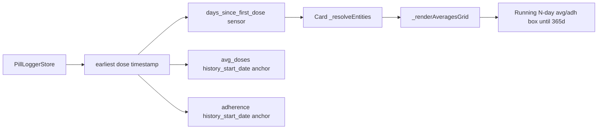

# Plan — Days Since First Pill Sensor + Running Avg/Adherence Boxes

## Goal
1. Add a backend sensor counting days since the **first recorded dose** (not setup time).
2. Re-anchor `avg_doses` and `adherence` windows to the first dose timestamp so a device set up before any pills are taken does not crush averages/adherence.
3. Frontend: in the Graph panel averages grid, only show the 7/14/30/Year Day-Avg and Adherence boxes once their window has actually elapsed. Until 365 days have passed, show a running "{N}-day avg" box (and "{N}-day Adh" box) representing the elapsed-days average.

## Current Behavior Problem
- [`avg_doses.py:56`](../Home-Assistant-Pill-Logger/custom_components/pill_logger/sensors/avg_doses.py:56) and [`adherence.py:108`](../Home-Assistant-Pill-Logger/custom_components/pill_logger/sensors/adherence.py:108) set `history_start_date = dt_util.now()` on first setup when no restored state exists.
- Result: setting up a device a week before taking any pills starts the window ticking from setup → averages and adherence are penalized for the pre-dose days.
- The "running window" math (`effective_window_days = min(days_since_start, window_days)`) already exists in both sensors — it is just anchored to the wrong date.
- Frontend [`_renderAveragesGrid()`](src/pill-logger-card.ts:900) always shows all 4 Day-Avg + 4 Adherence boxes with fixed labels regardless of elapsed time.

## Architecture

## Backend Changes (`/workspaces/Home-Assistant-Pill-Logger/`)

### 1. New sensor: `sensors/days_since_first_dose.py`
- Class `PillDaysSinceFirstDoseSensor(RestoreSensor)`.
- `should_poll = False`; listens to `pill_taken_{entry_id}`, `pill_undone_{entry_id}`, `pill_reset_{entry_id}` dispatcher signals.
- On `async_added_to_hass`: read dose history from `hass.data[DOMAIN]["_store"].get_history(entry_id)`, find earliest timestamp. Also restore last state. If no doses yet → `_attr_native_value = 0` (or `None` with reason attribute "No doses recorded yet").
- `_attr_native_value` = integer days = `max(0, (now - earliest_dose).days)`.
- Attributes: `first_dose_timestamp` (iso or None), `history_start_date` (mirrors earliest dose for consistency with other sensors).
- Icon: `mdi:calendar-start`.
- `state_class = MEASUREMENT`.
- Updates on `pill_taken` (recompute earliest if new dose is earlier — rare but possible after undo/reset), `pill_undone`, `pill_reset` (reset → 0/None), and a midnight `async_track_time_change` tick so the day count rolls over at local midnight.
- Device info via `(DOMAIN, entry_id)` identifiers, matching other sensors.

### 2. Re-anchor `avg_doses.py`
- In `async_added_to_hass`, after restoring `_history_start_date` from last state: if store has dose history, set `_history_start_date = earliest_dose_timestamp` (overrides the `dt_util.now()` fallback at line 56-57).
- Keep the existing `if self._history_start_date is None: self._history_start_date = dt_util.now()` as a last-resort fallback only when there are genuinely no doses and no restored state.
- Net effect: until first dose, `days_since_start` calculation still runs but `_timestamps` is empty → avg = 0.0; after first dose, window counts from that dose.
- Also update `reset_data()` (line 87): on full reset, set `_history_start_date = dt_util.now()` only if no doses remain; otherwise keep earliest. Actually `reset_data` clears `_timestamps` so earliest is gone → reset to `dt_util.now()` is acceptable (matches "fresh start" semantics). Leave as-is.

### 3. Re-anchor `adherence.py`
- Same pattern: in `async_added_to_hass` after restoring `_history_start_date` (line 108), if store has dose history, override with earliest dose timestamp.
- `adherence_reset()` (line 150) clears `_timestamps` and resets `history_start_date = dt_util.now()` — this is the user-initiated "Reset Adherence %" tool, so resetting the anchor is correct there. Leave as-is.

### 4. Register in `sensor.py`
- Import `PillDaysSinceFirstDoseSensor`.
- Append `entities.append(PillDaysSinceFirstDoseSensor(entry))` for all tracking types (meaningful for both scheduled and As Needed).

### 5. Verification
- `python -m py_compile` on all 4 modified/created files.

## Frontend Changes (`/workspaces/lovelace-pill-logger-card/`)

### 6. Entity resolution
- Add `daysSinceFirstDose?: string` to [`ResolvedEntities`](src/pill-logger-card.ts:42) interface.
- In [`_resolveEntities()`](src/pill-logger-card.ts:121): add `else if (entityId.endsWith('_days_since_first_dose')) result.daysSinceFirstDose = entityId;`.

### 7. Rework `_renderAveragesGrid()` ([src/pill-logger-card.ts:900](src/pill-logger-card.ts:900))
- Read `daysSince = parseInt(this._getState(entities.daysSinceFirstDose)) || 0`.
- **Day Avg row** (gated by `show_day_avg_boxes !== false`):
  - Push 7-Day box only if `daysSince >= 7`.
  - Push 14-Day box only if `daysSince >= 14`.
  - Push 30-Day box only if `daysSince >= 30`.
  - Push Year box only if `daysSince >= 365`.
  - If `daysSince < 365` AND `daysSince` is not exactly 7/14/30 AND `daysSince > 0`: push a running box labeled `${daysSince}-Day Avg` using the **30-day sensor value** as the closest available running proxy? 
  
  **Problem:** the backend only produces 7/14/30/365 fixed-window averages — there is no "N-day avg" sensor for arbitrary N. Options:
  
  **Option A (chosen):** Use the **30-day avg sensor** value as the running box value until 365 days pass, but label it `{daysSince}-Day Avg`. Rationale: the 30-day sensor already computes `effective_window_days = min(days_since_start, 30)` so before 30 days it IS the running elapsed-days avg; after 30 days it's a fixed 30-day avg. This mislabels once `daysSince > 30`. 
  
  **Option B (better, requires backend):** Add a dedicated `avg_doses_running` sensor whose window = `days_since_start` (no cap), used for the running box. Cleaner but more backend work.
  
  **Option C (cleanest, chosen):** Reuse the **365-day (yearly) avg sensor** for the running box value. Its `effective_window_days = min(days_since_start, 365)` — so it IS the running elapsed-days average until 365 days pass, then becomes the true yearly avg. Label it `{daysSince}-Day Avg` while `daysSince < 365`, and `Year Avg` once `daysSince >= 365`. This is exactly the user's requested behavior: "until a year has passed, the last box should be days passed avg."
  
  → **Adopt Option C.** The Year box slot becomes the running box: label = `daysSince < 365 ? \`${daysSince}-Day Avg\` : 'Year Avg'`, value = `avgYearly` sensor state. Only show it when `daysSince > 0`.
  - So the 7/14/30 boxes hide until their threshold; the Year slot shows the running avg from day 1 until day 365, then flips label to "Year Avg".

- **Adherence row** (gated by `show_adherence_boxes !== false`): same pattern.
  - 7d/14d/30d adherence boxes hide until `daysSince >= 7/14/30`.
  - 365d slot: label = `daysSince < 365 ? \`${daysSince}d Adh\` : '365d Adh'`, value = `adherence365Days` sensor state (which already uses `effective_window_days = min(days_since_start, 365)`).
  - Only show when `daysSince > 0`.

- If `daysSinceFirstDose` entity is missing (older backend), fall back to current behavior (show all boxes) so existing installs don't regress.

### 8. Stats pane (optional, minor)
- In [`_renderPane3()`](src/pill-logger-card.ts:932): add a "Days Since First Dose" row when `entities.daysSinceFirstDose` exists, icon `mdi:calendar-start`, value = integer days. Place near Total Doses.

### 9. Verification
- `yarn run build` — clean compilation.

## Edge Cases
- **No doses yet:** `daysSince = 0` → no avg/adherence boxes render (all hidden), running box suppressed (`daysSince > 0` guard). Grid returns `nothing`. Clean empty state.
- **Undo dose that was the first:** backend `pill_undone` pops latest timestamp; `days_since_first_dose` sensor recomputes earliest from remaining store history. If no doses remain → 0.
- **Reset History button:** clears store + dispatches `pill_reset` → `days_since_first_dose` → 0, avg/adherence anchors reset to now. Consistent.
- **Reset Adherence % button:** only clears adherence `_timestamps` and resets adherence anchor to now — does NOT affect `days_since_first_dose` or avg sensors. The adherence running box will restart from 0 days. Acceptable since user explicitly reset adherence.
- **Migration (existing installs with history_start_date already set to old setup time):** On next reload, `async_added_to_hass` re-anchors to earliest dose from store, fixing historical data automatically.

## Files to Modify
**Backend:**
- `custom_components/pill_logger/sensors/days_since_first_dose.py` (NEW)
- `custom_components/pill_logger/sensors/avg_doses.py` (re-anchor)
- `custom_components/pill_logger/sensors/adherence.py` (re-anchor)
- `custom_components/pill_logger/sensor.py` (register)

**Frontend:**
- `src/pill-logger-card.ts` (entity resolution, averages grid rework, stats row)
- `dist/pill-logger-card.js` (rebuilt)