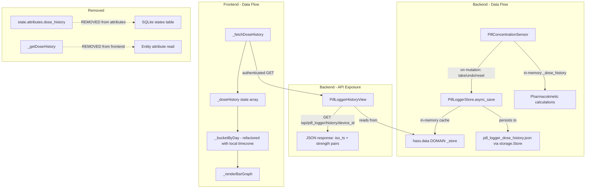

# Dose History API Refactor Plan

## Problem Statement

The integration stores a rolling `dose_history` array in `_attr_extra_state_attributes` on the `PillConcentrationSensor`. This violates Home Assistant core architecture guidelines:

1. **SQLite bloat**: Every state update writes the entire array to the `states` table, growing the database unboundedly
2. **16KB attribute limit**: HA core enforces a hard 16KB limit on `extra_state_attributes`; a long medication history will exceed this
3. **Architectural violation**: Entities should hold present state; the Recorder holds the past

Additionally, the original plan to use the core `/api/history/period/` endpoint for dose counts is **fatally flawed**: it logs ALL state transitions including "Undo" actions and system reboots, which would artificially inflate dose counts. The backend's `_dose_history` is the authoritative, pruned list (undos remove entries, resets clear it).

**Solution**: Remove `dose_history` from entity attributes, persist it via `storage.Store`, and expose it through a custom REST endpoint that returns the pristine in-memory data.

## Scope

### In Scope
- Remove `dose_history` from `PillConcentrationSensor` attributes
- Add `storage.Store`-backed persistence for `_dose_history` in the backend
- Create custom REST endpoint `/api/pill_logger/history/{device_id}` via `HomeAssistantView`
- Add `_fetchDoseHistory()` in the frontend calling the custom endpoint
- Refactor `_bucketByDay()` to process the custom endpoint response (with local timezone fix)
- Remove `_getDoseHistory()` from the frontend

### Out of Scope (Follow-up)
- `timestamps` attribute on `last_dose.py`, `pill_limit.py`, `adherence.py`, `avg_doses.py`, `next_dose.py` — same architectural problem, should be migrated in a separate PR

---

## Architecture Overview



---

## Phase 1: Backend — `storage.Store` Persistence

### Step 1.1: Create `PillLoggerStore` data manager

**File**: `custom_components/pill_logger/store.py` (NEW)

Create a `storage.Store`-backed data manager that persists `dose_history` outside of entity attributes. Uses a single storage file keyed by `entry_id`:

```python
from homeassistant.core import HomeAssistant, callback
from homeassistant.helpers.storage import Store

STORAGE_VERSION = 1
STORAGE_KEY = "pill_logger_dose_history"


class PillLoggerStore:
    """Manages persistent storage for dose history data outside entity attributes.

    Uses HA's storage.Store to persist dose history to a JSON file.
    Data format: { entry_id: [[iso_timestamp, strength], ...] }
    """

    def __init__(self, hass: HomeAssistant) -> None:
        self._hass = hass
        self._store = Store(hass, STORAGE_VERSION, STORAGE_KEY)
        self._data: dict[str, list[list[str | float]]] = {}

    async def async_load(self) -> None:
        """Load data from storage."""
        data = await self._store.async_load()
        if data:
            self._data = data

    @callback
    def get_history(self, entry_id: str) -> list[list[str | float]]:
        """Get dose history for a specific entry. Returns [[iso_ts, strength], ...]."""
        return self._data.get(entry_id, [])

    async def async_set_history(self, entry_id: str, history: list[list[str | float]]) -> None:
        """Save dose history for a specific entry."""
        self._data[entry_id] = history
        await self._store.async_save(self._data)
```

### Step 1.2: Initialize store in `__init__.py`

**File**: `custom_components/pill_logger/__init__.py`

Changes:
1. Import `PillLoggerStore`
2. In `async_setup_entry()`, create and load the store (singleton, shared across entries)
3. Store the `PillLoggerStore` instance in `hass.data[DOMAIN]["_store"]`
4. In `async_unload_entry()`, if last entry is unloaded, clean up store reference

```python
from .store import PillLoggerStore

async def async_setup_entry(hass: HomeAssistant, entry: ConfigEntry) -> bool:
    hass.data.setdefault(DOMAIN, {})
    
    # Initialize shared store (singleton)
    if "_store" not in hass.data[DOMAIN]:
        store = PillLoggerStore(hass)
        await store.async_load()
        hass.data[DOMAIN]["_store"] = store
    
    hass.data[DOMAIN][entry.entry_id] = entry.data
    entry.async_on_unload(entry.add_update_listener(async_reload_entry))
    
    await hass.config_entries.async_forward_entry_setups(entry, PLATFORMS)
    return True
```

### Step 1.3: Modify `concentration.py` to use store instead of attributes

**File**: `custom_components/pill_logger/sensors/concentration.py`

Changes:

1. **Remove `dose_history` from `_attr_extra_state_attributes`** in `__init__()` (line 51):
   - IR branch: `{"last_updated": None, "gut_mass": 0.0, "ka": 0.0, "lag_time": 0.0}`
   - ER branch: `{"last_updated": None, "gut_mass": 0.0, "gut_ir_mass": 0.0, "matrix_sr_mass": 0.0, "gut_sr_mass": 0.0, "ka": 0.0, "kr": 0.0, "lag_time": 0.0}`

2. **Remove `dose_history` from `update_state()`** — both the IR branch (line 524) and ER branch (line 516) should no longer include `dose_history` in the attributes dict

3. **Add store reference** — retrieve `PillLoggerStore` from `hass.data[DOMAIN]["_store"]` in `async_added_to_hass()`

4. **Modify `async_added_to_hass()`** — restore `_dose_history` from the store first, then fall back to legacy `last_state.attributes["dose_history"]` for migration

5. **Add `_save_dose_history()` helper** — serializes `_dose_history` and saves to store via `async_set_history()`. Called after `handle_pill_taken()`, `handle_pill_undone()`, and `reset_data()`

6. **Keep `_dose_history` as in-memory list** — it is still needed for `_recalculate_from_history()` calculations

7. **Legacy migration path** — in `async_added_to_hass()`, if the store is empty but `last_state.attributes["dose_history"]` exists, migrate data to the store and remove from attributes

### Step 1.4: Update `sensor.py` entity setup

**File**: `custom_components/pill_logger/sensor.py`

No changes needed — `PillConcentrationSensor` retrieves the store from `hass.data` in `async_added_to_hass()`, so no constructor parameter changes are required.

---

## Phase 2: Backend — Custom REST Endpoint

### Step 2.1: Create `PillLoggerHistoryView`

**File**: `custom_components/pill_logger/views.py` (NEW)

Create a `HomeAssistantView` subclass that exposes the dose history via a custom REST endpoint:

```python
from homeassistant.components.http import HomeAssistantView
from homeassistant.helpers import device_registry as dr
from aiohttp import web

from .const import DOMAIN


class PillLoggerHistoryView(HomeAssistantView):
    """Expose dose history via custom REST endpoint.
    
    URL: /api/pill_logger/history/{device_id}
    Method: GET
    Auth: Bearer token (requires_auth = True)
    Response: JSON array [[iso_timestamp, strength], ...]
    """
    url = "/api/pill_logger/history/{device_id}"
    name = "api:pill_logger:history"
    requires_auth = True

    async def get(self, request: web.Request, device_id: str) -> web.Response:
        """Return dose history for the given device."""
        hass = request.app["hass"]
        
        # Get the store from hass.data
        store = hass.data.get(DOMAIN, {}).get("_store")
        if not store:
            return self.json([])
        
        # Map device_id to config entry_id via device registry
        device_reg = dr.async_get(hass)
        device = device_reg.async_get(device_id)
        if not device or not device.config_entries:
            return self.json([])
        
        # Use the first config entry for this device
        entry_id = next(iter(device.config_entries))
        
        # Get dose history from store
        history = store.get_history(entry_id)
        return self.json(history)
```

### Step 2.2: Register the view in `__init__.py`

**File**: `custom_components/pill_logger/__init__.py`

Add view registration in `async_setup_entry()`:

```python
from .views import PillLoggerHistoryView

async def async_setup_entry(hass: HomeAssistant, entry: ConfigEntry) -> bool:
    hass.data.setdefault(DOMAIN, {})
    
    # Initialize shared store (singleton)
    if "_store" not in hass.data[DOMAIN]:
        store = PillLoggerStore(hass)
        await store.async_load()
        hass.data[DOMAIN]["_store"] = store
    
    # Register REST view (idempotent — HA ignores duplicate registrations)
    hass.http.register_view(PillLoggerHistoryView(hass))
    
    hass.data[DOMAIN][entry.entry_id] = entry.data
    entry.async_on_unload(entry.add_update_listener(async_reload_entry))
    
    await hass.config_entries.async_forward_entry_setups(entry, PLATFORMS)
    return True
```

**Note**: `hass.http.register_view()` is idempotent — calling it multiple times with the same URL pattern is safe because HA checks for duplicate registrations.

---

## Phase 3: Frontend — Custom API Fetch for Dose History

### Step 3.1: Add `_doseHistory` state property

**File**: `src/pill-logger-card.ts`

Add a new `@state()` property alongside the existing `_amountHistory`:

```typescript
@state() private _doseHistory: Array<[string, number]> = [];
```

This stores the dose history from the custom REST endpoint. Each entry is `[iso_timestamp, strength]` — matching the backend's serialization format.

### Step 3.2: Create `_fetchDoseHistory()` method

**File**: `src/pill-logger-card.ts`

Add a new async method following the pattern of [`_fetchAmountHistory()`](src/pill-logger-card.ts:603) but calling the custom endpoint:

```typescript
private async _fetchDoseHistory(entities: ResolvedEntities) {
  if (!this.hass || !this.config?.device_id) return;

  const deviceId = this.config.device_id;

  try {
    const token = (this.hass as any).auth?.data?.access_token;
    if (!token) return;

    const url = `/api/pill_logger/history/${deviceId}`;
    const response = await fetch(url, {
      headers: { 'Authorization': `Bearer ${token}` }
    });

    if (!response.ok) return;

    const data = await response.json();
    // data is [[iso_timestamp, strength], ...]
    if (Array.isArray(data)) {
      this._doseHistory = data;
    }
  } catch (_e) {
    // Silently fail — custom endpoint may not be available yet
  }
}
```

Key differences from `_fetchAmountHistory()`:
- Uses `config.device_id` to construct the URL (not an entity ID)
- Calls `/api/pill_logger/history/{device_id}` instead of `/api/history/period/`
- No time range parameters — the backend returns the complete dose history
- No filtering needed — the backend returns the authoritative, pruned list
- Response format: `[[iso_timestamp, strength], ...]` — direct array, not nested

### Step 3.3: Update `updated()` lifecycle

**File**: `src/pill-logger-card.ts`

Modify [`updated()`](src/pill-logger-card.ts:854) to call both fetch methods when the graphs pane is active:

```typescript
updated(changedProperties: Map<string, any>) {
  super.updated(changedProperties);
  if (this._activePane === 'graphs' && this.config && this.hass) {
    const entities = this._resolveEntities();
    this._fetchAmountHistory(entities);
    this._fetchDoseHistory(entities);
  }
}
```

---

## Phase 4: Frontend — Refactor Bucket Processing (with Local Timezone Fix)

### Step 4.1: Add `_toLocalDateKey()` helper method

**File**: `src/pill-logger-card.ts`

**Critical timezone bug fix**: The current code uses `.toISOString().split('T')[0]` which converts `Date` objects to UTC before extracting the date string. For users in timezones ahead of UTC (e.g., UTC+1 through UTC+14), late-night doses are incorrectly bucketed into the previous calendar day. The fix uses `.getFullYear()`, `.getMonth()`, and `.getDate()` with zero-padding to construct local date strings.

Add a private helper method:

```typescript
private _toLocalDateKey(d: Date): string {
  const year = d.getFullYear();
  const month = String(d.getMonth() + 1).padStart(2, '0');
  const day = String(d.getDate()).padStart(2, '0');
  return `${year}-${month}-${day}`;
}
```

### Step 4.2: Refactor `_bucketByDay()` to use `_doseHistory` state and local timezone

**File**: `src/pill-logger-card.ts`

The current [`_bucketByDay()`](src/pill-logger-card.ts:233) takes a `doseHistory` parameter of type `Array<[string, number]>`. Change it to read from `this._doseHistory` directly and use `_toLocalDateKey()` for local timezone bucketing:

```typescript
private _bucketByDay(): DayBucket[] {
  const buckets: Record<string, number> = {};

  // Count doses per day from custom API data
  // Each entry is [iso_timestamp, strength]
  // Use local timezone for date bucketing (NOT .toISOString() which shifts to UTC)
  for (const entry of this._doseHistory) {
    const key = this._toLocalDateKey(new Date(entry[0]));
    buckets[key] = (buckets[key] || 0) + 1;
  }

  const result: DayBucket[] = [];
  const now = new Date();
  for (let i = 13; i >= 0; i--) {
    const d = new Date(now);
    d.setDate(d.getDate() - i);
    const key = this._toLocalDateKey(d);
    result.push({
      date: key,
      label: d.getDate().toString(),
      count: buckets[key] || 0,
    });
  }
  return result;
}
```

### Step 4.3: Remove `_getDoseHistory()` method

**File**: `src/pill-logger-card.ts`

Delete the [`_getDoseHistory()`](src/pill-logger-card.ts:226) method entirely (lines 226-231). It is no longer needed since dose history comes from the custom REST API, not from entity attributes.

### Step 4.4: Update `_renderPane2()` call sites

**File**: `src/pill-logger-card.ts`

In [`_renderPane2()`](src/pill-logger-card.ts:484), change:

```typescript
// BEFORE (lines 485-486)
const doseHistory = this._getDoseHistory(entities);
const dailyBuckets = this._bucketByDay(doseHistory);
```

To:

```typescript
// AFTER
const dailyBuckets = this._bucketByDay();
```

### Step 4.5: Handle loading state gracefully

The current `_renderBarGraph()` already handles the "no data" case with a "No dose data yet" placeholder. When `_doseHistory` is empty (before the API fetch completes), `_bucketByDay()` returns 14 buckets with `count: 0`, which triggers the existing placeholder. This is acceptable — the user sees "No dose data yet" briefly, then the bar chart populates.

No additional loading state is needed since the fetch completes quickly and the placeholder is already informative.

---

## Phase 5: Verification

### Step 5.1: Backend verification

1. Start HA with the modified integration
2. Verify `sensor.*_amount_in_body` no longer has `dose_history` in its attributes
3. Verify `sensor.*_amount_in_body` still calculates concentration correctly after restart (via `storage.Store` restore)
4. Verify undo/reset still works correctly (dose history is pruned, not inflated)
5. Verify existing installations migrate seamlessly (legacy `dose_history` in attributes → `storage.Store`)
6. Test the REST endpoint: `curl -H "Authorization: Bearer <token>" http://localhost:8123/api/pill_logger/history/<device_id>` — should return `[[iso_ts, strength], ...]`

### Step 5.2: Frontend verification

1. `yarn run build` — clean compilation, zero warnings, zero errors
2. Load the card in HA dashboard
3. Switch to Graphs pane — bar chart should show 14-day dose data from custom API
4. Verify bar chart updates correctly when a dose is taken (may need pane switch to trigger re-fetch)
5. Verify line graph still works (unchanged — still uses core History API for amount_in_body)
6. Verify "No dose data yet" placeholder shows briefly before API data loads
7. Verify timezone correctness: take a dose at 11:30 PM local time in UTC+1, confirm it appears in today's bucket (not yesterday's)

### Step 5.3: Update memory banks

Update both frontend and backend `memory-bank/` directories.

---

## Files Modified Summary

### Backend (`/workspaces/Home-Assistant-Pill-Logger/`)

| File | Change |
|------|--------|
| `custom_components/pill_logger/store.py` | **NEW** — `PillLoggerStore` class using `storage.Store` |
| `custom_components/pill_logger/views.py` | **NEW** — `PillLoggerHistoryView` REST endpoint |
| `custom_components/pill_logger/__init__.py` | Initialize store, register view |
| `custom_components/pill_logger/sensors/concentration.py` | Remove `dose_history` from attributes, add store persistence, keep legacy migration path |

### Frontend (`/workspaces/lovelace-pill-logger-card/`)

| File | Change |
|------|--------|
| `src/pill-logger-card.ts` | Add `_doseHistory` state, add `_fetchDoseHistory()`, add `_toLocalDateKey()` helper, refactor `_bucketByDay()` with local timezone, remove `_getDoseHistory()`, update `updated()` and `_renderPane2()` |

---

## Risk Assessment

1. **`storage.Store` save timing**: The store save is async. If HA shuts down between a dose event and the store save completing, that dose would be lost. **Mitigation**: Use `await` in the save call. The `storage.Store` uses a write buffer with debouncing, so rapid successive saves (take + undo) are handled correctly.

2. **Custom endpoint availability**: The `/api/pill_logger/history/` endpoint only exists when the Pill Logger integration is installed and loaded. **Mitigation**: The frontend `_fetchDoseHistory()` silently fails on network errors, and the bar chart shows "No dose data yet" as a fallback.

3. **Device ID to entry ID mapping**: The REST endpoint maps `device_id` → `entry_id` via the device registry. If the device has multiple config entries, it uses the first one. **Mitigation**: Pill Logger creates one config entry per device, so this is always a 1:1 mapping.

4. **Legacy migration**: Existing users with `dose_history` in their SQLite database need a migration path. **Mitigation**: `async_added_to_hass()` checks `last_state.attributes["dose_history"]` as a fallback, migrates data to `storage.Store`, and then stops writing it to attributes.

5. **Concurrent access**: Multiple sensors could try to save to the store simultaneously. **Mitigation**: `storage.Store` uses a single write buffer with debouncing, so concurrent saves are serialized correctly.

6. **Timezone correctness**: Using `.toISOString()` for date bucketing shifts timestamps to UTC, causing late-night doses to appear on the wrong day for users ahead of UTC. **Mitigation**: The `_toLocalDateKey()` helper uses `.getFullYear()`, `.getMonth()`, `.getDate()` with zero-padding to construct local date strings, ensuring doses are bucketed in the user's local timezone.