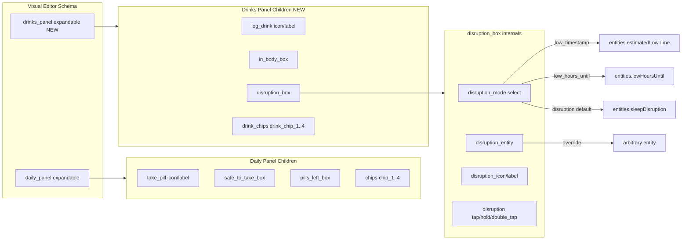

# Drinks Panel Settings — Full Parity with Daily Panel

## Objective
Add a new **Drinks Panel** expandable subheading to the card's visual editor that mirrors the existing **Daily Panel** expandable. This gives Master Tracker cards (Caffeine / Alcohol) the same per-box override capability that medicine cards already have, plus functional custom chips and a "Time to Low" display-mode selector on the Disruption box.

## Current State

### Daily Panel editor schema ([`src/ax-dose-logger-editor.ts:162-367`](src/ax-dose-logger-editor.ts:162))
```
daily_panel (expandable, flatten: true)
  ├── grid: take_pill_icon + take_pill_label
  ├── safe_to_take_box (expandable)
  │   ├── safe_to_take_entity (entity selector)
  │   ├── grid: safe_to_take_icon + safe_to_take_label
  │   ├── safe_to_take_tap_action (ui_action)
  │   ├── safe_to_take_hold_action (ui_action)
  │   └── safe_to_take_double_tap_action (ui_action)
  ├── pills_left_box (expandable)
  │   ├── pills_left_show_days_left (boolean toggle)
  │   ├── pills_left_entity (entity selector)
  │   ├── grid: pills_left_icon + pills_left_label
  │   ├── pills_left_tap_action / hold_action / double_tap_action
  └── chips (expandable)
      └── 4× grid: chip_N + chip_N_label
```

### Drinks Panel ([`src/components/drinks-panel.ts`](src/components/drinks-panel.ts))
Currently has **zero editor config**. The Log Drink button icon/label, In Body box, and Disruption box are all hardcoded. No chips row.

## Proposed Drinks Panel editor schema

```
drinks_panel (expandable, flatten: true)
  ├── grid: log_drink_icon + log_drink_label
  ├── in_body_box (expandable)
  │   ├── in_body_entity (entity selector, filter_device_id)
  │   ├── grid: in_body_icon + in_body_label
  │   ├── in_body_tap_action (ui_action)
  │   ├── in_body_hold_action (ui_action)
  │   └── in_body_double_tap_action (ui_action)
  ├── disruption_box (expandable)
  │   ├── disruption_mode (select: 'disruption' | 'low_timestamp' | 'low_hours_until')
  │   ├── disruption_entity (entity selector, filter_device_id)
  │   ├── grid: disruption_icon + disruption_label
  │   ├── disruption_tap_action (ui_action)
  │   ├── disruption_hold_action (ui_action)
  │   └── disruption_double_tap_action (ui_action)
  └── drink_chips (expandable)
      └── 4× grid: drink_chip_N + drink_chip_N_label
```

### Mapping: Daily Panel → Drinks Panel

| Daily Panel | Drinks Panel | Notes |
|---|---|---|
| `take_pill_icon` / `take_pill_label` | `log_drink_icon` / `log_drink_label` | Log Drink button overrides |
| Safe to Take Box | **In Body Box** | `in_body_entity` swap + icon/label/actions; default tap → more-info (same as Safe to Take) |
| Pills Left Box (`pills_left_show_days_left` toggle) | **Disruption Box** (`disruption_mode` select) | 3-option select replaces the boolean toggle: "Sleep Disruption" (default) / "Low - Timestamp" / "Low - Hours Until" |
| `chips` (chip_1..chip_4) | `drink_chips` (drink_chip_1..4) | Separate config namespace so the two panels don't cross-contaminate |

### Disruption Box — "Time to Low" select dropdown (Option A, user-confirmed)

A single `select` field at the top of the Disruption Box expandable with three options:

| Value | Label | Display | Default tap |
|---|---|---|---|
| `disruption` (default) | "Sleep Disruption" | Title-cased state (None/Low/Moderate/High) | Sleep Disruption popup (card-internal) |
| `low_timestamp` | "Low - Timestamp" | HH:MM (24-hour) | more-info on `entities.estimatedLowTime` |
| `low_hours_until` | "Low - Hours Until" | `X h` (1 decimal) | more-info on `entities.lowHoursUntil` |

**Priority order** for `getDisruptionBoxEntity`:
1. `disruption_mode === 'low_timestamp'` → `entities.estimatedLowTime` (built-in swap, wins over entity field)
2. `disruption_mode === 'low_hours_until'` → `entities.lowHoursUntil` (built-in swap)
3. `disruption_entity` configured → user's entity (arbitrary HA entity)
4. default (`disruption`) → `entities.sleepDisruption`

This mirrors the Pills Left Box priority pattern (built-in toggle wins over entity swap).

## Files to Modify

### 1. [`src/types.ts`](src/types.ts) — Config fields + controller interface
Add to `AxDoseLoggerCardConfig`:
- `log_drink_icon?: string`
- `log_drink_label?: string`
- `in_body_entity?: string`
- `in_body_icon?: string`
- `in_body_label?: string`
- `in_body_tap_action?: ActionConfig`
- `in_body_hold_action?: ActionConfig`
- `in_body_double_tap_action?: ActionConfig`
- `disruption_mode?: 'disruption' | 'low_timestamp' | 'low_hours_until'`
- `disruption_entity?: string`
- `disruption_icon?: string`
- `disruption_label?: string`
- `disruption_tap_action?: ActionConfig`
- `disruption_hold_action?: ActionConfig`
- `disruption_double_tap_action?: ActionConfig`
- `drink_chip_1?` … `drink_chip_4?` + `drink_chip_1_label?` … `drink_chip_4_label?`

Add to `CardController`:
- `getInBodyBoxEntity(entities: ResolvedEntities): string | undefined`
- `getDisruptionBoxEntity(entities: ResolvedEntities): string | undefined`
- `handleInBodyBoxAction(e, kind, cfg, entity?): void`
- `handleDisruptionBoxAction(e, kind, cfg, entity?, fallback?): void`
- `getDrinkChipEntities(): Array<{ entityId: string; label?: string }>`

### 2. [`src/ax-dose-logger-editor.ts`](src/ax-dose-logger-editor.ts) — Editor schema
- Add `drinks_panel` expandable after `daily_panel` (before `graphs_panel`), mirroring the Daily Panel schema exactly.
- Update `computeLabel`: suppress labels for `drink_chip_N` / `drink_chip_N_label` fields (same pattern as chip_N).
- Update `computeHelper`: add `drinks_panel`, `in_body_box`, `disruption_box`, `drink_chips` to the expandable/container guard list.

### 3. [`src/localize.ts`](src/localize.ts) — Label + helper keys
Add config label keys:
- `config.drinks_panel` → "Drinks Panel"
- `config.log_drink_icon` → "Log Drink Icon"
- `config.log_drink_label` → "Log Drink Label"
- `config.in_body_box` → "In Body Box"
- `config.in_body_entity` → "In Body Entity"
- `config.in_body_label` → "In Body Label"
- `config.in_body_icon` → "In Body Icon"
- `config.in_body_tap_action` / `hold_action` / `double_tap_action`
- `config.disruption_box` → "Disruption Box"
- `config.disruption_mode` → "Time to Low"
- `config.disruption_entity` → "Disruption Entity"
- `config.disruption_label` → "Disruption Label"
- `config.disruption_icon` → "Disruption Icon"
- `config.disruption_tap_action` / `hold_action` / `double_tap_action`
- `config.drink_chips` → "Custom Chips"
- `config.drink_chip_1`..`drink_chip_4` + `drink_chip_*_label`

Add helper keys (mirrors Daily Panel helpers):
- `config.helper.drinks_panel`, `config.helper.in_body_box`, `config.helper.disruption_box`, `config.helper.drink_chips`
- `config.helper.log_drink_icon` / `log_drink_label`
- `config.helper.in_body_*` (entity/label/icon/actions)
- `config.helper.disruption_mode` ("Show Sleep Disruption state, or switch to the Low - Timestamp / Low - Hours Until countdown sensor.")
- `config.helper.disruption_entity` / `label` / `icon` / actions
- `config.helper.drink_chip` / `drink_chip_label` (reuse the chip helper text pattern)

Add the three disruption_mode option labels:
- `config.disruption_mode_disruption` → "Sleep Disruption"
- `config.disruption_mode_low_timestamp` → "Low - Timestamp"
- `config.disruption_mode_low_hours_until` → "Low - Hours Until"

### 4. [`src/ax-dose-logger-card.ts`](src/ax-dose-logger-card.ts) — Controller methods
- `_getInBodyBoxEntity(entities)`: `config.in_body_entity || entities.amountInBody`
- `_getDisruptionBoxEntity(entities)`: mode-based resolution (priority order above)
- `_handleInBodyBoxAction(...)`: mirrors `_handleSafeBoxAction` — custom action → handleAction; no tap → more-info fallback
- `_handleDisruptionBoxAction(...)`: mirrors `_handlePillsLeftBoxAction` — custom action → handleAction; no tap → fallback (Sleep Disruption popup when mode='disruption' + substance exists; else more-info)
- `_getDrinkChipEntities()`: reads `drink_chip_1`..`drink_chip_4` + labels (parallel to `_getChipEntities`)
- Public wrappers: `getInBodyBoxEntity`, `getDisruptionBoxEntity`, `handleInBodyBoxAction`, `handleDisruptionBoxAction`, `getDrinkChipEntities`
- Update `_relevantStateChanged`: append drink chip entity IDs to `watchedIds` when `this._activePane === 'drinks'` (same pattern as the existing chip watch)

### 5. [`src/components/drinks-panel.ts`](src/components/drinks-panel.ts) — Render logic
- **Log Drink button**: read `config.log_drink_icon` / `config.log_drink_label` overrides (fall back to substance-aware defaults: `mdi:coffee` / `mdi:glass-mug-variant` and "Log Drink" label).
- **In Body box**: full override parity mirroring the Daily panel's Safe to Take box:
  - `getInBodyBoxEntity` for display entity
  - Entity swap: numeric → `formatInteger` + `unit_of_measurement` attr; non-numeric → title-case
  - Default (no swap): `Math.round(bodyNum) + ' ' + unit` (current behavior)
  - Configurable icon/label overrides
  - Tap/hold/double-tap wiring via `handleInBodyBoxAction`
- **Disruption box**: mode-aware display:
  - `disruption` (default): title-cased state, tap → Sleep Disruption popup fallback
  - `low_timestamp`: `toLocaleTimeString({ hour:'2-digit', minute:'2-digit', hour12:false })` → HH:MM; `unknown`/`unavailable`/`None` → `daily.na`
  - `low_hours_until`: `parseFloat(state) + ' h'`; `None`/`unknown`/`unavailable` → `daily.na` (or `-`)
  - Entity swap: same numeric/title-case pattern as In Body box
  - Configurable icon/label overrides
  - Default icon/label switch per mode (e.g. `mdi:timer-sand` for hours-until, `mdi:clock-outline` for timestamp, `mdi:sleep` for disruption)
  - Tap/hold/double-tap wiring via `handleDisruptionBoxAction` with the Sleep Disruption popup fallback
- **Chips row**: render `getDrinkChipEntities()` identical to the Daily panel's chips row (same CSS, same `formatInteger` + `unit_of_measurement` pattern). Import `getDrinkChipEntities` from the controller.
- Add `@property hass` reactive prop (already present) so drink chip state changes trigger re-render.

### 6. [`README.md`](README.md) — Configuration Options table
Add rows for all new config fields (log_drink_icon/label, in_body_*, disruption_*, drink_chip_*).

### 7. Rebuild
`yarn run build` — exit 0, no warnings.

## Architecture Diagram



## Key Design Decisions

1. **Separate `drink_chip_*` namespace** (not reusing `chip_*`): a card is bound to one device, but if the user changes `device_id` from a medicine to a master tracker, shared chip fields would carry over confusingly. Separate fields keep the two panels' configs fully independent. The editor shows each only inside its own expandable.

2. **`disruption_mode` select instead of boolean toggle** (Option A, user-confirmed): the three display modes (Sleep Disruption / Low - Timestamp / Low - Hours Until) are mutually exclusive states of one box. A single 3-option select is cleaner than a boolean toggle + conditional sub-select. The built-in mode swap wins over `disruption_entity` (mirrors the Pills Left Box's `pills_left_show_days_left` winning over `pills_left_entity`).

3. **Disruption box default tap = Sleep Disruption popup** (card-internal, only when mode='disruption'): this is the current behavior and is retained as the fallback. For `low_timestamp` / `low_hours_until` modes, the default tap falls back to more-info (like the Safe to Take box). A custom `disruption_tap_action` always wins.

4. **In Body box mirrors Safe to Take box** (not Pills Left box): the In Body box's default tap is more-info (no card-internal dialog), exactly like the Safe to Take box. No fallback parameter needed — `handleInBodyBoxAction` follows the `_handleSafeBoxAction` signature.

5. **No backend changes**: all three sensors (`sleepDisruption`, `estimatedLowTime`, `lowHoursUntil`) are already resolved in `ResolvedEntities` by `_computeEntities`. The card already has access to all the data; this is purely a frontend config + render change.

## Verification
- `yarn run build` — exit 0, no warnings
- Manual: configure a Master Tracker card, open the visual editor, verify the Drinks Panel expandable appears with all three sub-expandables (In Body Box, Disruption Box, Custom Chips)
- Test the disruption_mode select: switch between Sleep Disruption / Low - Timestamp / Low - Hours Until and verify the box value + tap behavior changes
- Test In Body entity swap + icon/label/action overrides
- Test drink chips render on the Drinks pane