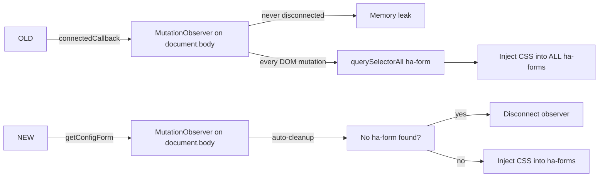
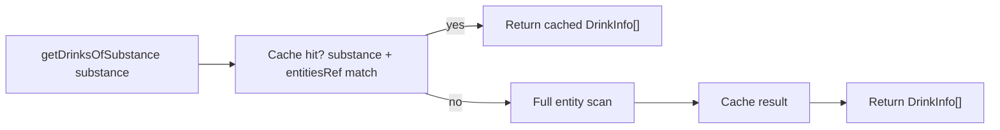

# Fix Plan — HIGH Audit Findings (H1 + H2)

**Date:** 2026-07-11
**Parent audit:** [`card-integration-audit.md`](card-integration-audit.md)

---

## H1 — MutationObserver Leak + Global CSS Injection

### Root Cause

[`installEditorGridAlignment()`](src/ax-dose-logger-editor.ts:44) is called from [`connectedCallback()`](src/ax-dose-logger-card.ts:1923), which fires on **every dashboard load** for every card instance. It creates a `MutationObserver` on `document.body` that:

1. **Never disconnects** — `_formStyleObserver` is module-scoped, never cleared in `disconnectedCallback()` → memory leak
2. **Scans the entire document** — `processForms()` runs `document.querySelectorAll('ha-form')` on every DOM mutation anywhere in the dashboard → performance cost
3. **Injects CSS into every `ha-form`** — `align-items: end !important` lands in all `ha-form` shadow roots, not just this card's editor → cross-card pollution

### Fix Strategy

The key insight: `installEditorGridAlignment()` should only run when the **visual editor is actually open**, not on every dashboard load. HA calls the static [`getConfigForm()`](src/ax-dose-logger-card.ts:2198) method when the user clicks "Configure" on the card — that's the correct lifecycle hook.



### Changes

#### File: [`src/ax-dose-logger-editor.ts`](src/ax-dose-logger-editor.ts)

1. **Add auto-cleanup to the observer callback** — after `processForms()`, if no `ha-form` elements exist in the document (editor dialog closed), disconnect the observer and null it out. This self-heals the leak without needing an external cleanup call.

2. **Add `uninstallEditorGridAlignment()` export** — defense-in-depth function that disconnects the observer. Available for manual cleanup if needed.

```typescript
export function uninstallEditorGridAlignment(): void {
  if (_formStyleObserver) {
    _formStyleObserver.disconnect();
    _formStyleObserver = null;
  }
}
```

3. **Modify the observer callback** to self-clean:

```typescript
_formStyleObserver = new MutationObserver(() => {
  processForms();
  // Auto-cleanup: if no ha-form exists in the document, the editor
  // dialog has closed — disconnect the observer so it stops scanning.
  if (document.querySelectorAll('ha-form').length === 0) {
    _formStyleObserver?.disconnect();
    _formStyleObserver = null;
  }
});
```

#### File: [`src/ax-dose-logger-card.ts`](src/ax-dose-logger-card.ts)

4. **Remove `installEditorGridAlignment()` from `connectedCallback()`** (line 1923) — no longer runs on every dashboard load.

5. **Add `installEditorGridAlignment()` call in `getConfigForm()`** (line 2198) — runs only when the user opens the visual editor:

```typescript
static getConfigForm() {
  // Install the grid-alignment CSS observer when the editor opens,
  // not on every dashboard load (was previously in connectedCallback).
  // The observer auto-cleans when the editor dialog closes.
  installEditorGridAlignment();
  return buildEditorForm();
}
```

### What This Fixes

| Problem | Before | After |
|---------|--------|-------|
| Memory leak | Observer never disconnected | Auto-disconnects when editor closes (no `ha-form` in DOM) |
| Performance on dashboard load | Observer installed for every card instance | Observer installed only when editor opens |
| Ongoing performance | `querySelectorAll` on every DOM mutation while dashboard is open | `querySelectorAll` only while editor dialog is open |
| Cross-card pollution | CSS injected into all `ha-form` elements on every dashboard load | CSS injected only while this card's editor is open; auto-removed when dialog closes (style tags persist in stale forms but observer stops injecting into new ones) |

### What This Does NOT Fix

- The CSS selector `div[style*="display: grid"]` is still generic — while the editor is open, it affects all `ha-form` elements in the document. But since the editor is a modal dialog, the only visible `ha-form` is the card's own. Other forms behind the dialog are not user-visible. This is an acceptable trade-off vs. the complexity of detecting "our" dialog.
- Style tags already injected into `ha-form` shadow roots persist after the observer disconnects (the observer stops injecting, but doesn't remove existing tags). This is harmless — the forms are destroyed when the dialog closes, taking their shadow roots with them.

---

## H2 — `_getDrinksOfSubstance()` Has No Cache

### Root Cause

[`_getDrinksOfSubstance()`](src/ax-dose-logger-card.ts:712) does a full `Object.entries(this.hass.entities)` scan on every call. It's called from:

- [`_relevantStateChanged()`](src/ax-dose-logger-card.ts:2100) — runs on **every HA state change** while the inventory pane is active
- [`_renderLogDrinkDialog()`](src/ax-dose-logger-card.ts:1122) — every render of the Log Drink popup
- [`_fetchDrinkLowPredictions()`](src/ax-dose-logger-card.ts:875) — popup open
- Panel components via [`getDrinksOfSubstance()`](src/ax-dose-logger-card.ts:940) — Inventory + Tools panel renders

Unlike `_resolveEntities()` (which has a cache at [line 200](src/ax-dose-logger-card.ts:200)), this method has no caching.

### Fix Strategy

Add a cache mirroring the `_resolvedEntities` pattern — key by `(substance, hass.entities reference)`. HA replaces the `entities` object when the entity registry is updated, which naturally invalidates the cache.

The cache is safe because `DrinkInfo` stores only **entity IDs** (stable identifiers), not entity states. Entity IDs don't change unless the entity registry changes, which replaces the `hass.entities` reference.



### Changes

#### File: [`src/ax-dose-logger-card.ts`](src/ax-dose-logger-card.ts)

1. **Add cache fields** (near the existing `_resolvedEntities` cache at line 139):

```typescript
// Cache for _getDrinksOfSubstance() — mirrors the _resolvedEntities cache
// pattern. DrinkInfo stores only entity IDs (stable), so the cache is valid
// until the entity registry reference changes (HA replaces hass.entities).
private _drinksCache: { substance: 'caffeine' | 'alcohol'; entitiesRef: object; drinks: DrinkInfo[] } | null = null;
```

2. **Add cache check at the top of `_getDrinksOfSubstance()`** (line 712):

```typescript
private _getDrinksOfSubstance(substance: 'caffeine' | 'alcohol'): DrinkInfo[] {
  if (!this.hass) return [];
  const entitiesRef = this.hass.entities;
  if (this._drinksCache &&
      this._drinksCache.substance === substance &&
      this._drinksCache.entitiesRef === entitiesRef) {
    return this._drinksCache.drinks;
  }
  // ... existing scan logic ...
  const result = Object.values(byDevice).sort((a, b) => a.name.localeCompare(b.name));
  this._drinksCache = { substance, entitiesRef, drinks: result };
  return result;
}
```

3. **Invalidate the cache in `_invalidateEntityCache()`** (line 221) — for completeness, though the `entitiesRef` check already handles registry updates:

```typescript
private _invalidateEntityCache(): void {
  this._resolvedEntities = null;
  this._resolvedEntitiesRef = null;
  this._drinksCache = null;
}
```

### What This Fixes

| Scenario | Before | After |
|----------|--------|-------|
| Inventory pane open, HA state change | Full O(n) entity scan per state change | Cache hit (O(1) reference check) |
| Log Drink popup rendering | Full scan per render | Cache hit after first scan |
| Tools panel rendering | Full scan per render | Cache hit after first scan |
| Entity registry update (new drink added) | Next call scans | Cache misses (entitiesRef changed), re-scans once, then cached |

### Edge Cases Considered

- **Device name change without entity registry update**: `DrinkInfo.name` reads `this.hass.devices?.[deviceId]?.name`. If a device name changes without an entity registry update, the cache would be stale. This is extremely rare (device renames are manual admin actions) and the impact is cosmetic (drink name in popup/panel). Acceptable trade-off.
- **Two master tracker cards (caffeine + alcohol) on the same dashboard**: Each card instance has its own `_drinksCache` (instance field, not module-scoped), so no cross-card cache thrashing.
- **Substance switch on the same card**: Would require a `device_id` config change, which calls `_invalidateEntityCache()` → cache cleared. Even without that, the `substance` check in the cache key handles it.

---

## Verification

After both fixes:
1. `yarn run build` — clean compilation, zero warnings
2. Manual verification (if possible): open the visual editor → confirm grid alignment still works → close editor → confirm observer disconnected (no `ha-form` style tags injected into new forms)
3. Manual verification: navigate to inventory pane → confirm drinks still render correctly → confirm no perf degradation on state changes

## Files Modified

- [`src/ax-dose-logger-editor.ts`](src/ax-dose-logger-editor.ts) — auto-cleanup in observer callback + `uninstallEditorGridAlignment()` export
- [`src/ax-dose-logger-card.ts`](src/ax-dose-logger-card.ts) — move `installEditorGridAlignment()` from `connectedCallback()` to `getConfigForm()` + add `_drinksCache` + cache check in `_getDrinksOfSubstance()` + invalidate in `_invalidateEntityCache()`
- [`dist/ax-dose-logger-card.js`](dist/ax-dose-logger-card.js) — rebuilt via `yarn run build`