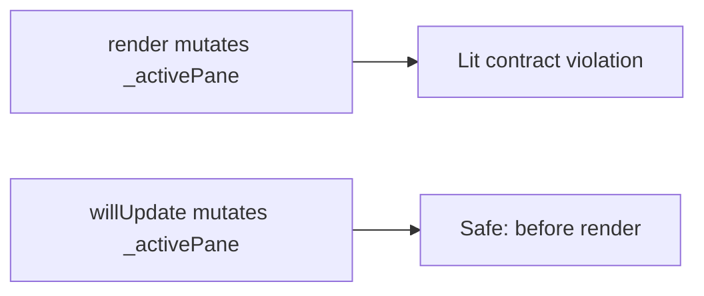
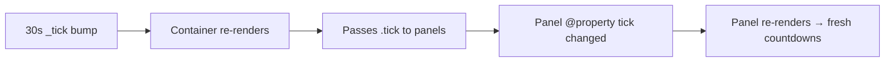
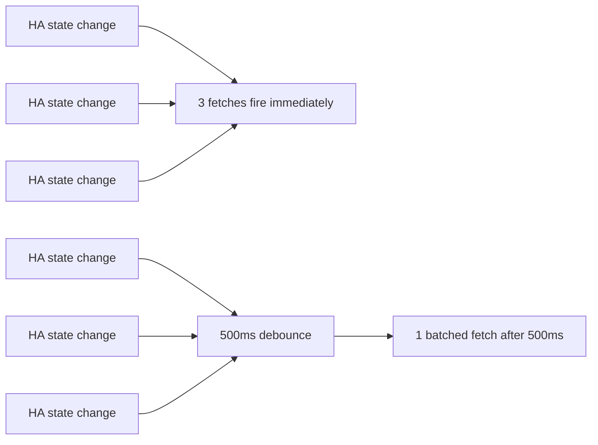

# Fix Plan — MEDIUM + LOW Audit Findings (M1–M4, L1–L7)

**Date:** 2026-07-11
**Parent audit:** [`card-integration-audit.md`](card-integration-audit.md)
**Prior fix:** H1 + H2 — [`fix-high-audit-findings-plan.md`](fix-high-audit-findings-plan.md)

---

## M1 — Mutating `@state` inside `render()`

### Problem
[`render()`](src/ax-dose-logger-card.ts:1907) mutates `this._activePane` during render:
```typescript
if (this._activePane === 'tracking' && entities.metrics.length === 0) {
  this._activePane = 'daily';   // ← mutating @state during render
}
if (isMaster && medicinePanes.includes(this._activePane)) this._activePane = 'drinks';
if (!isMaster && masterPanes.includes(this._activePane)) this._activePane = 'daily';
```
Lit docs: "Do not update reactive properties in `render()`."

### Fix
Move the auto-fallback logic into a new `willUpdate()` lifecycle method. Lit calls `willUpdate()` **before** `render()`, so reactive property mutations there are safe and will be reflected in the same render pass.



**File:** [`src/ax-dose-logger-card.ts`](src/ax-dose-logger-card.ts)

Add `willUpdate()` before `render()` (around line 1900):

```typescript
protected willUpdate(changedProps: PropertyValues): void {
  if (!this.config || !this.hass) return;
  // Auto-fallback: moved here from render() — Lit requires reactive
  // property mutations to happen before render(), not during it.
  if (changedProps.has('_activePane') || changedProps.has('config') || changedProps.has('hass')) {
    const entities = this._resolveEntities();
    if (entities.deviceType === 'drink') return; // granular drink → placeholder, no fallback
    if (this._activePane === 'tracking' && entities.metrics.length === 0) {
      this._activePane = 'daily';
    }
    const isMaster = entities.deviceType === 'drink_master';
    const masterPanes = ['drinks', 'inventory'];
    const medicinePanes = ['daily', 'tracking'];
    if (isMaster && medicinePanes.includes(this._activePane)) this._activePane = 'drinks';
    if (!isMaster && masterPanes.includes(this._activePane)) this._activePane = 'daily';
  }
}
```

Remove the 3 mutation lines + their comments from `render()` (lines 1905–1918).

---

## M2 — 30s `_tick` doesn't propagate to panel components

### Problem
The `_tick` `@state` bumps every 30s → container re-renders → but `controller`, `entities`, `hass` refs passed to panels are unchanged → panel's default `shouldUpdate` skips re-render → countdown text inside panels stays stale.

### Fix
Pass `_tick` as a prop to the time-relative panels (daily, stats, drinks, inventory). The panels don't need to use the value — just having it as a `@property` means Lit will re-render them when it changes.



**File:** [`src/ax-dose-logger-card.ts`](src/ax-dose-logger-card.ts) — render() panel bindings (lines 1922–1929)

Add `.tick=${this._tick}` to the 4 time-relative panels:

```typescript
${this._activePane === 'daily' ? html`<ax-dose-daily-panel .controller=${this} .entities=${entities} .hass=${this.hass} .tick=${this._tick}></ax-dose-daily-panel>` : nothing}
// ... graphs panel unchanged (no time-relative content) ...
${this._activePane === 'stats' ? html`<ax-dose-stats-panel .controller=${this} .entities=${entities} .hass=${this.hass} .tick=${this._tick}></ax-dose-stats-panel>` : nothing}
${this._activePane === 'drinks' ? html`<ax-dose-drinks-panel .controller=${this} .entities=${entities} .hass=${this.hass} .tick=${this._tick}></ax-dose-drinks-panel>` : nothing}
${this._activePane === 'inventory' ? html`<ax-dose-inventory-panel .controller=${this} .entities=${entities} .hass=${this.hass} .tick=${this._tick}></ax-dose-inventory-panel>` : nothing}
// tools + tracking unchanged (no time-relative content)
```

**Files:** Each of the 4 panel components — add `@property({ attribute: false }) tick: number = 0;`

- [`src/components/daily-panel.ts`](src/components/daily-panel.ts)
- [`src/components/stats-panel.ts`](src/components/stats-panel.ts)
- [`src/components/drinks-panel.ts`](src/components/drinks-panel.ts)
- [`src/components/inventory-panel.ts`](src/components/inventory-panel.ts)

The panels don't read `this.tick` — it's a reactive trigger only. A brief comment explains this.

---

## M3 — Global CSS injection (cross-card pollution)

### Status: **Largely resolved by H1**

The H1 fix moved `installEditorGridAlignment()` from `connectedCallback()` to `getConfigForm()`, so the observer only runs while the editor is open. The CSS is still injected into all `ha-form` elements in the document while the editor is open, but since the editor is a modal dialog, the only visible `ha-form` is the card's own.

### Remaining concern
Other `ha-form` elements behind the dialog still receive the CSS, but they're not user-visible. This is an acceptable trade-off vs. the complexity of detecting "our" dialog.

### Action: **No code change needed** — document as accepted in the audit follow-up.

---

## M4 — History re-fetch on every state change while on graphs pane

### Problem
[`updated()`](src/ax-dose-logger-card.ts:2162) — when `changedProperties.has('hass')` and active pane is `'graphs'`, ALL three fetches fire simultaneously. Two of them (`_fetchAmountHistory`, `_fetchEffectivenessHistory`) hit the HA `history/period` endpoint (recorder DB query).

### Fix
Debounce the `hass`-change re-fetch with a short delay (500ms) so rapid successive state changes coalesce into one fetch. The per-fetch race-guard tokens already discard stale results, so the debounce is purely to reduce DB query frequency.



**File:** [`src/ax-dose-logger-card.ts`](src/ax-dose-logger-card.ts)

1. Add a debounce timer field (near the other fetch tokens around line 150):
```typescript
// Debounce timer for graphs-pane history re-fetch on hass change. Rapid
// successive state changes (e.g. take-pill + state propagation) coalesce
// into one fetch after 500ms instead of firing 3 fetches per change.
private _graphsRefetchTimer: number | null = null;
private static readonly GRAPHS_REFETCH_DEBOUNCE_MS = 500;
```

2. Replace the `hass` branch in `updated()` (lines 2162–2178):
```typescript
} else if (changedProperties.has('hass')) {
  // Debounce: coalesce rapid state changes into one re-fetch after 500ms.
  // The per-fetch race-guard tokens discard stale results, so this is
  // purely to reduce recorder DB query frequency.
  if (this._graphsRefetchTimer !== null) {
    window.clearTimeout(this._graphsRefetchTimer);
  }
  this._graphsRefetchTimer = window.setTimeout(() => {
    this._graphsRefetchTimer = null;
    this._fetchDoseHistory(entities);
    this._fetchAmountHistory(entities);
    if (entities.metrics.length) {
      this._fetchEffectivenessHistory(entities);
    }
  }, AxDoseLoggerCard.GRAPHS_REFETCH_DEBOUNCE_MS);
}
```

3. Clear the timer in `disconnectedCallback()` (after the token bumps):
```typescript
if (this._graphsRefetchTimer !== null) {
  window.clearTimeout(this._graphsRefetchTimer);
  this._graphsRefetchTimer = null;
}
```

---

## L1 — Unused `svg` import

**File:** [`src/ax-dose-logger-card.ts`](src/ax-dose-logger-card.ts:1)

Change:
```typescript
import { LitElement, html, svg, css, nothing } from 'lit';
```
to:
```typescript
import { LitElement, html, css, nothing } from 'lit';
```

---

## L2 — Dead localize keys

**File:** [`src/localize.ts`](src/localize.ts)

Remove 3 keys:
- Line 17: `'pane.caffeine': 'Caffeine',`
- Lines 102–103: `'caffeine.placeholder'` comment + key
- Line 295–296: `'config.graph_options'` key + backward-compat comment

---

## L3 — Dead type re-exports

**File:** [`src/ax-dose-logger-card.ts`](src/ax-dose-logger-card.ts:39)

Remove the entire re-export block (lines 39–48):
```typescript
export type {
  AxDoseLoggerCardConfig,
  ...
} from './types.js';
```

Keep the import block (lines 25–34) which the card itself uses.

---

## L4 — `_predictLowToken` should not be `@state()`

**File:** [`src/ax-dose-logger-card.ts`](src/ax-dose-logger-card.ts:88)

Change:
```typescript
@state() private _predictLowToken: number = 0;
```
to:
```typescript
private _predictLowToken: number = 0;
```

Remove `'_predictLowToken'` from the `shouldUpdate` whitelist (line ~2044).

---

## L5 — Duplicate `_getTimeframeHours()`

**File:** [`src/helpers.ts`](src/helpers.ts) — add exported function:
```typescript
export function getTimeframeHours(timeframe: string): number {
  switch (timeframe) {
    case '12h': return 12;
    case '24h': return 24;
    case '7d': return 168;
    case '14d': return 336;
    case '30d': return 720;
    default: return 48;
  }
}
```

**File:** [`src/ax-dose-logger-card.ts`](src/ax-dose-logger-card.ts:595) — replace `_getTimeframeHours()` body with a delegate:
```typescript
private _getTimeframeHours(): number {
  return getTimeframeHours(this._activeTimeframe);
}
```

**File:** [`src/components/graphs-panel.ts`](src/components/graphs-panel.ts:75) — replace with import + delegate.

---

## L6 — `_pendingTracking` not cleared on disconnect

**File:** [`src/ax-dose-logger-card.ts`](src/ax-dose-logger-card.ts:1959)

Add to `connectedCallback()` dialog reset block:
```typescript
this._pendingTracking.clear();
```

---

## L7 — `_computeEntities()` double iteration

**File:** [`src/ax-dose-logger-card.ts`](src/ax-dose-logger-card.ts:236)

Merge the two `Object.entries(this.hass.entities)` loops (lines 236–296 + 308–373) into a single pass. The suffix-based categorization and the master-tracker attribute detection can run in the same loop body.

**Priority:** Low — the result is cached, so this only runs on device_id or entity registry change.

---

## Implementation Order

1. **L1, L2, L3, L4** — trivial dead-code removals (can batch in one pass)
2. **L6** — trivial one-liner
3. **L5** — deduplicate `_getTimeframeHours()`
4. **M1** — move state mutation to `willUpdate()`
5. **M2** — propagate tick to 4 panels
6. **M4** — debounce graphs-pane re-fetch
7. **L7** — merge double iteration (optional, lowest priority)
8. **M3** — no code change (documented as accepted)

## Verification

`yarn run build` — clean compilation, zero warnings.

## Files Modified

- [`src/ax-dose-logger-card.ts`](src/ax-dose-logger-card.ts) — M1 (willUpdate), M2 (tick prop), M4 (debounce), L1 (svg import), L3 (re-exports), L4 (token demotion), L5 (delegate), L6 (pendingTracking clear), L7 (merge loops)
- [`src/ax-dose-logger-editor.ts`](src/ax-dose-logger-editor.ts) — no changes
- [`src/helpers.ts`](src/helpers.ts) — L5 (add `getTimeframeHours`)
- [`src/components/graphs-panel.ts`](src/components/graphs-panel.ts) — L5 (import + delegate)
- [`src/components/daily-panel.ts`](src/components/daily-panel.ts) — M2 (add `tick` prop)
- [`src/components/stats-panel.ts`](src/components/stats-panel.ts) — M2
- [`src/components/drinks-panel.ts`](src/components/drinks-panel.ts) — M2
- [`src/components/inventory-panel.ts`](src/components/inventory-panel.ts) — M2
- [`src/localize.ts`](src/localize.ts) — L2 (remove 3 dead keys)
- [`dist/ax-dose-logger-card.js`](dist/ax-dose-logger-card.js) — rebuilt