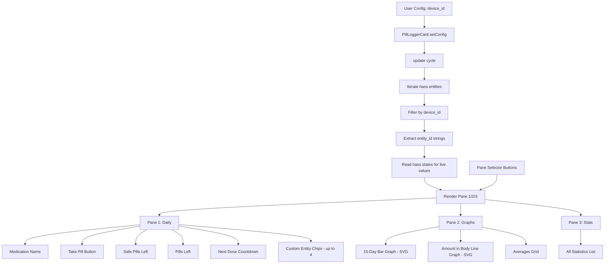

# Pill Logger Card — Implementation Plan

## Architecture Overview



## File Structure

Single file: [`src/pill-logger-card.ts`](src/pill-logger-card.ts)

Contains:
1. `PillLoggerCard` class (main card, extends `LitElement`)
2. `PillLoggerCardEditor` class (visual editor, extends `LitElement`)
3. `customElements.define` calls for both
4. `window.customCards.push` boilerplate

Build infrastructure (new files):
- [`package.json`](package.json) — project metadata, scripts, dependencies
- [`tsconfig.json`](tsconfig.json) — TypeScript config
- [`rollup.config.js`](rollup.config.js) — Rollup build config

## Data Model

### Config Schema
```typescript
interface PillLoggerCardConfig {
  device_id: string;           // Required: HA device ID
  chips?: string[];            // Optional: up to 4 custom entity IDs for Pane 1 chips
  show_amount_in_body?: boolean; // Optional: default true
}
```

### Entity Resolution Algorithm
```
1. Iterate over Object.entries(this.hass.entities)
2. For each [entity_id, entity_info], check if entity_info.device_id === this.config.device_id
3. Collect matching entity_ids into a map keyed by entity type suffix:
   - sensor.{name}_total_doses
   - sensor.{name}_last_dose
   - sensor.{name}_pills_safe_to_take
   - sensor.{name}_amount_in_body
   - sensor.{name}_next_dose
   - sensor.{name}_avg_daily_doses_7_days
   - sensor.{name}_avg_daily_doses_14_days
   - sensor.{name}_avg_daily_doses_30_days
   - sensor.{name}_avg_daily_doses_yearly
   - sensor.{name}_adherence_7_days
   - sensor.{name}_adherence_14_days
   - sensor.{name}_adherence_30_days
   - sensor.{name}_adherence_365_days
   - sensor.{name}_days_to_steady_state
   - sensor.{name}_strength
   - button.{name}_take
   - button.{name}_reset_history
   - button.{name}_undo_dose
   - number.{name}_pills_left
   - number.{name}_add_refill
4. Extract medication name from device info or entity friendly_name
```

### State Access
All live values read from `this.hass.states[entity_id].state` and `.attributes`.

## Pane Designs

### Pane 1: Daily
```
┌─────────────────────────────────┐
│  Medication Name                 │
│  ┌─────────────────────────────┐ │
│  │     💊 TAKE PILL            │ │  ← Large action button
│  │     (or ⚠️ LIMIT REACHED)   │ │  ← Conditional: red when safe=0
│  └─────────────────────────────┘ │
│  ┌──────────┐ ┌──────────────┐  │
│  │ Safe: N  │ │ Left: N      │  │  ← Two stat pills side by side
│  └──────────┘ └──────────────┘  │
│  Next dose: Available now /     │
│  Wait: Xh Ym                    │  ← Countdown text
│  ┌─────────────────────────────┐ │
│  │ [Chip1] [Chip2] [Chip3] [C4]│ │  ← Custom entity chips (optional)
│  └─────────────────────────────┘ │
└─────────────────────────────────┘
```

**Take Pill button behavior:**
- When `pills_safe_to_take > 0`: Blue pill icon, "Take Pill" label, calls `button.press` on `button.{name}_take`
- When `pills_safe_to_take == 0`: Red alert icon, "LIMIT REACHED" label, calls same service but with confirmation dialog
- When `pills_safe_to_take` is `unknown`: Blue pill icon (PRN mode), no limit check

**Next Dose countdown:**
- Parse `sensor.{name}_next_dose` state as datetime
- If `None` or `<= now()`: "Available now"
- Else: compute hours/minutes remaining, display "Wait: Xh Ym"

### Pane 2: Graphs
```
┌─────────────────────────────────┐
│  ◀ [15-Day Doses] [Body Amt] ▶ │  ← Slider/carousel navigation
│  ┌─────────────────────────────┐ │
│  │                             │ │
│  │   SVG Bar Chart / Line      │ │  ← Active graph
│  │                             │ │
│  └─────────────────────────────┘ │
│  ┌─────────────────────────────┐ │
│  │  Averages Grid              │ │
│  │  7d: X  │ 14d: X           │ │
│  │  30d: X │ Year: X          │ │
│  │  Adh 7d: X% │ Adh 14d: X% │ │
│  │  Adh 30d: X%│ Adh 365d: X%│ │
│  └─────────────────────────────┘ │
└─────────────────────────────────┘
```

**15-Day Bar Graph (SVG):**
- X-axis: last 15 days (dates)
- Y-axis: pills taken per day
- Data source: `sensor.{name}_total_doses` attributes or computed from dose history
- If dose history unavailable, show placeholder "No data yet"
- Bars colored with Mushroom blue gradient

**Amount in Body Line Graph (SVG):**
- Only rendered when `sensor.{name}_amount_in_body` state != "0" and != "unknown"
- X-axis: time (last 24-48 hours)
- Y-axis: mg in body
- Data source: `sensor.{name}_amount_in_body` attributes (`dose_history`, `last_updated`)
- Line colored with Mushroom purple gradient

**Averages Grid:**
- 2-column grid below graphs
- Shows: 7d/14d/30d/Year averages + 7d/14d/30d/365d adherence
- Each cell: label + value, compact Mushroom chip style

### Pane 3: Stats
```
┌─────────────────────────────────┐
│  Statistics                     │
│  ┌─────────────────────────────┐ │
│  │ Total Doses          N      │ │
│  │ Last Dose            time   │ │
│  │ Pills Left           N      │ │
│  │ Pills Safe to Take   N      │ │
│  │ Strength             N mg   │ │
│  │ Amount in Body       N mg   │ │
│  │ Steady State         N days │ │
│  │ 7-Day Average        N      │ │
│  │ 14-Day Average       N      │ │
│  │ 30-Day Average       N      │ │
│  │ Yearly Average       N      │ │
│  │ 7-Day Adherence      N%     │ │
│  │ 14-Day Adherence     N%     │ │
│  │ 30-Day Adherence     N%     │ │
│  │ 365-Day Adherence    N%     │ │
│  └─────────────────────────────┘ │
└─────────────────────────────────┘
```

Each row: label on left, value on right. Clean list with subtle separators. Hide rows for entities that don't exist (e.g., steady state for PRN meds).

### Pane Selector
```
┌─────────────────────────────────┐
│  [ Daily ]  [ Graphs ]  [ Stats ]│  ← Bottom button bar
└─────────────────────────────────┘
```

Three equal-width buttons. Active pane highlighted with accent color. Uses `mdi:pill`, `mdi:chart-bar`, `mdi:clipboard-list` icons.

## CSS / Theming Strategy

Follow Mushroom card design language:
- Use HA CSS variables: `--ha-card-background`, `--primary-text-color`, `--secondary-text-color`, `--divider-color`
- Card background: `var(--ha-card-background, var(--card-background-color, white))`
- Border radius: `var(--ha-card-border-radius, 12px)`
- Font: inherit from HA theme
- Accent colors: `var(--primary-color)` for active elements, `var(--error-color)` for warnings
- Chips: rounded pills with subtle background, matching Mushroom chips style
- Buttons: smooth transitions, hover effects, active scale animation
- Graphs: SVG with HA-compatible color palette

## Visual Editor

```typescript
class PillLoggerCardEditor extends LitElement {
  // Uses <ha-device-picker> filtered to pill_logger domain
  // Plus optional fields for chips (entity picker, up to 4)
  // Plus toggle for show_amount_in_body
  // Dispatches 'config-changed' event on changes
}
```

The editor will:
1. Use `<ha-device-picker>` with a filter for the `pill_logger` integration domain
2. Provide optional entity pickers for up to 4 custom chips
3. Provide a toggle for `show_amount_in_body`
4. Dispatch `config-changed` custom event with the new config

## Build Infrastructure

### package.json
- name: `lovelace-pill-logger-card`
- main: `dist/pill-logger-card.js`
- scripts: `build` (rollup -c), `watch` (rollup -c -w)
- dependencies: `lit` (for LitElement, html, css)
- devDependencies: `rollup`, `@rollup/plugin-typescript`, `@rollup/plugin-node-resolve`, `typescript`, `rollup-plugin-css-only` (or inline CSS via Lit)

### tsconfig.json
- target: ES2020
- module: ESNext
- moduleResolution: node
- strict: false (leniency for HA types)
- outDir: dist
- rootDir: src

### rollup.config.js
- input: `src/pill-logger-card.ts`
- output: `dist/pill-logger-card.js` (ES module format)
- plugins: typescript, node-resolve

## Key Design Decisions

1. **Single file**: All code in `src/pill-logger-card.ts` — card class, editor class, styles, registrations
2. **No external chart libs**: SVG graphs built with inline SVG in LitElement `render()`
3. **Device-centric**: `device_id` config param, dynamic entity resolution from `hass.entities`
4. **Mushroom aesthetic**: Clean, minimal, HA-native look using CSS variables
5. **TypeScript leniency**: `any` for `hass`, minimal inline interfaces
6. **Pane state**: Tracked via `_activePane` property ('daily' | 'graphs' | 'stats')
7. **Graph carousel**: Tracked via `_activeGraph` property (0 = bar, 1 = line)
8. **Conditional rendering**: Amount in Body graph only shown when value != 0; Steady State only when entity exists
