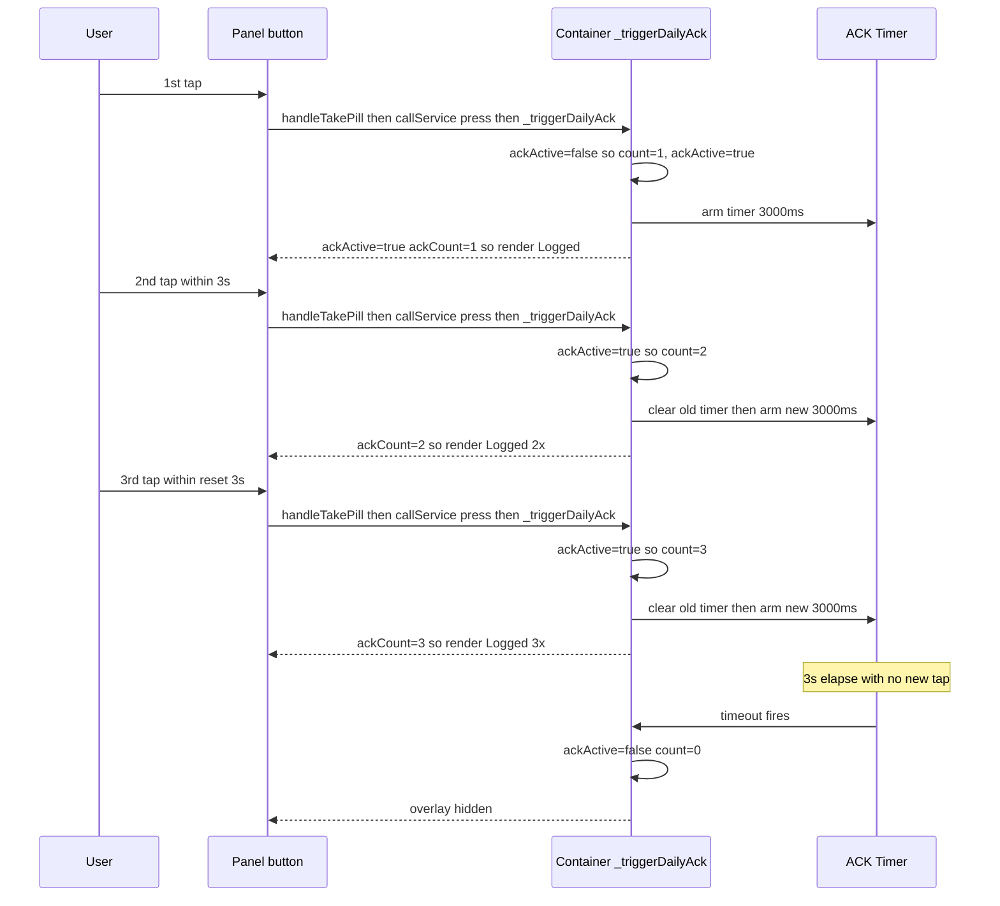

# Rapid Successive Click Counter on ACK Flash

## Goal

Visually track rapid successive clicks of the **Take Pill** and **Log Drink**
buttons. When the user taps again while the green "Logged" ACK flash is still
active, instantly update the text to reflect the total click count (e.g.
`Logged 2x`, `Logged 3x`) and reset the fade-out timer. The counter is a pure
UI affordance — each press already calls `hass.callService('button','press')`
so the backend receives a real dose per press; only the visual lacks the
running tally.

Both buttons share an identical ACK-flash state machine, so the counter logic
is mirrored on both for parity.

## Current Architecture (relevant pieces)

### Container — [`src/ax-dose-logger-card.ts`](src/ax-dose-logger-card.ts)

- **Reactive flags** ([lines 99-102](src/ax-dose-logger-card.ts:99)):
  `@state() _dailyAckActive: boolean` + `@state() _drinksAckActive: boolean`.
- **Non-reactive timer handles**: `_dailyAckTimer?: number`,
  `_drinksAckTimer?: number` (no rendering impact; only the booleans are
  reactive).
- **Frozen-state guards**: `@state() _dailyFrozenState` +
  `@state() _drinksFrozenState` (held for `ACK_INTRO_MS = 240ms` so the
  underlying state transition is hidden behind the opaque overlay).
- **`_triggerDailyAck()`** ([line 845](src/ax-dose-logger-card.ts:845)):
  1. captures pre-press state into `_dailyFrozenState`
  2. arms `_dailyFreezeTimer` (clears frozen state after 240ms + requestUpdate)
  3. sets `_dailyAckActive = true`
  4. clears any in-flight `_dailyAckTimer`
  5. arms `_dailyAckTimer` → flip `_dailyAckActive = false` + requestUpdate
     after `Math.max(500, duration)` ms.
- **`_triggerDrinksAck()`** ([line 876](src/ax-dose-logger-card.ts:876)) —
  mirror for the Log Drink button.
- **Render props** ([line 2279](src/ax-dose-logger-card.ts:2279),
  [line 2282](src/ax-dose-logger-card.ts:2282)):
  `.ackActive=${this._dailyAckActive}` / `.ackActive=${this._drinksAckActive}`
  passed to the respective panels.
- **`disconnectedCallback()`** ([line 2363](src/ax-dose-logger-card.ts:2363)):
  cancels `_dailyFreezeTimer` / `_drinksFreezeTimer` (NOT the ACK timers — a
  known minor gap; the ACK timers currently fire `requestUpdate` on a detached
  element, harmless but not cancelled).

### Daily Panel — [`src/components/daily-panel.ts`](src/components/daily-panel.ts)

- **Props** ([line 40](src/components/daily-panel.ts:40)):
  `@property({ attribute: false }) ackActive: boolean = false`.
- **ACK overlay render** ([lines 224-229](src/components/daily-panel.ts:224)):
  when `ackActive`, renders a `<div class="ack-flash ack-${layout}">` with a
  `mdi:check-bold` icon and a `<span class="ack-text">Logged</span>` (the
  `big` layout omits the text). The `ack-text` is always
  `localize('button.ack_text')` = `"Logged"`.

### Drinks Panel — [`src/components/drinks-panel.ts`](src/components/drinks-panel.ts)

- Identical ACK overlay render ([lines 240-245](src/components/drinks-panel.ts:240)),
  same `button.ack_text` localize key.

### Localize — [`src/localize.ts`](src/localize.ts)

- `button.ack_text` ([line 344](src/localize.ts:344)) = `"Logged"`.

## Design

### Visual Output (per user spec)

| Event | Visual |
|---|---|
| 1st press (idle → ACK) | Green success state as today: `Logged` (no `x`, so no `1x` rendered). |
| 2nd press while ACK active | Text instantly updates to `Logged 2x`; fade timer reset. |
| 3rd+ press while ACK active | `Logged 3x`, `Logged 4x` …; timer reset each time. |
| Timer expires | Overlay fades out; counter resets to 0. |
| New press after fade-out | Fresh `Logged` (count = 1, no suffix). |

### State Model

Add two reactive counters on the container:

```ts
@state() private _dailyAckCount: number = 0;
@state() private _drinksAckCount: number = 0;
```

**Semantics:**
- `_dailyAckCount === 0` ⟺ no ACK active (overlay hidden).
- `_dailyAckCount === 1` ⟺ first press; render `Logged` (no suffix).
- `_dailyAckCount >= 2` ⟺ subsequent press while active; render
  `Logged {count}x`.

`_triggerDailyAck()` becomes:

```ts
private _triggerDailyAck(): void {
  const duration = this.config?.take_button_ack_duration_ms ?? 3000;
  // Existing freeze-state capture (unchanged) …
  const entities = this._resolveEntities();
  this._dailyFrozenState = this._computeDailyButtonState(entities);
  if (this._dailyFreezeTimer !== undefined) {
    window.clearTimeout(this._dailyFreezeTimer);
  }
  this._dailyFreezeTimer = window.setTimeout(() => {
    this._dailyFrozenState = null;
    this._dailyFreezeTimer = undefined;
    this.requestUpdate();
  }, ACK_INTRO_MS);

  // ── NEW: increment counter when already active, init when first ──
  if (this._dailyAckActive) {
    this._dailyAckCount += 1;
  } else {
    this._dailyAckCount = 1;
    this._dailyAckActive = true;
  }

  // ── reset the fade timer (covers both first + subsequent) ──
  if (this._dailyAckTimer !== undefined) {
    window.clearTimeout(this._dailyAckTimer);
  }
  this._dailyAckTimer = window.setTimeout(() => {
    this._dailyAckActive = false;
    this._dailyAckCount = 0;        // NEW: clear counter alongside the flag
    this._dailyAckTimer = undefined;
    this.requestUpdate();
  }, Math.max(500, duration));
}
```

Mirror exactly for `_triggerDrinksAck()` with `_drinksAckCount`.

> **Why increment-then-render, not a separate tally variable?** Keeping the
> counter coupled to the ACK flag lifecycle (zero ⟺ inactive) means there is
> exactly one source of truth for "is the overlay showing a count?" and it
> clears itself automatically when the timer expires — no second timer, no
> reset-on-expire edge case. The existing single-timer architecture is
> preserved; only the bookkeeping inside it changes.

### Render Props

Add `ackCount` prop to both panels:

```ts
// daily-panel.ts + drinks-panel.ts
@property({ attribute: false }) ackCount: number = 0;
```

Container render site ([line 2279](src/ax-dose-logger-card.ts:2279)):

```ts
<ax-dose-daily-panel … .ackActive=${this._dailyAckActive} .ackCount=${this._dailyAckCount}>
```

Same for the drinks panel ([line 2282](src/ax-dose-logger-card.ts:2282)).

### Panel ACK Render (both panels)

Three layouts, each receives a count indicator when `ackCount >= 2`:

**`top` / `inline` layouts** (have text) — append the suffix to the existing
`ack-text` span via a new `_ackLabelText()` helper:

```ts
private _ackLabelText(): string {
  // 1st press → "Logged" (no suffix). 2nd+ → "Logged 2x" etc.
  const base = localize(this._lang, 'button.ack_text'); // "Logged"
  return this.ackCount >= 2 ? `${base} ${this.ackCount}x` : base;
}
```

**`big` layout** (large tickmark only, no text) — inject a small `Nx` badge
below the tickmark when `ackCount >= 2`. No extra DOM wrapper; a new
`<span class="ack-count-badge">` is conditionally rendered inside the
existing `.ack-flash.ack-big` flex column. CSS scopes it to the `big` layout
so the `top`/`inline` text spans are unaffected.

Unified render block (replaces the current `ackActive` conditional in both
panels):

```ts
${this.ackActive ? html`
  <div class="ack-flash ack-${this._ackLayout()}">
    <ha-icon icon="mdi:check-bold" class="ack-icon"></ha-icon>
    ${this._ackLayout() !== 'big'
      ? html`<span class="ack-text">${this._ackLabelText()}</span>`
      : (this.ackCount >= 2
        ? html`<span class="ack-count-badge">${this.ackCount}x</span>`
        : nothing)}
  </div>
` : nothing}
```

New CSS (added once per panel's stylesheet, scoped under
`.ack-flash.ack-big`):

```css
/* Rapid-click count badge for the `big` (tickmark-only) ACK layout.
   Hidden on top/inline (those embed the count in ack-text). */
.take-pill-btn .ack-flash.ack-big .ack-count-badge {
  font-size: calc(14px + var(--pill-text-offset, 0px));
  font-weight: 600;
  color: var(--btn-green);
  background: rgba(67, 160, 71, 0.18);
  padding: 1px 8px;
  border-radius: 10px;
  margin-top: 6px;
  line-height: 1.2;
}
```

> The badge uses the same `--btn-green` glyph color as the tickmark so it
> reads as part of the success indicator, not a separate element. The
> translucent green chip background ties it to the green overlay surface.
> The drinks panel mirrors this rule under its own `.log-drink-btn` selector.

### Localize

No new key needed — the `${count}x` suffix is constructed by string
interpolation off the existing `button.ack_text` (`"Logged"`). Localizing
the multiplier token (`x`) is English-centric; if i18n becomes a concern
later, a `button.ack_count_suffix` key with placeholder can replace the
literal `x`. For now, the single `Logged` base + ` ${count}x` suffix matches
the user's verbatim examples (`Logged 2x`, `Logged 3x`).

### CSS

Beyond the `big`-layout badge rule above, no other CSS change is required.
The existing `.ack-text` flex container holds the string; a longer string
(`Logged 10x`) flows within the overlay's `justify-content: center` without
layout shift (the overlay is `position: absolute; inset: 0` over the button,
so width is the full button).

One defensive guard: the overlay has `pointer-events: none`, so rapid taps
pass through to the button's `@click` — the counter increments on every real
press even while the overlay is visible. ✓ No change needed.

### Disconnect Cleanup

Extend [`disconnectedCallback()`](src/ax-dose-logger-card.ts:2363) to cancel
the ACK timers (currently only the freeze timers are cancelled). This is a
small hardening fix that falls out of the change:

```ts
if (this._dailyAckTimer !== undefined) {
  window.clearTimeout(this._dailyAckTimer);
  this._dailyAckTimer = undefined;
}
if (this._drinksAckTimer !== undefined) {
  window.clearTimeout(this._drinksAckTimer);
  this._drinksAckTimer = undefined;
}
```

### What Does NOT Change

- **Backend** — no coordinator / sensor / button / store / config-flow change.
  Each press already fires `hass.callService('button','press')`; the counter is
  a pure UI affordance tracking how many presses landed during the ACK window.
- **ACK duration / freeze-state logic** — unchanged. The fade duration is
  still `ack_duration_ms` (default 3000), the freeze window is still
  `ACK_INTRO_MS` (240ms).
- **`button.ack_text` localize key** — unchanged (`"Logged"`); the suffix is
  built by interpolation.
- **No new config option** — the counter is always-on behaviour, matching the
  user's "indicators always on" directive. No editor-schema change.

## Sequence Diagram



## Steps

1. **Container state** — add `_dailyAckCount` + `_drinksAckCount` reactive
   counters; rewrite `_triggerDailyAck` / `_triggerDrinksAck` to
   increment-or-init + reset timer + clear-on-expire.
2. **Container render props** — pass `.ackCount=${this._dailyAckCount}` /
   `.ackCount=${this._drinksAckCount}` to the two panels.
3. **Container disconnect** — cancel the ACK timers in
   `disconnectedCallback` (hardening).
4. **Daily panel** — add `ackCount` prop + `_ackLabelText()` helper; wire
   into the ack-text span / big-layout badge; add the `.ack-count-badge` CSS.
5. **Drinks panel** — same as daily panel (parity) under `.log-drink-btn`.
6. **Build + verify** — `yarn run build` clean; dist grep for the new
   counter logic; manual logic trace for first / subsequent / expire / new
   press sequence.
7. **Memory bank + README** — update frontend `activeContext.md` +
   `progress.md`; README update with a one-line note on the count affordance
   in the Button State Matrix / ACK section.

## Verification

- `yarn run build` exit 0, no TS errors.
- Dist grep: `ackCount` present (panel render path) + `_dailyAckCount` /
  `_drinksAckCount` (container) + `ack-count-badge` (CSS).
- Logic trace (no HA runtime available in the card repo):
  - 1st press → count=1, text=`Logged`, timer armed.
  - 2nd press while active → count=2, text=`Logged 2x`, timer reset.
  - timer expires → count=0, ackActive=false, overlay hidden.
  - new press after expiry → count=1 again, text=`Logged`.
  - `big` layout → tickmark only at count=1; `Nx` badge appears at count≥2.

## Resolved Scope Decisions

- **Both Take Pill + Log Drink buttons** get the counter (parity — both share
  the identical ACK flash state machine).
- **`big` layout gets a small `Nx` badge below the tickmark** when
  `ackCount >= 2` (user-confirmed). The `top` / `inline` layouts embed the
  count in the existing `Logged` text as `Logged 2x`. This satisfies the
  user's "all the styles should have the 2x, 3x, 4x indicators always on"
  directive across all three ACK layouts.