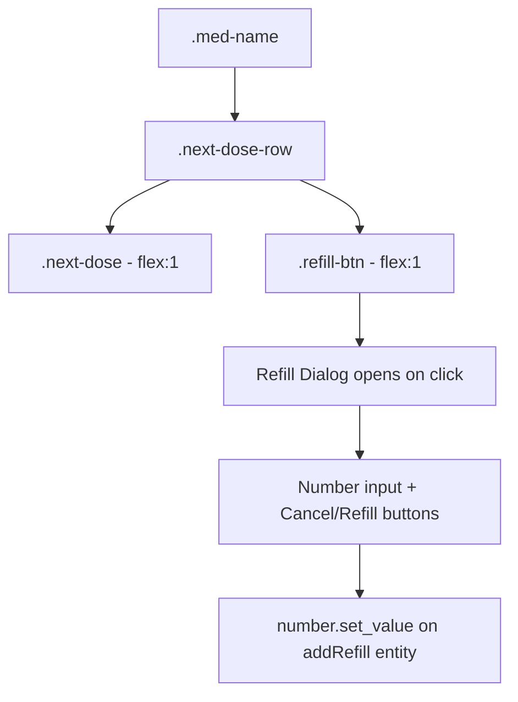

# Refill Button Feature — Architecture Plan

## Overview

Add a "Refill Medication" button next to the Next Dose box in the Daily pane. When pressed, a dialog opens with a number input and a "Refill" button. Submitting the dialog calls `number.set_value` on the device's `add_refill` entity, which automatically increases `pills_left` on the backend.

## Current State

- The **Next Dose** box is a full-width `.next-dose` div in [`_renderPane1()`](src/pill-logger-card.ts:363)
- The `addRefill` entity is already resolved in [`_resolveEntities()`](src/pill-logger-card.ts:148) as `entities.addRefill`
- The existing [`_renderDeviceInfoDialog()`](src/pill-logger-card.ts:321) provides a proven dialog pattern: fixed backdrop, centered box, backdrop-click/Escape dismiss

## Changes Required

### 1. New State Properties

```typescript
@state() private _showRefillDialog: boolean = false;
@state() private _refillAmount: string = '';
```

### 2. New Action Method — `_handleRefill()`

Calls HA `number.set_value` service on the `addRefill` entity:

```typescript
private _handleRefill(entities: ResolvedEntities) {
  if (!this.hass || !entities.addRefill) return;
  const value = parseFloat(this._refillAmount);
  if (isNaN(value) || value <= 0) return;
  this.hass.callService('number', 'set_value', {
    entity_id: entities.addRefill,
    value: value,
  });
  this._showRefillDialog = false;
  this._refillAmount = '';
}
```

### 3. New Dialog Method — `_renderRefillDialog()`

Follows the existing dialog pattern with a number input and Refill button:

```html
<div class="dialog-backdrop" @click=dismiss @keydown=Escape>
  <div class="dialog-box" @click=stopPropagation>
    <div class="dialog-title">Refill Medication</div>
    <input type="number" class="refill-input" 
           .value=${this._refillAmount}
           @input=${update _refillAmount}
           placeholder="Enter number of pills"
           min="1" step="1" />
    <div class="dialog-actions">
      <button class="dialog-btn dialog-cancel" @click=${dismiss}>Cancel</button>
      <button class="dialog-btn dialog-confirm" @click=${_handleRefill}>Refill</button>
    </div>
  </div>
</div>
```

### 4. Layout Restructure — Next Dose Row

Current layout in `_renderPane1()`:

```
.med-name
.next-dose          ← full width
.daily-main         ← Take Pill + Stats column
.chips-row
```

New layout:

```
.med-name
.next-dose-row      ← NEW flex container
  .next-dose        ← flex: 1 (half width)
  .refill-btn       ← flex: 1 (half width), button styled
.daily-main
.chips-row
```

The `.next-dose` div moves inside `.next-dose-row` and gets `flex: 1` instead of full width. The `.refill-btn` is a new button element also with `flex: 1`.

### 5. Refill Button Markup

```html
<button class="refill-btn" @click=${() => { this._showRefillDialog = true; this._refillAmount = ''; }}>
  <ha-icon icon="mdi:pill"></ha-icon>
  <span>Refill Medication</span>
</button>
```

Only rendered if `entities.addRefill` exists — graceful fallback if entity unavailable.

### 6. CSS Additions

```css
/* Next dose row — flex container for next-dose + refill button */
.next-dose-row {
  display: flex;
  gap: 8px;
}

/* Next dose takes half width */
.next-dose-row .next-dose {
  flex: 1;
}

/* Refill button takes half width */
.refill-btn {
  flex: 1;
  display: flex;
  align-items: center;
  justify-content: center;
  gap: 8px;
  padding: 10px 14px;
  border: none;
  border-radius: var(--ha-card-border-radius, 12px);
  background: rgba(var(--rgb-primary-color, 3, 169, 244), 0.08);
  color: var(--primary-color, #03a9f4);
  font-size: 14px;
  font-weight: 500;
  font-family: inherit;
  cursor: pointer;
  transition: background 0.2s;
}

.refill-btn:hover {
  background: rgba(var(--rgb-primary-color, 3, 169, 244), 0.18);
}

.refill-btn ha-icon {
  --mdc-icon-size: 20px;
}

/* Refill dialog input */
.refill-input {
  width: 100%;
  padding: 12px 14px;
  border: 1px solid var(--divider-color, rgba(0,0,0,0.1));
  border-radius: var(--ha-card-border-radius, 12px);
  font-size: 16px;
  font-family: inherit;
  background: var(--card-background-color, var(--primary-background-color));
  color: var(--primary-text-color);
  box-sizing: border-box;
}

.refill-input:focus {
  outline: none;
  border-color: var(--primary-color, #03a9f4);
}

/* Dialog actions row */
.dialog-actions {
  display: flex;
  gap: 8px;
}

.dialog-actions .dialog-btn {
  flex: 1;
}

.dialog-cancel {
  background: rgba(var(--rgb-primary-color, 3, 169, 244), 0.06) !important;
  color: var(--secondary-text-color, #666) !important;
}

.dialog-confirm {
  background: rgba(var(--rgb-primary-color, 3, 169, 244), 0.12) !important;
  color: var(--primary-color, #03a9f4) !important;
}
```

### 7. Conditional Rendering in `render()`

Add alongside the existing device info dialog:

```typescript
${this._showRefillDialog ? this._renderRefillDialog(entities) : nothing}
```

## Layout Diagram



## Edge Cases

- **No addRefill entity**: The refill button is not rendered; `.next-dose` remains full-width as a solo child of `.next-dose-row`
- **Invalid input**: `_handleRefill()` validates with `isNaN` and `value <= 0` check before calling service
- **Dialog dismiss**: Backdrop click, Escape key, and Cancel button all close the dialog and clear `_refillAmount`
- **Service call**: Uses `number.set_value` which is the standard HA service for `number.*` entities

## Files Modified

- [`src/pill-logger-card.ts`](src/pill-logger-card.ts) — All changes in single file: state properties, action method, dialog method, pane1 restructure, CSS additions, render() conditional