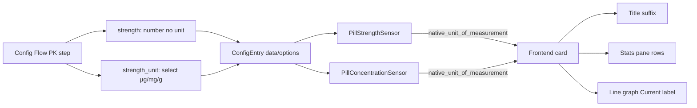

# Plan — Dose Strength Unit Selector (µg / mg / g)

## Goal
On the **Pharmacokinetics** configuration panel (both initial config flow and options flow), remove the hardcoded `mg` unit from the Dose Strength field and add a dropdown directly underneath that lets the user pick the unit: **µg**, **mg**, or **g**. The selected unit then drives the unit shown on the **Dose Strength** sensor and the **Amount in Body** sensor, and the unit suffix shown in the frontend card (title, Stats pane, line-graph "Current" label).

## Architecture Overview



## Backend Changes — `/workspaces/Home-Assistant-Pill-Logger/`

### 1. `custom_components/pill_logger/const.py`
Add a constant for the allowed units so both config_flow and sensors can reference it:

```python
STRENGTH_UNITS: list[str] = ["µg", "mg", "g"]
```

### 2. `custom_components/pill_logger/config_flow.py`
- Remove `unit_of_measurement="mg"` from `_STRENGTH_SELECTOR` (line 24-26). The number field becomes unitless; the unit is conveyed by the new dropdown directly below it.
- Add a reusable selector:
  ```python
  _STRENGTH_UNIT_SELECTOR = sel.SelectSelector(
      sel.SelectSelectorConfig(
          options=STRENGTH_UNITS,
          mode=sel.SelectSelectorMode.DROPDOWN,
          translation_key="strength_unit",
      )
  )
  ```
- In `async_step_pk()` (config flow, ~line 214) add immediately after the `strength` field:
  ```python
  vol.Optional("strength_unit", default="mg"): _STRENGTH_UNIT_SELECTOR,
  ```
- In `PillLoggerOptionsFlowHandler.async_step_pk()` (~line 345) add the same field with default pulled from options/data:
  ```python
  vol.Optional("strength_unit", default=options.get("strength_unit", data.get("strength_unit", "mg"))): _STRENGTH_UNIT_SELECTOR,
  ```
- Bump `VERSION = 7` → `VERSION = 8` on the `PillLoggerConfigFlow` class.

### 3. `custom_components/pill_logger/__init__.py`
Add a migration block for `config_entry.version <= 7`:
```python
if config_entry.version <= 7:
    # Version 8: add strength_unit (default mg for existing entries)
    new_data.setdefault("strength_unit", "mg")
    new_options.setdefault("strength_unit", "mg")
```
Update the final `async_update_entry(..., version=8)` call and the log message.

### 4. `custom_components/pill_logger/sensors/strength.py`
- In `__init__`, read the unit:
  ```python
  self._strength_unit = entry.options.get("strength_unit", entry.data.get("strength_unit", "mg"))
  self._attr_native_unit_of_measurement = self._strength_unit
  ```
- Expose the unit as an extra state attribute so the frontend can read it without parsing the unit string:
  ```python
  self._attr_extra_state_attributes = {"strength_unit": self._strength_unit}
  ```
- Add an `async_added_to_hass`-style reload is not needed because strength is recreated on entry reload (options flow triggers `async_reload_entry`). But to be safe, add a small `_load_unit()` helper called in `__init__` only (strength sensor has no live update path).

### 5. `custom_components/pill_logger/sensors/concentration.py`
- In `__init__` and `_load_pk_params()`, read `strength_unit`:
  ```python
  self._strength_unit = entry.options.get("strength_unit", entry.data.get("strength_unit", "mg"))
  ```
  and in `_load_pk_params`:
  ```python
  self._strength_unit = entry.options.get("strength_unit", entry.data.get("strength_unit", "mg"))
  ```
- Set `self._attr_native_unit_of_measurement = self._strength_unit` in `__init__` (replacing the hardcoded `"mg"` on line 48).
- **Important**: The PK math is unit-agnostic — `strength` and `amount_in_body` use the same unit, so no conversion factor is needed. The half-life / bioavailability calculations operate on the numeric value regardless of unit. This keeps the change purely presentational on the concentration side.

### 6. `custom_components/pill_logger/strings.json` + `translations/en.json`
In **both** `config.step.pk.data` and `options.step.pk.data`, add:
```json
"strength_unit": "Dose Strength Unit"
```
In **both** `config.step.pk.data_description` and `options.step.pk.data_description`:
```json
"strength_unit": "Unit for the dose strength value. Also sets the unit shown on the Amount in Body sensor and the card."
```
Add a new top-level `selector` block (sibling of `tracking_type` / `release_type`):
```json
"selector": {
  "strength_unit": {
    "options": {
      "µg": "µg — micrograms",
      "mg": "mg — milligrams (default)",
      "g": "g — grams"
    }
  }
}
```
(Merge into the existing `selector` object — do not duplicate the key.)

### 7. Backend verification
Run `python -m py_compile` on each modified file, or `hass -c ./config --script check_config` if available.

## Frontend Changes — `/workspaces/lovelace-pill-logger-card/`

### 8. `src/pill-logger-card.ts` — read the unit
Add a helper that reads `strength_unit` from the strength entity's extra state attributes, falling back to `mg`:

```ts
private _getStrengthUnit(entities: ResolvedEntities): string {
  if (entities.strength && this.hass) {
    const stateObj = this.hass.states[entities.strength];
    if (stateObj?.attributes?.strength_unit) {
      return stateObj.attributes.strength_unit as string;
    }
  }
  return 'mg';
}
```

### 9. Replace hardcoded `mg` strings
Three locations currently hardcode `mg`:

1. **Title** — [`_getMedName()`](src/pill-logger-card.ts:433-439), line 438:
   ```ts
   name += ` - ${this._formatInteger(strengthState)} ${this._getStrengthUnit(entities)}`;
   ```
   (Note: `_getMedName` currently takes no `entities` arg — it reads `this._entities` or similar. Check signature; pass `entities` through or read from a cached field. If signature change is invasive, cache the unit on a private field updated in `setConfig`/`updated`.)

2. **Stats pane** — [`_renderPane3()`](src/pill-logger-card.ts:865-866):
   ```ts
   const unit = this._getStrengthUnit(entities);
   if (entities.strength) rows.push({ label: 'Strength', value: this._formatInteger(this._getState(entities.strength)) + ' ' + unit, icon: 'mdi:scale' });
   if (entities.amountInBody) rows.push({ label: 'Amount in Body', value: this._getState(entities.amountInBody) + ' ' + unit, icon: 'mdi:chart-bell-curve' });
   ```

3. **Line graph "Current" label** — [`_renderLineGraph()`](src/pill-logger-card.ts:811):
   ```ts
   Current: ${amountInBody} ${this._getStrengthUnit(entities)}
   ```

### 10. Frontend verification
`yarn run build` — clean compilation, zero warnings.

## Memory Bank Updates
- **Backend** `memory-bank/activeContext.md`, `progress.md`, `projectstructure.md` (if file responsibilities changed — they don't here, so likely just activeContext + progress).
- **Frontend** `memory-bank/activeContext.md`, `progress.md`.

## Key Design Decisions
1. **Unitless strength selector + separate unit dropdown** — matches the user's explicit request ("remove the predefined unit … add a drop down button underneath"). Keeps the number input clean.
2. **Unit stored on config entry, not derived** — `strength_unit` is a first-class config field, migrated with a default of `mg` for existing entries (no breaking change).
3. **PK math unchanged** — strength and amount-in-body share the same unit, so the Bateman/ER equations need no unit conversion. The change is purely presentational on the concentration sensor.
4. **Unit exposed via `strength_unit` attribute on the strength sensor** — the frontend reads it from there rather than parsing the `native_unit_of_measurement` string, which is more robust across HA versions and locale formatting.
5. **Config flow version bump 7 → 8** with a one-line migration (`setdefault("strength_unit", "mg")`) — existing users see no behavior change.
6. **Dropdown options use proper SI symbols** (µg, mg, g) per user confirmation.

## Risks / Notes
- The `µ` character is non-ASCII; ensure JSON files are saved UTF-8 (they already contain em-dashes, so encoding is fine).
- HA's `SensorDeviceClass.WEIGHT` on the strength sensor expects units HA recognizes. `µg`, `mg`, `g` are all valid HA weight units, so device class can stay. If any issue arises, fall back to removing `SensorDeviceClass.WEIGHT` and using a plain measurement — but this should not be necessary.
- The concentration sensor currently has no `SensorDeviceClass` (only `SensorStateClass.MEASUREMENT`), so changing its `native_unit_of_measurement` is safe.