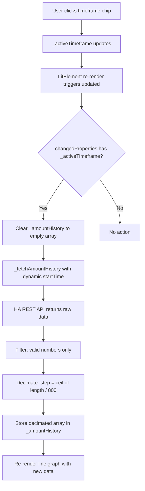

# Implementation Plan: Timeframe Chips + Array Decimation

## Problem Statement

The `amount_in_body` sensor updates every 2 minutes. A 30-day fetch returns >21,000 data points. Rendering an SVG `<polyline>` with 21,000 nodes stalls the browser thread. We need:

1. **Timeframe selection** — inline chips (48H, 7D, 14D, 30D) on the line graph
2. **Dynamic fetch** — startTime calculated from selected timeframe
3. **Array decimation** — cap SVG nodes at ~800 regardless of timeframe
4. **Dynamic time labels** — adapt X-axis labels to the selected timeframe

## Data Volume Analysis

| Timeframe | Hours | Data Points (2-min interval) | Decimation Step |
|-----------|-------|------------------------------|-----------------|
| 48H       | 48    | ~1,440                       | 2 (→ 720)       |
| 7D        | 168   | ~5,040                       | 7 (→ 720)       |
| 14D       | 336   | ~10,080                      | 13 (→ 776)      |
| 30D       | 720   | ~21,600                      | 27 (→ 800)      |

## Architecture



## Changes — File: `src/pill-logger-card.ts`

### 1. Add `_activeTimeframe` State Property

**Location**: After line 82 (`@state() private _refillAmount: string = '';`)

```typescript
@state() private _activeTimeframe: string = '48h';
```

Valid values: `'48h'`, `'7d'`, `'14d'`, `'30d'`

---

### 2. Add `_getTimeframeHours()` Helper

**Location**: In the "Computed Values" section, after `_computeTimeSinceLastDose()`

```typescript
private _getTimeframeHours(): number {
  switch (this._activeTimeframe) {
    case '7d': return 168;
    case '14d': return 336;
    case '30d': return 720;
    default: return 48;
  }
}
```

---

### 3. Add `_handleTimeframeChange()` Method

**Location**: In the "Actions" section, after `_handleRefill()`

```typescript
private _handleTimeframeChange(timeframe: string): void {
  if (timeframe === this._activeTimeframe) return;
  this._activeTimeframe = timeframe;
}
```

This triggers `updated()` via LitElement's reactive state change, which handles the re-fetch.

---

### 4. Modify `_fetchAmountHistory()` — Dynamic startTime + Decimation

**Location**: Lines 603–635

**Current** (line 608):
```typescript
const startTime = new Date(now.getTime() - 48 * 60 * 60 * 1000).toISOString();
```

**New**:
```typescript
const startTime = new Date(now.getTime() - this._getTimeframeHours() * 60 * 60 * 1000).toISOString();
```

**Current** (lines 625–630 — after filtering for valid numbers):
```typescript
this._amountHistory = data[0]
  .filter((entry: any) => entry.state && !isNaN(parseFloat(entry.state)))
  .map((entry: any) => ({
    timestamp: entry.last_changed,
    value: parseFloat(entry.state)
  }));
```

**New** — add decimation after the map:
```typescript
const filteredData = data[0]
  .filter((entry: any) => entry.state && !isNaN(parseFloat(entry.state)))
  .map((entry: any) => ({
    timestamp: entry.last_changed,
    value: parseFloat(entry.state)
  }));

const MAX_NODES = 800;
const step = Math.ceil(filteredData.length / MAX_NODES);
this._amountHistory = step > 1
  ? filteredData.filter((_: any, index: number) => index % step === 0)
  : filteredData;
```

---

### 5. Modify `updated()` Lifecycle — Re-fetch on Timeframe Change

**Location**: Lines 883–890

**Current**:
```typescript
if (changedProperties.has('_activePane') && this._activePane === 'graphs' && this.config && this.hass) {
  const entities = this._resolveEntities();
  this._fetchAmountHistory(entities);
  this._fetchDoseHistory(entities);
}
```

**New**:
```typescript
if (this._activePane === 'graphs' && this.config && this.hass) {
  const entities = this._resolveEntities();
  if (changedProperties.has('_activePane')) {
    this._fetchAmountHistory(entities);
    this._fetchDoseHistory(entities);
  } else if (changedProperties.has('_activeTimeframe')) {
    this._amountHistory = [];
    this._fetchAmountHistory(entities);
  }
}
```

Key design decisions:
- Pane switch → fetch both amount history AND dose history
- Timeframe change → only re-fetch amount history, clear stale data first
- Dose history is always 14 days for the bar graph, unaffected by timeframe

---

### 6. Modify `_renderLineGraph()` — Dynamic Time Labels + Timeframe Chips

**Location**: Lines 663–751

#### 6a. Replace hardcoded 48h time range

**Current** (line 687):
```typescript
const hours48Ago = new Date(now.getTime() - 48 * 60 * 60 * 1000);
```

**New**:
```typescript
const timeframeHours = this._getTimeframeHours();
const startTime = new Date(now.getTime() - timeframeHours * 60 * 60 * 1000);
```

**Current** (line 696 — polyline point calculation):
```typescript
const fraction = Math.max(0, Math.min(1, (t.getTime() - hours48Ago.getTime()) / (48 * 60 * 60 * 1000)));
```

**New**:
```typescript
const fraction = Math.max(0, Math.min(1, (t.getTime() - startTime.getTime()) / (timeframeHours * 60 * 60 * 1000)));
```

#### 6b. Replace hardcoded time labels

**Current** (lines 703–707):
```typescript
const timeLabels: Array<{ hour: number; x: number }> = [];
for (let hours = 0; hours <= 48; hours += 6) {
  const fraction = hours / 48;
  timeLabels.push({ hour: hours, x: padLeft + fraction * chartW });
}
```

**New** — dynamic labels based on timeframe:
```typescript
const timeLabels: Array<{ label: string; x: number }> = [];
const totalHours = this._getTimeframeHours();

if (totalHours <= 48) {
  // 48H: labels every 6 hours, format "-Xh"
  for (let h = 0; h <= totalHours; h += 6) {
    const fraction = h / totalHours;
    timeLabels.push({ label: `-${totalHours - h}h`, x: padLeft + fraction * chartW });
  }
} else {
  // 7D/14D/30D: labels in days
  const totalDays = totalHours / 24;
  let step: number;
  if (totalDays <= 7) step = 1;       // 7D: every 1 day
  else if (totalDays <= 14) step = 2;  // 14D: every 2 days
  else step = 5;                       // 30D: every 5 days

  for (let d = 0; d <= totalDays; d += step) {
    const fraction = d / totalDays;
    timeLabels.push({ label: `-${Math.round(totalDays - d)}d`, x: padLeft + fraction * chartW });
  }
}
```

**Current** (line 747 — time label rendering):
```typescript
fill="var(--secondary-text-color)">-${48 - tl.hour}h</text>
```

**New**:
```typescript
fill="var(--secondary-text-color)">${tl.label}</text>
```

#### 6c. Wrap SVG in positioned container + add timeframe chips

The entire return value of `_renderLineGraph()` needs to be wrapped in a `<div class="line-graph-wrapper">` with `position: relative`, containing both the SVG and the chips overlay.

**Empty state** (lines 676–683) — wrap in container with chips:
```typescript
if (history.length === 0) {
  return html`
    <div class="line-graph-wrapper">
      <div class="timeframe-chips">
        ${this._renderTimeframeChips()}
      </div>
      <svg viewBox="0 0 ${w} ${h}" class="chart-svg" preserveAspectRatio="xMidYMid meet" style="aspect-ratio: 320/180">
        <text x="${w / 2}" y="${h / 2}" text-anchor="middle"
              style="font-size: calc(13px + var(--pill-text-offset, 0px))"
              fill="var(--secondary-text-color)">Loading history...</text>
      </svg>
    </div>
  `;
}
```

**Main return** (lines 709–750) — wrap in container with chips:
```typescript
return html`
  <div class="line-graph-wrapper">
    <div class="timeframe-chips">
      ${this._renderTimeframeChips()}
    </div>
    <svg viewBox="0 0 ${w} ${h}" class="chart-svg" ...>
      <!-- existing SVG content unchanged -->
    </svg>
  </div>
`;
```

#### 6d. Add `_renderTimeframeChips()` helper method

**Location**: In the "Pane 2: Graphs" section, before `_renderLineGraph()`

```typescript
private _renderTimeframeChips() {
  const timeframes = [
    { id: '48h', label: '48H' },
    { id: '7d', label: '7D' },
    { id: '14d', label: '14D' },
    { id: '30d', label: '30D' },
  ];
  return timeframes.map(tf => html`
    <button
      class="timeframe-chip ${this._activeTimeframe === tf.id ? 'active' : ''}"
      @click=${() => this._handleTimeframeChange(tf.id)}
    >${tf.label}</button>
  `);
}
```

---

### 7. Add CSS for Timeframe Chips and Line Graph Wrapper

**Location**: In the `static styles` block, in the "Pane 2: Graphs" section

```css
.line-graph-wrapper {
  position: relative;
}

.timeframe-chips {
  position: absolute;
  top: 4px;
  right: 4px;
  display: flex;
  gap: 2px;
  z-index: 1;
}

.timeframe-chip {
  padding: 2px 6px;
  font-size: 10px;
  font-weight: 500;
  border-radius: 4px;
  cursor: pointer;
  color: var(--secondary-text-color);
  background: rgba(var(--rgb-primary-color, 3, 169, 244), 0.08);
  border: none;
  font-family: inherit;
  transition: color 0.2s, background 0.2s;
  line-height: 1.4;
}

.timeframe-chip:hover {
  background: rgba(var(--rgb-primary-color, 3, 169, 244), 0.15);
}

.timeframe-chip.active {
  color: var(--primary-color);
  background: rgba(var(--rgb-primary-color, 3, 169, 244), 0.2);
  font-weight: 600;
}
```

---

## Summary of All Changes

| # | Change | Location |
|---|--------|----------|
| 1 | Add `@state() _activeTimeframe` property | Line ~83 |
| 2 | Add `_getTimeframeHours()` helper | Computed Values section |
| 3 | Add `_handleTimeframeChange()` method | Actions section |
| 4 | Dynamic `startTime` in `_fetchAmountHistory()` | Line 608 |
| 5 | Decimation logic in `_fetchAmountHistory()` | Lines 625–630 |
| 6 | Update `updated()` for timeframe re-fetch | Lines 883–890 |
| 7 | Dynamic time range in `_renderLineGraph()` | Lines 687, 696 |
| 8 | Dynamic time labels in `_renderLineGraph()` | Lines 703–707, 747 |
| 9 | Wrap SVG in `.line-graph-wrapper` + chips | Lines 676–750 |
| 10 | Add `_renderTimeframeChips()` helper | Pane 2 section |
| 11 | Add CSS for `.line-graph-wrapper`, `.timeframe-chips`, `.timeframe-chip` | Styles section |

## Verification

After implementation:
1. `yarn run build` — clean compilation, zero warnings, zero errors
2. Visual check: 48H chip should be active by default
3. Clicking 7D/14D/30D should re-fetch and re-render with appropriate time labels
4. 30D fetch should produce ≤800 SVG nodes regardless of raw data size
5. Time labels should show hours for 48H, days for 7D/14D/30D