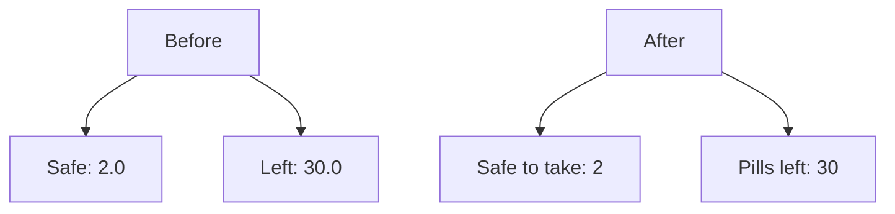

# UI Refinements Plan

## Overview
Four targeted UI changes to the Pill Logger Card: reorder editor field, fix decimal display, rename labels, and restructure the Stats pane.

---

## Changes

### 1. Move `show_amount_in_body` to bottom of editor config
**File:** `src/pill-logger-card.ts` — `getConfigForm()` method (line ~675)

**Current order:** `device_id` → `show_amount_in_body` → `name` → `chip_1` → `chip_1_label` → ...

**New order:** `device_id` → `name` → `chip_1` → `chip_1_label` → ... → `chip_4_label` → `show_amount_in_body`

Move the `show_amount_in_body` schema entry from position 2 to the very end of the schema array.

---

### 2. Add `_formatInteger()` helper
**File:** `src/pill-logger-card.ts` — new private method in the State Helpers section (after `_getAttr`)

```typescript
private _formatInteger(value: string): string {
  const num = parseFloat(value);
  if (isNaN(num)) return value; // preserve "unavailable", "unknown", etc.
  return Math.round(num).toString();
}
```

This strips decimal places from Safe and Left values. If the value is not a number (e.g., "unavailable"), it returns the original string unchanged.

---

### 3. Rename labels in Daily pane
**File:** `src/pill-logger-card.ts` — `_renderPane1()` method

| Current | New |
|---------|-----|
| `Safe` | `Safe to take` |
| `Left` | `Pills left` |

---

### 4. Apply `_formatInteger()` to Safe and Left in Daily pane
**File:** `src/pill-logger-card.ts` — `_renderPane1()` method

- Line ~324: `${isUnknown ? 'N/A' : safeState}` → `${isUnknown ? 'N/A' : this._formatInteger(safeState)}`
- Line ~329: `${pillsLeft === 'unavailable' ? '-' : pillsLeft}` → `${pillsLeft === 'unavailable' ? '-' : this._formatInteger(pillsLeft)}`

---

### 5. Convert Stats pane to 2-column grid
**File:** `src/pill-logger-card.ts` — `_renderPane3()` method and CSS

**Current:** Single-column `.stats-list` with `.stat-row` items (icon + label on left, value on right).

**New:** 2-column grid layout. Each cell shows:
- Icon (small)
- Label (small, uppercase)
- Value (large, bold)

This mirrors the `.averages-grid` / `.avg-cell` pattern already used in the Graphs pane.

**HTML change in `_renderPane3()`:**
```html
<div class="stats-grid">
  ${rows.map(row => html`
    <div class="stat-cell">
      <div class="stat-cell-header">
        <ha-icon icon="${row.icon}"></ha-icon>
        <span class="stat-cell-label">${row.label}</span>
      </div>
      <span class="stat-cell-value">${row.value === 'unavailable' ? '-' : row.value}</span>
    </div>
  `)}
</div>
```

**CSS changes:**
- Remove `.stats-list` and `.stat-row` / `.stat-row-left` / `.stat-row-value` styles
- Add `.stats-grid` — `display: grid; grid-template-columns: 1fr 1fr; gap: 8px;`
- Add `.stat-cell` — `display: flex; flex-direction: column; gap: 4px; padding: 10px 8px; background: rgba(...); border-radius: 10px;`
- Add `.stat-cell-header` — `display: flex; align-items: center; gap: 6px;`
- Add `.stat-cell-label` — `font-size: 10px; color: var(--secondary-text-color); text-transform: uppercase; letter-spacing: 0.3px;`
- Add `.stat-cell-value` — `font-size: 16px; font-weight: 600; color: var(--primary-text-color);`

---

### 6. Stats pane decimal rules follow entities
**File:** `src/pill-logger-card.ts` — `_renderPane3()` method

For `pillsLeft` and `pillsSafeToTake` rows in the stats pane, apply `_formatInteger()` to strip decimals. All other values keep their entity-provided precision (no forced formatting).

Current stats rows that need `_formatInteger()`:
- `pillsLeft` → `this._formatInteger(this._getState(entities.pillsLeft))`
- `pillsSafeToTake` → `this._formatInteger(this._getState(entities.pillsSafeToTake))`

All other rows remain unchanged — they display the raw entity state value.

---

## Mermaid: Before vs After Layout

### Daily Pane — Stats Column


### Stats Pane Layout
```merdyna
graph TD
    A[Before: Single Column] --> B[Icon + Label ............ Value]
    C[After: 2-Column Grid] --> D[Icon + Label / Value]
    C --> E[Icon + Label / Value]
```

---

## Files Modified
- `src/pill-logger-card.ts` — All changes above
- `dist/pill-logger-card.js` — Rebuilt output