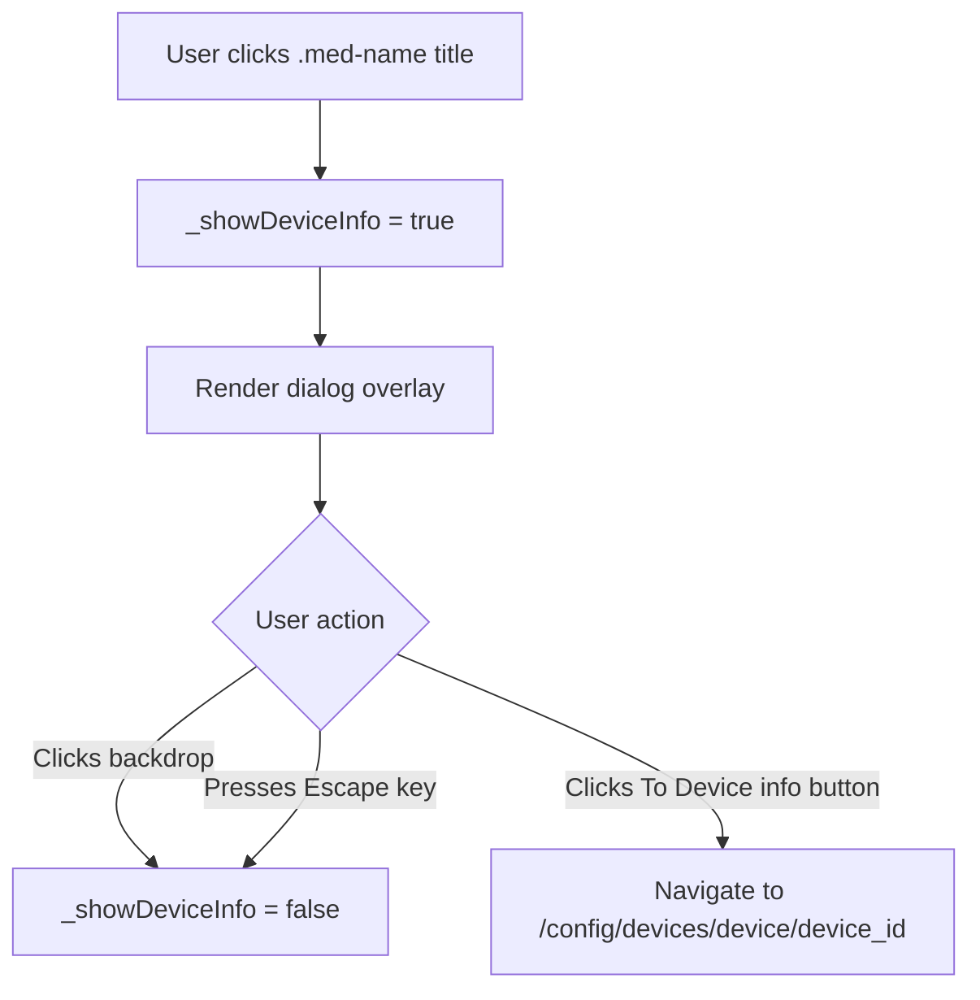

# UI Tweaks Plan — Strength Formatting, Device Dialog, Label Margin

## Overview

Three targeted UI improvements to the Pill Logger Card:

1. **Strength integer formatting** — Remove decimal places from strength in both the title and Stats pane
2. **Title click → Device info dialog** — Clicking the medication name opens a dialog with a "To Device info" navigation button
3. **Date label bottom margin** — Add breathing room between bar-graph date labels and the card border

---

## Change 1: Strength Integer Formatting

### Problem
The strength sensor may report values like `10.0` or `5.5`. Currently the raw state string is used directly, so decimals appear in both the title and the Stats pane.

### Locations

| Location | File | Line | Current Code |
|----------|------|------|--------------|
| Title | [`_getMedName()`](src/pill-logger-card.ts:321) | 321 | `name += \` - ${strengthState} mg\`;` |
| Stats pane | [`_renderPane3()`](src/pill-logger-card.ts:668) | 668 | `value: this._getState(entities.strength) + ' mg'` |

### Fix
- **Title**: Replace `strengthState` with `this._formatInteger(strengthState)` in the template literal at line 321
- **Stats pane**: Replace `this._getState(entities.strength)` with `this._formatInteger(this._getState(entities.strength))` at line 668

The existing [`_formatInteger()`](src/pill-logger-card.ts:183) method already does `Math.round(parseFloat(value)).toString()` — perfect for this use case.

---

## Change 2: Title Click → Device Info Dialog

### Problem
No way to quickly navigate from the card to the HA device info page for the configured medication device.

### Design



### Implementation Details

1. **New `@state()` property**: `_showDeviceInfo: boolean = false`

2. **Click handler on `.med-name`**: Add `@click=${() => this._showDeviceInfo = true}` and style the title as clickable with `cursor: pointer`

3. **Dialog rendering**: When `_showDeviceInfo` is true, render a dialog overlay inside the card. The dialog will contain:
   - The medication name as a header
   - A "To Device info" button that navigates to `/config/devices/device/${this.config.device_id}`
   - The backdrop click dismisses the dialog

4. **Navigation**: Use `window.location.href = \`/config/devices/device/${deviceId}\`` to navigate to the HA device page. This works because HA is a single-page app and the router handles the path.

5. **Escape key**: Add a `@keydown` handler on the dialog to close on Escape

### Template Addition

In [`render()`](src/pill-logger-card.ts:747), after the card-content div, add the dialog markup:

```html
${this._showDeviceInfo ? this._renderDeviceInfoDialog(entities) : nothing}
```

New method `_renderDeviceInfoDialog(entities)`:
```html
<div class="dialog-backdrop" @click=${() => this._showDeviceInfo = false}>
  <div class="dialog-box" @click=${(e: Event) => e.stopPropagation()}>
    <div class="dialog-title">${this._getMedName(entities)}</div>
    <button class="dialog-btn" @click=${() => this._navigateToDevice()}>
      <ha-icon icon="mdi:information-outline"></ha-icon>
      <span>To Device info</span>
    </button>
  </div>
</div>
```

### CSS Additions

```css
.med-name {
  cursor: pointer;          /* make it look clickable */
  /* existing styles retained */
}

.dialog-backdrop {
  position: fixed;
  inset: 0;
  background: rgba(0, 0, 0, 0.5);
  display: flex;
  align-items: center;
  justify-content: center;
  z-index: 999;
}

.dialog-box {
  background: var(--card-background, var(--ha-card-background, #fff));
  border-radius: var(--ha-card-border-radius, 12px);
  padding: 24px;
  min-width: 240px;
  display: flex;
  flex-direction: column;
  gap: 16px;
  box-shadow: 0 8px 32px rgba(0,0,0,0.3);
}

.dialog-title {
  font-size: 16px;
  font-weight: 600;
  color: var(--primary-text-color);
  text-align: center;
}

.dialog-btn {
  display: flex;
  align-items: center;
  justify-content: center;
  gap: 8px;
  padding: 12px 20px;
  border: none;
  border-radius: var(--ha-card-border-radius, 12px);
  background: rgba(var(--rgb-primary-color, 3, 169, 244), 0.12);
  color: var(--primary-color, #03a9f4);
  font-size: 14px;
  font-weight: 500;
  font-family: inherit;
  cursor: pointer;
  transition: background 0.2s;
}

.dialog-btn:hover {
  background: rgba(var(--rgb-primary-color, 3, 169, 244), 0.2);
}

.dialog-btn ha-icon {
  --mdc-icon-size: 20px;
}
```

---

## Change 3: Date Label Bottom Margin

### Problem
The bar-graph date labels at the bottom of the graph are touching the card border with no breathing room.

### Location

[`.bar-labels`](src/pill-logger-card.ts:1223) CSS at line 1223 and [`.bar-labels span`](src/pill-logger-card.ts:1231) at line 1231.

### Current CSS
```css
.bar-labels {
  display: flex;
  padding-left: 10%;
  padding-right: 2.5%;
  margin-top: -2px;
  overflow: hidden;
}

.bar-labels span {
  flex: 1;
  text-align: center;
  font-size: 9px;
  color: var(--secondary-text-color, #666);
  white-space: nowrap;
  line-height: 1;
}
```

### Fix
Add `padding-bottom: 6px` to `.bar-labels` to create a small margin between the label text bottom and the card border. Also increase `line-height` from `1` to `1.4` on `.bar-labels span` for slightly more vertical breathing room within each label.

---

## Summary of File Changes

All changes are in [`src/pill-logger-card.ts`](src/pill-logger-card.ts):

| Change | Section | Type |
|--------|---------|------|
| Strength formatting in title | `_getMedName()` line 321 | Use `_formatInteger()` |
| Strength formatting in Stats | `_renderPane3()` line 668 | Use `_formatInteger()` |
| New state property | Class body | `_showDeviceInfo` |
| New method | Class body | `_navigateToDevice()` |
| New method | Class body | `_renderDeviceInfoDialog()` |
| Click handler on title | `_renderPane1()` line 338 | Add `@click` |
| Dialog in render | `render()` | Conditional dialog |
| CSS: `.med-name` cursor | Styles | Add `cursor: pointer` |
| CSS: dialog styles | Styles | New rules |
| CSS: `.bar-labels` padding | Styles | Add `padding-bottom: 6px` |
| CSS: `.bar-labels span` line-height | Styles | Change `1` → `1.4` |