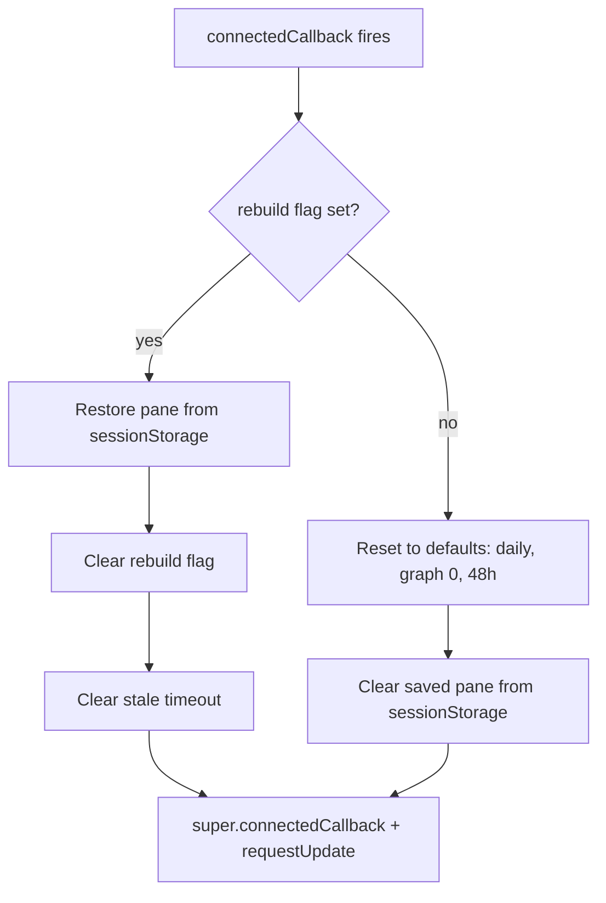

# View-Entry State Reset Plan

## Problem

The card's UI state (`_activePane`, `_activeGraph`, `_activeTimeframe`) is "sticky" — it persists across view changes. If the user opens the graphs pane, navigates to another HA view, and comes back, the card is still on the graphs pane instead of resetting to the default daily pane.

## Root Cause

Two mechanisms cause the stickiness:

1. **`sessionStorage` persistence in [`setConfig()`](src/pill-logger-card.ts:107)** — Iteration 10.2 added sessionStorage save/restore of `_activePane` to survive the destructive `ll-rebuild` event (which tears down and recreates the element). But `sessionStorage` survives the entire browser session, so even a fresh element creation on a new view entry restores the last-used pane.

2. **Element retention** — In some HA view configurations, the card element is not destroyed on view change; it is merely detached from the DOM and reattached when the view is shown again. In that case `setConfig()` is NOT called again, and the `@state()` properties (`_activePane`, `_activeGraph`, `_activeTimeframe`) persist in memory across detach/reattach.

The core conflict: both "view entry" and "ll-rebuild" can cause element recreation or reconnection, and the card cannot currently distinguish between them.

## Solution

Introduce a **short-lived sessionStorage flag** (`pill_logger_rebuilding_<device_id>`) that is set immediately before dispatching `ll-rebuild` and consumed on the next `connectedCallback()`. This lets the card distinguish "ll-rebuild reconnection" (restore pane) from "genuine view entry" (reset to defaults).

Move all pane restore/reset logic out of `setConfig()` and into a new `connectedCallback()` lifecycle hook, which fires on both element creation and DOM reattachment.

### Lifecycle Flow



### Changes

#### 1. Add `connectedCallback()` lifecycle hook

New method on `PillLoggerCard`:

```typescript
connectedCallback(): void {
  super.connectedCallback();
  const deviceId = this.config?.device_id || '';
  const flagKey = 'pill_logger_rebuilding_' + deviceId;
  const paneKey = 'pill_logger_pane_' + deviceId;

  if (sessionStorage.getItem(flagKey)) {
    // ll-rebuild path: restore the pane the user was on
    const saved = sessionStorage.getItem(paneKey);
    if (saved === 'daily' || saved === 'graphs' || saved === 'stats') {
      this._activePane = saved;
    }
    sessionStorage.removeItem(flagKey);
  } else {
    // Genuine view entry or initial load: reset to defaults
    this._activePane = 'daily';
    this._activeGraph = 0;
    this._activeTimeframe = '48h';
    sessionStorage.removeItem(paneKey);
  }
  this.requestUpdate();
}
```

#### 2. Remove pane-restore logic from `setConfig()`

Delete the block at [`setConfig()` lines 107-113](src/pill-logger-card.ts:107) that restores `_activePane` from sessionStorage. `setConfig()` should only set `this.config` — the restore/reset is now handled by `connectedCallback()`.

#### 3. Set rebuild flag in `_handlePaneChange()`

In [`_handlePaneChange()` at line 362](src/pill-logger-card.ts:362), set the flag before dispatching `ll-rebuild`, and schedule a self-clearing timeout as a safety net (in case `ll-rebuild` does not actually destroy the element in some HA versions):

```typescript
private _handlePaneChange(paneId: 'daily' | 'graphs' | 'stats'): void {
  if (paneId === this._activePane) return;
  this._activePane = paneId;
  const deviceId = this.config?.device_id || '';
  sessionStorage.setItem('pill_logger_pane_' + deviceId, paneId);
  sessionStorage.setItem('pill_logger_rebuilding_' + deviceId, '1');
  this.requestUpdate();
  this.updateComplete.then(() => {
    this.dispatchEvent(new CustomEvent('ll-rebuild', { bubbles: true, composed: true }));
    // Safety net: if ll-rebuild does not recreate the element,
    // clear the flag after 2s so the next view entry resets cleanly.
    setTimeout(() => sessionStorage.removeItem('pill_logger_rebuilding_' + deviceId), 2000);
  });
}
```

### Why This Works

| Scenario | Flag state at `connectedCallback` | Action |
|----------|----------------------------------|--------|
| Initial dashboard load | absent | Reset to defaults (no-op, already defaults) |
| View entry (element recreated) | absent | Reset to daily/graph 0/48h |
| View entry (element reattached) | absent | Reset to daily/graph 0/48h |
| ll-rebuild after pane switch | present | Restore saved pane, clear flag |
| Rapid pane switching | present (last write wins) | Restore last-selected pane |

### Edge Case Handling

- **setTimeout safety net**: If `ll-rebuild` does not destroy the element (HA version variance), the flag would linger and cause the next view entry to incorrectly restore the old pane. The 2-second `setTimeout` clears the flag so the next genuine view entry resets cleanly. If the element IS destroyed, the `setTimeout` callback runs in global scope but the flag has already been consumed by the new element's `connectedCallback`, so the clear is harmless.
- **`_activeGraph` and `_activeTimeframe`**: These are NOT persisted across `ll-rebuild` (current behavior unchanged). They reset to defaults on both view entry and ll-rebuild. This is acceptable — the user's complaint is specifically about the pane. Persisting these across ll-rebuild could be a future enhancement.
- **`_amountHistory` / `_doseHistory`**: Not explicitly reset. Since the pane resets to 'daily' on view entry, stale graph data is not displayed. When the user navigates to graphs again, `updated()` fires and fetches fresh data.

### Files Modified

- [`src/pill-logger-card.ts`](src/pill-logger-card.ts) — Add `connectedCallback()`, remove pane-restore from `setConfig()`, add flag set in `_handlePaneChange()`
- [`dist/pill-logger-card.js`](dist/pill-logger-card.js) — Rebuilt output

### Verification

1. `yarn run build` — clean compilation
2. Manual test in HA:
   - Open view with card → switch to graphs pane → navigate to another view → navigate back → card should be on daily pane ✓
   - Open view with card → switch to graphs pane → switch to stats pane → card should stay on stats (ll-rebuild persistence) ✓
   - Open view with card → switch to graphs → select 30d timeframe → switch to daily → switch back to graphs → timeframe should reset to 48h (current behavior) ✓