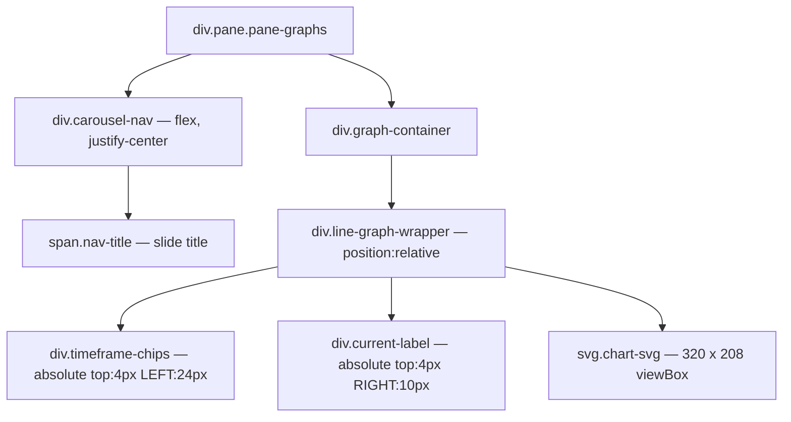
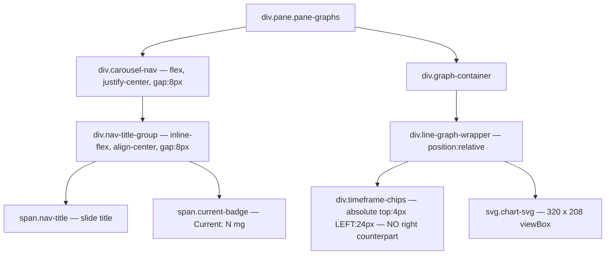

# X-Axis Collision Resolution — Graphs Pane Current Badge Relocation

**Date:** 2026-08-11
**Component:** [`src/components/graphs-panel.ts`](../src/components/graphs-panel.ts)
**Directive:** Route A (Preferred) — extract the "Current" amount badge from the time-selector row and inject it into the graph's header row adjacent to the slide title.

---

## 1. Problem Analysis

### Current DOM (per slide)

The Graphs pane (`<ax-dose-graphs-panel>`) renders a carousel header (`.carousel-nav`) followed by a `.graph-container` holding one of three slides. Only the **line** slide (Amount-in-Body) renders the "Current" badge.



### Collision Mechanism

- [`timeframe-chips`](../src/components/graphs-panel.ts:851) is `position:absolute; top:4px; left:24px; display:flex; gap:2px` — a horizontal flex row of 6 buttons (12H, 24H, 48H, 7D, 14D, 30D), each `min-width:41px` → intrinsic width ≈ 6 × 41 + 5 × 2 = **256 px** (+ left offset 24 px = **280 px** consumed from the left).
- [`current-label`](../src/components/graphs-panel.ts:865) is `position:absolute; top:4px; right:10px; white-space:nowrap` — the "Current: N mg" badge, anchored to the right edge.
- Both sit at `top:4px` inside the same `position:relative` [`line-graph-wrapper`](../src/components/graphs-panel.ts:847). On viewports ≤ ~360 px the SVG (320 viewBox scaled to container width) leaves insufficient horizontal slack, so the left-anchored chip row and the right-anchored badge **intersect** (the chip row's right edge crosses the badge's left edge).
- The bar and effectiveness slides do NOT render the badge, so they are unaffected — the collision is exclusive to the line slide.

### Why the collision violates the directive

| Directive clause | Violation |
|---|---|
| Data Locality | The badge is *visually* coupled to the chip row (same absolute layer) rather than to the slide title / data stream header. |
| Hit-Box Integrity | The chip row's right edge is eaten by the overlap, reducing effective hit-box separation on touch. |
| Prohibited Protocols | A `display:none` media-query fix would hide the badge (forbidden). Horizontal overflow scroll is forbidden. |

---

## 2. Selected Route — Route A (Preferred)

**Extract the "Current" badge from `.line-graph-wrapper` and inject it into the `.carousel-nav` header row, anchored adjacent to the slide title.**

### Rationale for choosing Route A over Route B

- Route A keeps the badge **above** the chart surface entirely, eliminating the shared absolute layer that causes the collision. The chip row reclaims the full top strip of the graph with no right-side counterpart to collide with.
- Route B (Y-axis wrap of the chip row) would still leave the badge absolutely positioned in the graph wrapper; wrapping the chips vertically also consumes chart vertical space and complicates the `padTop=36` clearance that the SVG gridline layout depends on. Route B is kept as a documented fallback only.
- Route A satisfies "permanently visible and strictly associated with the graph's active data stream": the badge renders **only when the line slide is active** (the slide whose data stream is Amount-in-Body), and it is never hidden by media queries.

### Post-change DOM



Key structural changes:
1. A new wrapping element `.nav-title-group` holds the existing `.nav-title` **plus** the relocated badge, so the badge sits immediately to the right of the title and the existing `justify-content:center` on `.carousel-nav` centers the pair as a unit.
2. The `div.current-label` is **removed** from [`_renderLineGraph()`](../src/components/graphs-panel.ts:268). The SVG dashed current-amount line (`<line x1=… y1=currentY …>`) stays — it is the data-stream anchor inside the chart; only the textual badge moves.
3. The badge markup renders in `render()` (the carousel-nav block), gated on `activeSlide === 'line' && hasCurrent`, so it appears exclusively on the Amount-in-Body slide.

---

## 3. Data Flow — Lifting `hasCurrent` / `currentAmountNum` into `render()`

The badge's text (`Current: N <unit>`) depends on values currently computed **inside** `_renderLineGraph`:

- `amountInBody = c.getState(entities.amountInBody)` — already available in `render()` via `e.amountInBody` + the existing `hasAmountInBody` check.
- `currentAmountNum = parseFloat(amountInBody)` + `hasCurrent` parse guard.
- `c.getStrengthUnit(entities)` — controller call, callable from `render()`.

`render()` will compute, **only when `activeSlide === 'line'`**:

```ts
const amountInBodyState = c.getState(e.amountInBody);
const currentAmountNum = parseFloat(amountInBodyState);
const hasCurrent = activeSlide === 'line'
  && amountInBodyState
  && amountInBodyState !== 'unavailable'
  && !isNaN(currentAmountNum);
const currentUnit = hasCurrent ? c.getStrengthUnit(e) : '';
```

`_renderLineGraph()` keeps its own identical computation for the SVG dashed line (no change to `currentY` math). The small duplication is acceptable and keeps the SVG path self-contained; extracting a shared helper is out of scope for this layout fix.

---

## 4. CSS Changes

### 4a. Remove `.current-label` rule block

Delete the [`current-label`](../src/components/graphs-panel.ts:865) rule (lines ~860–880). It is no longer rendered anywhere.

### 4b. Add `.nav-title-group` + `.current-badge` rules

```css
.nav-title-group {
  display: inline-flex;
  align-items: center;
  gap: 8px;
  /* Inherits the centered position from .carousel-nav's justify-content.
     No fixed width — sizes to title + badge so the pair centers as a unit. */
}

/* "Current" amount badge — relocated from the graph surface into the
   carousel header row, adjacent to the slide title. Inherits the pill
   styling of the former .current-label so it reads as the same element.
   Never hidden by media queries (Data Locality directive). */
.current-badge {
  padding: 3px 10px;
  font-size: 12px;
  font-weight: calc(500 * var(--pill-font-weight-boost, 1));
  border-radius: 4px;
  color: var(--secondary-text-color);
  background: rgba(var(--rgb-primary-color, 3, 169, 244), 0.08);
  white-space: nowrap;
  line-height: 1.4;
  /* flex-shrink:0 keeps the badge from being squeezed by a long title,
     while the title keeps its existing min-width:100px + text-align:center. */
  flex-shrink: 0;
}
```

### 4c. Chip row — no structural change needed

With the right-side badge gone, [`timeframe-chips`](../src/components/graphs-panel.ts:851) (absolute, left-anchored) has no collision partner. Its `min-width:41px` per chip + `gap:2px` already preserves hit-box integrity; no compression is introduced. **No CSS edit to `.timeframe-chips` or `.timeframe-chip`.**

### 4d. No media queries

Per the Prohibited Protocols clause, no `@media` rules are added. The badge is always visible when the line slide is active at every viewport width.

---

## 5. Hit-Box Integrity Verification (WCAG)

| Requirement | Status after Route A |
|---|---|
| Sufficient pixel separation between selector buttons | Unchanged — `gap:2px` + `min-width:41px` retained; the right-side overlap that was eating the last chip's hit box is gone. |
| Survive 200% text scaling without container collapse | The chip row is `position:absolute` (out of flow) so text scaling grows chips horizontally without forcing the SVG to reflow; the badge is now in the header (normal flow, `inline-flex`), so it grows with the title row, not the chart surface. No container collapse path. |
| No `display:none` | Confirmed — not used anywhere in the fix. |
| No horizontal overflow scroll | Confirmed — no `overflow-x` introduced. |

---

## 6. Implementation Steps (for Code mode)

1. **Edit [`render()`](../src/components/graphs-panel.ts:81)** — add the `hasCurrent` / `currentAmountNum` / `currentUnit` computation gated on `activeSlide === 'line'`; wrap the existing `.nav-title` `<span>` in a `.nav-title-group` `<div>` and append the `.current-badge` `<span>` when `hasCurrent`. Apply to **both** carousel-nav branches (multi-slide and single-slide) so the badge shows whether or not nav arrows are present.
2. **Edit [`_renderLineGraph()`](../src/components/graphs-panel.ts:268)** — remove the `div.current-label` template block (lines ~394–398). Leave the SVG dashed `<line>` for `currentY` untouched.
3. **Edit [`static styles`](../src/components/graphs-panel.ts:782)** — delete the `.current-label` rule; add `.nav-title-group` + `.current-badge` rules.
4. **Build** — `cd /workspaces/lovelace-pill-logger-card && yarn run build`; confirm exit 0.
5. **Grep audit** — `grep -n "current-label" src/components/graphs-panel.ts` must return **zero** matches; `grep -n "current-badge" src/components/graphs-panel.ts` must return the new rule + template occurrences.
6. **Memory bank update** — update `activeContext.md` + `progress.md` per the global instructions. `projectstructure.md` unchanged (no file added/renamed/deleted). README unchanged (internal layout fix, no user config/install impact).

---

## 7. Fallback — Route B (not selected, documented only)

If Route A is rejected during review: modify [`timeframe-chips`](../src/components/graphs-panel.ts:851) to `flex-wrap:wrap` with a fixed `max-width:100%` and remove `position:absolute` (move into normal flow above the SVG), letting the chips wrap to a second row when horizontal bandwidth is exhausted. The badge would stay in `.line-graph-wrapper` but move to `top:auto; bottom:4px` to avoid the wrapped chip rows. This consumes more vertical space and risks the `padTop=36` SVG clearance, so it is the fallback only.

---

## 8. Scope Boundaries

- **In scope:** [`src/components/graphs-panel.ts`](../src/components/graphs-panel.ts) only (template + CSS).
- **Out of scope:** [`src/localize.ts`](../src/localize.ts) (the `graphs.current` key already exists and is reused), the SVG dashed-line math, the bar/effectiveness slides, the backend repo.
- **No new files.** No `projectstructure.md` change. No README change.